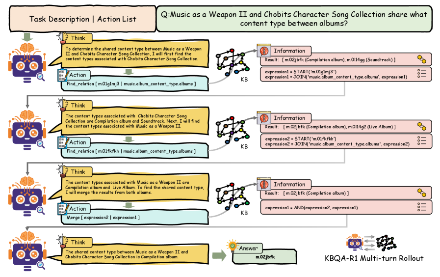
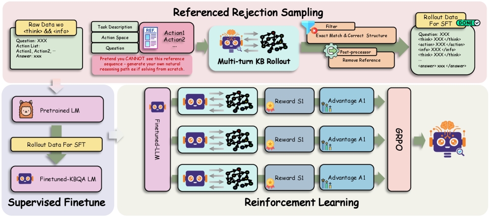
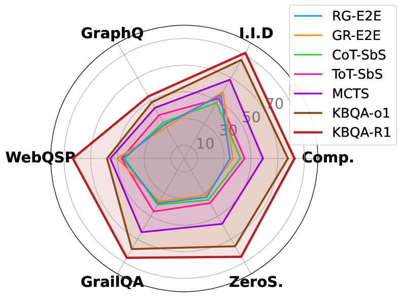
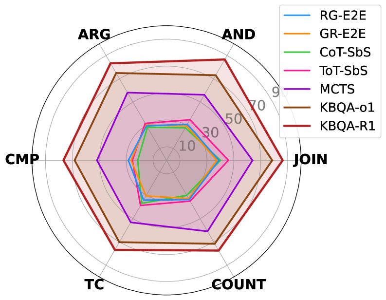
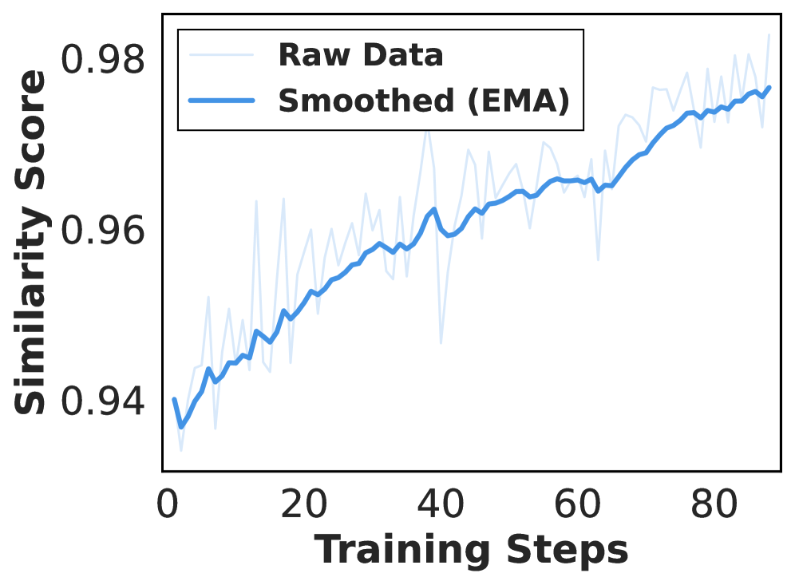
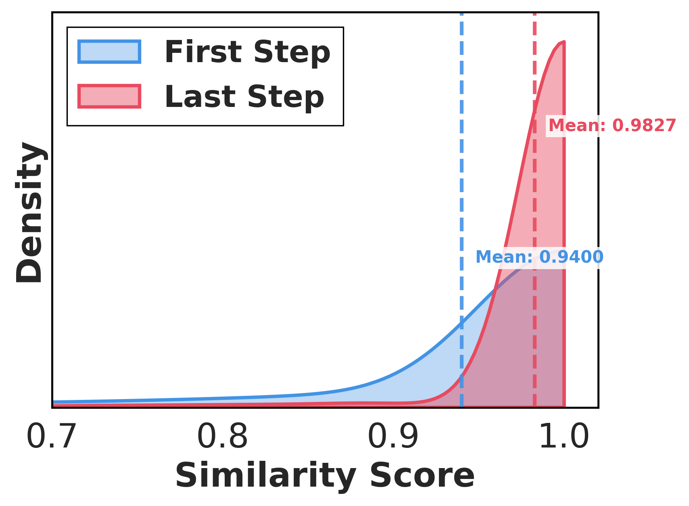
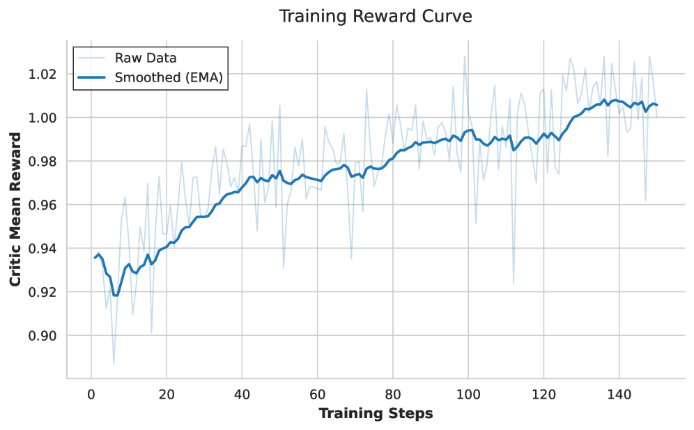

# KBQA-R1: Reinforcing Large Language Models for Knowledge Base Question Answering

# KBQA-R1: Reinforcing Large Language Models for Knowledge Base Question Answering

Xin Sun, Zhongqi Chen, Xing Zheng, Qiang Liu, , Shu Wu,  Bowen Song,
  
Zilei Wang,  Weiqiang Wang,  Liang Wang
Xin Sun, Qiang Liu, Shu Wu and Liang Wang are with the Institute of Automation, Chinese Academy of Sciences (Email: {xin.sun@cripac.ia.ac.cn, qiang.liu,shu.wu,wangliang}@nlpr.ia.ac.cn).
Zhongqi Chen, Xing Zheng, Bowen Song and Weiqiang Wang are with Ant Group. (Email: {chenzhongqi.czq,feishang.zx,bowen.sbw,weiqiang.wwq}@antgroup.com). Zilei Wang is with University of Science and Technology of China (Email: zlwang@ustc.edu.cn).
Corresponding author: Shu Wu, Bowen Song.

###### Abstract

Knowledge Base Question Answering (KBQA)
challenges models to bridge the gap between natural language and strict knowledge graph schemas by generating executable logical forms.
While Large Language Models (LLMs) have advanced this field, current approaches often struggle with a dichotomy of failure: they either generate hallucinated queries without verifying schema existence or exhibit rigid, template-based reasoning that mimics synthesized traces without true comprehension of the environment.
To address these limitations, we present KBQA-R1, a framework that shifts the paradigm from text imitation to interaction optimization via Reinforcement Learning. Treating KBQA as a multi-turn decision process, our model learns to navigate the knowledge base using a list of actions, leveraging Group Relative Policy Optimization (GRPO) to refine its strategies based on concrete execution feedback rather than static supervision. Furthermore, we introduce Referenced Rejection Sampling (RRS), a data synthesis method that resolves cold-start challenges by strictly aligning reasoning traces with ground-truth action sequences. Extensive experiments on WebQSP, GrailQA, and GraphQuestions demonstrate that KBQA-R1 achieves state-of-the-art performance, effectively grounding LLM reasoning in verifiable execution.

## I Introduction

Knowledge Base Question Answering (KBQA) aims to answer natural language questions by retrieving facts from large-scale Knowledge Bases (KBs) such as Freebase and Wikidata. Unlike Retrieval-Augmented Generation (RAG), which augments Large Language Models (LLMs) with unstructured text snippets, KBQA requires the model to generate executable logical forms (e.g., SPARQL or S-Expressions) that precisely navigate the KB’s schema. This task is particularly challenging: the model must not only comprehend natural language semantics but also master the strict relational schema and query syntax to perform multi-hop reasoning without error.

Despite significant progress in applying LLMs to KBQA, existing methodologies can be categorized into three paradigms, each with distinct limitations. The first category comprises End-to-end Approaches (e.g., KB-BINDER [KB-BINDER], KB-Coder [KB-Coder], ChatKBQA [ChatKBQA]), which generate entire logical forms in a single pass. While computationally efficient, these methods operate without intermediate KB interaction, making them unable to verify the existence of schema elements during generation. This often leads to *schema hallucinations*—syntactically valid but semantically incorrect queries that reference non-existent relations or entities.
The second category, Prompting-based Step-by-Step Approaches [ToG, RoG], leverages powerful commercial model APIs with few-shot in-context learning to decompose complex queries into sequential reasoning steps. While these methods benefit from the strong reasoning capabilities of large-scale models, they lack task-specific training, resulting in suboptimal performance on domain-specific schema navigation and complex multi-hop queries.
The third category, Supervised Agent Approaches [luo2025kbqa], mitigates the above issues by fine-tuning models on reasoning traces synthesized from templates or heuristics. However, this paradigm risks *superficial reasoning*: since the training data is inherently formulaic, the model’s “thoughts” often reduce to template-driven action announcements (e.g., “At this step, we should find the relation…”) rather than genuine analysis of environmental feedback. The model declares *what* action to take without explaining *why*—it neither interprets the KB observations nor justifies its choices based on the question semantics. Such rigid patterns, while achieving local consistency, fail to generalize when novel schema structures or unexpected query patterns arise.

To address these limitations, we present KBQA-R1, an action-centric reinforcement learning framework that shifts the paradigm from text imitation to *interaction optimization*. Instead of generating raw query code, KBQA-R1 operates within a well-defined action space, treating KBQA as a multi-turn Markov Decision Process (MDP). At each step, the model selects an action (e.g., Find\_Relation, Merge), observes concrete feedback from the KB execution engine, and dynamically adjusts its reasoning trajectory. Crucially, because the policy is optimized via Group Relative Policy Optimization (GRPO) [shao2024deepseekmath] with outcome-based rewards rather than imitation loss, the model is incentivized to develop *adaptive reasoning*—genuinely analyzing observations and justifying action choices—rather than memorizing fixed reasoning templates. This closed-loop interaction grounds decisions in verifiable outcomes and enables the model to discover effective reasoning strategies through environmental exploration.

To bootstrap this process and address the “cold start” problem inherent in RL, we propose Referenced Rejection Sampling (RRS) for SFT (Supervised Fine-Tuning) data synthesis. Compared to standard rejection sampling, which draws trajectories from raw prompts and accepts only those that accidentally reach the correct answer, KBQA is a particularly challenging setting: the model must generate syntactically valid S-Expressions, choose schema-consistent relations, and navigate multi-hop paths in a large KB. In this regime, the zero-shot success rate of unconstrained LLM sampling is very low, so naive rejection sampling would produce very few usable trajectories even with a large sampling budget. RRS alleviates this by conditioning generation on a *reference sequence of ground-truth actions* extracted from the gold S-Expression, and asking the model to reconstruct a coherent reasoning trace around these actions. This simple constraint dramatically increases the acceptance rate while still forcing the model to explain *why* each reference action leads toward the answer. As a result, the synthesized SFT data contains trajectories whose “thought” process is tightly aligned with verifiable execution steps, helping KBQA-R1 learn robust, KB-grounded reasoning rather than relying on brittle, hallucinated logic.

Our main contributions are summarized as follows:

- •
  
  We propose KBQA-R1, a multi-turn reinforcement learning framework that grounds LLM reasoning in verifiable KB actions, enabling closed-loop interaction with the knowledge base.
- •
  
  We introduce Referenced Rejection Sampling (RRS), a novel data synthesis strategy that aligns reasoning traces with ground-truth action sequences, effectively preventing hallucinated logic.
- •
  
  We conduct extensive experiments on WebQSP, GrailQA, and GraphQuestions, demonstrating that KBQA-R1 achieves state-of-the-art performance, significantly outperforming both end-to-end and agent-based baselines.

## II Related Work

Knowledge Base Question Answering (KBQA). Before the rise of LLMs, KBQA studies are commonly categorized into information-retrieval-based (IR-based) methods [GRAFT-Net, PullNet, SR, NSM, EmbedKGQA] and semantic-parsing-based (SP-based) methods [RnG-KBQA, TIARA, ArcaneQA, FC-KBQA]. With LLMs, three paradigms have emerged: (i) *end-to-end approaches* that directly generate logical forms via in-context learning or fine-tuning [KB-BINDER, KB-Coder, ChatKBQA, StructGPT]; (ii) *step-by-step (agentic) approaches* that interleave reasoning with graph exploration and tool use [Pangu, QueryAgent, ToG, RoG, Interactive-KBQA, PoG, KG-Agent]; and (iii) *search-augmented approaches* that leverage tree search algorithms such as Monte Carlo Tree Search (MCTS) for systematic exploration [luo2025kbqa].

While MCTS-based methods like KBQA-o1 [luo2025kbqa] achieve strong performance through heuristic exploration, they exhibit two key limitations.
First, they incur significant computational overhead from multiple rollouts per query and require separate policy and reward models during inference. Second, their reasoning traces are often *template-driven* (e.g., “At this step, we should find the relation…”) rather than genuinely analytical—the model announces *what* action to take without explaining *why* based on observations. In contrast, we train a single policy via RL with outcome-based rewards, encouraging the model to develop *adaptive reasoning* that analyzes environmental feedback and justifies action choices, while eliminating test-time search overhead.

LLMs, tool use, and agentic reasoning. Chain-of-Thought (CoT) prompting improves reasoning by eliciting intermediate steps [CoT]; ReAct [ReAct] interleaves “think” and “act” to ground reasoning in environment feedback; and heuristic search has been applied to agent traces (e.g., MCTS-style selection in [RAP] and tree-structured deliberation in [ToT]). Recent graph-augmented approaches such as Plan-on-Graph [PoG] incorporate self-correcting mechanisms with dynamic memory for adaptive planning on knowledge graphs. While these methods expand the search space or stabilize multi-step reasoning, free-form thoughts can overfit prompt templates and do not guarantee executability. We keep the interleaved think-act design but require typed, schema-aware actions with validators and an executor, turning traces into verifiable computations rather than narrative justifications.

Retrieval-augmented generation and search-as-a-tool. Classical RAG pipelines retrieve text snippets and feed them to the model for generation [RAG]. Recent work moves toward search-as-a-tool, prompting or training LLMs to issue search calls and iterate [trivedi2022interleaving, ReAct, schick2023toolformer, li2025search, jin2025search]. GraphRAG approaches [G-Retriever, ToG2] further integrate graph retrieval with LLM reasoning, enabling tighter coupling between structured knowledge and text-based evidence. These approaches reduce hallucination but depend heavily on retrieval quality and, in supervised variants, on labeled trajectories. Our setting differs fundamentally by treating a *knowledge graph* as the environment: actions are typed and executable against the KB schema, observations are structure-grounded entity sets rather than text passages, and step-wise executability can be validated programmatically rather than inferred from unstructured documents.

## III Preliminaries

Knowledge Base and Executor.
We consider a knowledge base (KB) as a directed multi-relational graph 𝒦=(ℰ,ℛ,ℱ)\mathcal{K}=(\mathcal{E},\mathcal{R},\mathcal{F}), where ℰ\mathcal{E} is the set of entities, ℛ\mathcal{R} is the set of relations, and ℱ\mathcal{F} is the set of factual triples. Each triple f∈ℱf\in\mathcal{F} has the form (h,r,t)(h,r,t) with head entity h∈ℰh\in\mathcal{E}, relation r∈ℛr\in\mathcal{R}, and tail entity t∈ℰt\in\mathcal{E}. An executor ℰ\mathcal{E} (e.g., a SPARQL endpoint) takes a structured query over 𝒦\mathcal{K} and returns an answer set, which serves as the environment feedback in our framework.

KBQA Task.
Given a natural language question qq, the KB 𝒦\mathcal{K}, and a set of topic entities Eq⊆ℰE\_{q}\subseteq\mathcal{E} mentioned in qq, the goal of Knowledge Base Question Answering (KBQA) is to produce an answer set 𝒜q⊆ℰ\mathcal{A}\_{q}\subseteq\mathcal{E} that correctly responds to the question. Following prior work [luo2025kbqa], we assume that entity mentions in qq are already linked to the KB and the corresponding topic entities EqE\_{q} are given as input. In classic semantic-parsing based KBQA, this task is realized by generating a logical form (e.g., SPARQL or S-Expression) in one shot and executing it against the KB. In contrast, our framework rephrases the task as learning a multi-step interaction policy.

Agentic KBQA as Sequential Decision Making.
In our framework, we view the large language model as a stochastic policy πθ\pi\_{\theta} that interacts with the KB environment via a compact, validated action space. At each step tt, the agent observes a context ctc\_{t} summarizing the dialogue history, including prior reasoning (<think> blocks), actions (<action> blocks), and tool feedback (<information> blocks). Conditioned on ctc\_{t} and the original question qq, the policy samples an action ata\_{t}:

|  | at∼πθ(⋅∣q,ct).a\_{t}\sim\pi\_{\theta}(\cdot\mid q,c\_{t}). |  |
| --- | --- | --- |

The action ata\_{t} is grounded into an S-Expression fragment and executed by the executor ℰ\mathcal{E} over 𝒦\mathcal{K}, yielding an observation oto\_{t} (e.g., retrieved entities or diagnostic messages). The triple (ct,at,ot)(c\_{t},a\_{t},o\_{t}) is appended to the trajectory, and the context is updated accordingly. This interactive loop continues until the agent outputs a final answer 𝒜^q\hat{\mathcal{A}}\_{q} or a maximum number of steps TT is reached. We denote a complete trajectory by τ={(c1,a1,o1),…,(cT,aT,oT)}\tau=\{(c\_{1},a\_{1},o\_{1}),\ldots,(c\_{T},a\_{T},o\_{T})\}.

Policy Optimization Objective.
Our goal is to learn a policy that produces trajectories leading to correct answers. The action ata\_{t} is grounded into an S-Expression fragment [ArcaneQA, GrailQA] and executed by the executor over 𝒦\mathcal{K}. Let R​(τ)R(\tau) denote the cumulative reward of a trajectory. From the reinforcement learning perspective, we optimize the expected return:

|  | J​(θ)=𝔼τ∼πθ​[∑t=1Trt],rt=routcome+rformat,J(\theta)=\mathbb{E}\_{\tau\sim\pi\_{\theta}}\left[\sum\_{t=1}^{T}r\_{t}\right],\quad r\_{t}=r\_{\text{outcome}}+r\_{\text{format}}, |  | (1) |
| --- | --- | --- | --- |

where routcomer\_{\text{outcome}} reflects answer correctness and rformatr\_{\text{format}} rewards valid S-Expression structure.
Unlike methods [luo2025kbqa] that require test-time search (e.g., MCTS), our approach trains a single policy end-to-end that directly generates high-quality trajectories at inference time without additional search overhead.

## IV Method: The KBQA-R1 Framework

|  |
| --- |
| You are an expert assistant for querying the Freebase knowledge base using structured reasoning actions. |
| Answer the given question about Freebase knowledge base. |
| You MUST conduct reasoning inside <think>...</think> before emitting actions. |
| After reasoning, provide structured actions inside <action>...</action>. |
| The system will return query results between <information>...</information>. |
| When ready, return the final answer inside <answer>...</answer> using MIDs or literal values. For multiple answers, separate by spaces. |
| Available Actions : {Candidate Actions List} |
| Begin from the candidate entities detected in the question. |
| Candidate Entities: [ {CANDIDATE\_ENTITIES} ] |
| Question: {QUESTION}. |

TABLE I: Action-based reasoning prompt template for KBQA-R1. Placeholders {Candidate Actions List}, {CANDIDATE\_ENTITIES}, and {QUESTION} are dynamically populated per instance.

### IV-A Prompt and System Workflow

Our system is a multi-turn agent system inspired by the ReAct paradigm [ReAct]. At each turn, the LLM emits one or more actions to interact with the KB environment, and the environment returns the corresponding observations. After multiple turns of KB exploration, the model outputs the final answer.

#### IV-A1 Prompting Template for Action-Based Reasoning

Table [I](https://arxiv.org/html/2512.10999v1#S4.T1 "TABLE I ‣ IV Method: The KBQA-R1 Framework ‣ KBQA-R1: Reinforcing Large Language Models for Knowledge Base Question Answering") shows the prompting template used to elicit action-based reasoning from the LLM. The template structures the model’s output into three parts in an iterative fashion: first, a reasoning process (<think>...</think>), similar to Chain-of-Thought prompting [CoT], then a Knowledge Graph exploration action (<action>...</action>, e.g., Find\_relation, Merge), and finally the answer (<answer>...</answer>). Crucially, we only impose structural constraints on the output format, not on the reasoning content. This design choice ensures that the model learns to reason *adaptively* through RL, rather than mimicking template-driven patterns as in prior work [luo2025kbqa].

Figure 1: Overview of the KBQA-R1 multi-turn reasoning framework. Given a natural language question, the LLM-based agent iteratively executes a Think-Action-Information loop: it first reasons about the current state, selects an atomic action (e.g., Find\_relation, Merge), and receives grounded feedback from the knowledge base. The Relation Retrieval and Confidence Gating (RRCG) module validates each proposed relation against the KB schema, ensuring action validity. This process continues until the agent produces the final S-Expression and answer.

#### IV-A2 Action Space

Prior semantic parsing approaches to KBQA [ArcaneQA, ChatKBQA, RnG-KBQA] typically require the model to emit a full, nested S-expression in a single pass. This design is notoriously brittle: a single token-level error (e.g., a typo in a relation name or a mismatched parenthesis) can render the entire program unexecutable and cause the query to fail.

Following the recent KBQA-o1 framework [luo2025kbqa], we instead adopt a compact, discrete action space that decomposes logical-form construction into a sequence of simple, verifiable steps. Concretely, each action corresponds to an atomic operation over the evolving logical expression, such as extending from an entity along a relation (Find\_relation), intersecting two partial expressions (Merge), or applying aggregation and comparison operators (Order, Compare, Count, Time\_constraint). As summarized in Table [II](https://arxiv.org/html/2512.10999v1#S4.T2 "TABLE II ‣ IV-A2 Action Space ‣ IV-A Prompt and System Workflow ‣ IV Method: The KBQA-R1 Framework ‣ KBQA-R1: Reinforcing Large Language Models for Knowledge Base Question Answering"), every action is defined by (i) its arguments, (ii) a target functional update on the current expression (e.g., JOIN, AND, ARG, CMP, TC, COUNT), and (iii) the corresponding S-expression template.

Operationally, the agent does not generate the complete program at once. Instead, starting from candidate entities detected in the question, it emits one or more actions at each turn, observes the execution results against the KB, and then decides the next action based on this feedback. This interleaved generation–execution process, inherited from related iterative retrieval methods [trivedi2022interleaving, jiang2023active], improves robustness in two ways: the environment can validate and correct individual actions (e.g., via schema-aware relation retrieval), and errors are localized to specific steps rather than invalidating the entire program.

Actions are converted into an S-Expression list, then translated into SPARQL queries [SPARQL] executed against the KB. The resulting observations are appended to the dialogue state visible to the model. This workflow mitigates the fragility of string-based S-expression program generation and lowers the error rate in actions produced by the LLM.

| Action | Arguments | Target Function | Equivalent Logical Form |
| --- | --- | --- | --- |
| Find\_relation | entity || relation | expression = JOIN(‘relation’, START(entity)) | (JOIN relation entity) |
| Merge | expression1 || expression | expression = AND(expression1, expression) | (AND (expression1) (expression)) |
| Order | MAX/MIN || expression || relation | expression = ARG(‘mode’, expression, ‘relation’) | (mode (expression) relation) |
| Compare | le/lt/ge/gt || relation || number | expression = CMP(‘mode’, ‘relation’, number, expression) | (mode relation number (expression)) |
| Time\_constraint | relation || time | expression = TC(expression, ‘relation’, ‘time’) | (TC (expression) relation time) |
| Count | expression | expression = COUNT(expression) | (COUNT (expression)) |

TABLE II: Action space of KBQA-R1.

Figure 2: The two-stage training pipeline of KBQA-R1. Stage 1 (Referenced Rejection Sampling): Raw training data is augmented with reference action sequences derived from gold S-Expressions. The LLM generates reasoning trajectories conditioned on these references, which are then filtered by execution correctness and post-processed to remove reference hints, yielding high-quality SFT data. Stage 2 (Reinforcement Learning): The SFT-initialized policy performs multi-turn KB rollouts, receiving outcome-based rewards. Group Relative Policy Optimization (GRPO) computes per-group advantages and updates the policy to maximize expected rewards while maintaining proximity to the reference distribution.

#### IV-A3 Relation Retrieval and Confidence Gating

LLM-proposed relations can be noisy or ambiguous due to the well-known hallucination problem [hallucination]. To mitigate this, we introduce the Relation Retrieval and Confidence Gating (RRCG) module. The RRCG module acts as a validation layer, verifying the agent’s proposed textual relation before execution.

Let ragentr\_{\text{agent}} be the original textual relation proposed by the agent for the current entity ece\_{c}. Let R​(ec)R(e\_{c}) be the set of all neighboring schema relations of ece\_{c} in the knowledge base. The core of the RRCG module is a similarity function S​i​m​(⋅,⋅)Sim(\cdot,\cdot), implemented using dense retrieval techniques [karpukhin2020dense, dense\_retrieval], which scores ragentr\_{\text{agent}} against every schema relation rs∈R​(ec)r\_{s}\in R(e\_{c}). We define smax=maxrs∈R​(ec)⁡S​i​m​(ragent,rs)s\_{\text{max}}=\max\_{r\_{s}\in R(e\_{c})}Sim(r\_{\text{agent}},r\_{s}) as the highest similarity score, with rs∗=arg⁡maxrs∈R​(ec)⁡S​i​m​(ragent,rs)r\_{s}^{\*}=\arg\max\_{r\_{s}\in R(e\_{c})}Sim(r\_{\text{agent}},r\_{s}) being the best-matching schema relation.

Based on smaxs\_{\text{max}} and predefined thresholds τhigh\tau\_{\text{high}} and τlow\tau\_{\text{low}} (where τhigh>τlow\tau\_{\text{high}}>\tau\_{\text{low}}), the action is categorized into one of three confidence tiers:

- •
  
  Auto-Validation (High Confidence): If smax≥τhighs\_{\text{max}}\geq\tau\_{\text{high}}, it indicates a reliable match between ragentr\_{\text{agent}} and rs∗r\_{s}^{\*}. The action is auto-validated. The system executes the action using rs∗r\_{s}^{\*} as the replacement for ragentr\_{\text{agent}}.
- •
  
  Tentative Acceptance (Medium Confidence): If τlow≤smax<τhigh\tau\_{\text{low}}\leq s\_{\text{max}}<\tau\_{\text{high}}, rs∗r\_{s}^{\*} is considered a plausible but uncertain match. The action is tentatively accepted. To signal this ambiguity, the returned observation is annotated with *uncertainty cues*, such as the top-kk candidate set Ck={(rs,S​i​m​(ragent,rs))}top-kC\_{k}=\{(r\_{s},Sim(r\_{\text{agent}},r\_{s}))\}\_{\text{top-k}}, encouraging the agent to verify or issue corrective feedback in subsequent turns.
- •
  
  Rejection (Low Confidence): If smax<τlows\_{\text{max}}<\tau\_{\text{low}}, ragentr\_{\text{agent}} cannot be mapped to any reliable schema relation, as even the best-matching rs∗r\_{s}^{\*} is unreliable. The action is marked as invalid. The observation returned is a diagnostic message, such as the complete list of neighboring relations and their scores L={(rs,S​i​m​(ragent,rs))|rs∈R​(ec)}L=\{(r\_{s},Sim(r\_{\text{agent}},r\_{s}))|r\_{s}\in R(e\_{c})\}. This steers the policy away from this low-confidence branch and prompts it to make a new selection.

### IV-B Rejection Sampling and Supervised Fine-Tuning Warm-Start

To effectively warm-start the policy before RL and resolve the “cold start” problem, we propose Referenced Rejection Sampling (RRS), a data synthesis strategy that grounds the model’s reasoning in verifiable execution steps. In practice, we run RRS with a stronger instruction-following backbone (Qwen-2.5-72B-Instruct) to obtain high-quality trajectories, and then distill these trajectories into our Llama-3.1-8B-Instruct policy via supervised fine-tuning. RRS conditions the generation process on a sequence of ground-truth actions derived from the gold logical form, and tasks the model with reconstructing the corresponding reasoning trace.

The key insight behind RRS is that successful KBQA trajectories must align with executable action sequences.
Standard rejection sampling [RFT] from raw prompts suffers from very low acceptance rates due to the task complexity and the base LLM’s weak zero-shot ability on structured KB queries. Simply increasing sampling temperature or budget yields diminishing returns, as most generated trajectories contain hallucinated relations or malformed S-Expressions.

RRS addresses this by providing the model with a *reference action sequence*—extracted from the gold S-Expression—as implicit guidance during generation. This approach is inspired by rationalization techniques in STaR [STaR], where hints are provided when the model fails, but we extend it to agentic settings with environmental interaction. This constraint forces the model to:
❶ Ground reasoning in execution: The model must justify *why* each reference action leads toward the correct answer, rather than fabricating post-hoc explanations.
❷ Learn action-observation correspondence: By observing the actual KB feedback for each ground-truth action, the model internalizes the mapping between actions and their environmental consequences.

#### IV-B1 RRS Pipeline

Given a training example (q,𝒜,S∗)(q,\mathcal{A},S^{\*}) where qq is the question, 𝒜\mathcal{A} is the gold answer set, and S∗S^{\*} is the gold S-Expression, the RRS pipeline proceeds as follows:

Step 1: Action Extraction. Parse S∗S^{\*} to extract the ground-truth action sequence 𝐚∗=(a1∗,a2∗,…,ak∗)\mathbf{a}^{\*}=(a\_{1}^{\*},a\_{2}^{\*},\ldots,a\_{k}^{\*}), where each ai∗a\_{i}^{\*} corresponds to an atomic operation (e.g., Find\_relation, Merge).

Step 2: Referenced Rollout. Execute a rollout where the model generates reasoning traces (<think>) conditioned on observing the reference actions. At each step tt, the prompt includes the next ground-truth action at∗a\_{t}^{\*} as a reference.

Step 3: Trajectory Filtering. Accept trajectories that (a) successfully reach the correct answer with F1​(𝒜^,𝒜)≥τ\text{F1}(\hat{\mathcal{A}},\mathcal{A})\geq\tau, and
(b) maintain correct structure format of the tags.

Step 4: Reference Stripping. Before adding accepted trajectories to the SFT dataset, we strip all reference hints from the prompts. This ensures the model learns to reason independently at inference time.

The resulting SFT dataset SRRSS\_{\text{RRS}} contains high-quality trajectories where each reasoning step is grounded in verifiable KB interactions. This approach achieves significantly higher acceptance rates compared to raw rejection sampling while producing more robust reasoning patterns.

#### IV-B2 SFT Training

The SFT process fine-tunes the base LLM on SRRSS\_{\text{RRS}}. Following best practices in instruction tuning [ouyang2022training], we compute the loss *only* on assistant-visible tokens (i.e., <think> reasoning and <action> blocks); tool messages (<information> segments) are masked from the loss and serve only as context. This selective masking ensures the model learns to generate actions and reasoning, not to memorize environmental feedback. The resulting SFT checkpoint initializes the policy for subsequent GRPO optimization.

### IV-C Reinforcement Learning Optimization

The policy is further refined via Reinforcement Learning [kaelbling1996reinforcement], optimizing a composite reward signal using our GRPO algorithm [shao2024deepseekmath].

#### IV-C1 Reward Formulation

We define a composite reward RR to guide the policy, composed of three main components: an outcome reward (routcomer\_{\text{outcome}}), a format reward (rformatr\_{\text{format}}).
The primary component is the outcome reward (routcomer\_{\text{outcome}}), which measures the factual accuracy of the final answer. To make this signal robust against annotation variations, it is calculated as the *F1* score between the predicted answers 𝒜^\hat{\mathcal{A}} and all available gold answer variants 𝒜\mathcal{A} for a given prompt.
The second component is the format reward (rformatr\_{\text{format}}). This provides a bonus based on desirable structural properties, such as tag completeness and correct tag order. Crucially, this reward is applied *only when the outcome reward is positive (r*outcome*>0r\_{\text{outcome}}>0)*, ensuring the agent is not rewarded for good syntax when the answer is completely wrong.

The total reward RR for a trajectory is the weighted sum of these components, where 𝕀​[⋅]\mathbb{I}[\cdot] is the indicator function:

|  | R=λoutcome⋅routcome+λformat⋅𝕀​[routcome>0]⋅rformatR=\lambda\_{\text{outcome}}\cdot r\_{\text{outcome}}+\lambda\_{\text{format}}\cdot\mathbb{I}[r\_{\text{outcome}}>0]\cdot r\_{\text{format}} |  | (2) |
| --- | --- | --- | --- |

#### IV-C2 Policy Optimization (GRPO)

We optimize the policy πθ\pi\_{\theta} using Grouped-Reward Policy Optimization (GRPO) [shao2024deepseekmath], a PPO [schulman2017proximal] variant that leverages a low-variance, per-prompt advantage estimation without requiring a learned value function. The overall objective maximizes the expected advantage, regularized by a KL-divergence term against a frozen reference policy πref\pi\_{\text{ref}} to ensure training stability [ouyang2022training]:

|  | maxθ𝔼st,at∼πθ[A^tlogπθ(at|st)]−βKL(πθ(⋅|st)∥πref(⋅|st))\max\_{\theta}\;\mathbb{E}\_{s\_{t},a\_{t}\sim\pi\_{\theta}}[\hat{A}\_{t}\log\pi\_{\theta}(a\_{t}|s\_{t})]\;-\;\beta\,\text{KL}(\pi\_{\theta}(\cdot|s\_{t})\,\|\,\pi\_{\text{ref}}(\cdot|s\_{t})) |  | (3) |
| --- | --- | --- | --- |

where β\beta controls the KL penalty strength.

The key feature of GRPO is its definition of the advantage function A^t\hat{A}\_{t}. For a given prompt xx, we execute nn rollouts with the current policy πθ\pi\_{\theta} to generate nn candidate trajectories {yi}i=1n\{y\_{i}\}\_{i=1}^{n} and their corresponding scalar rewards {ri}i=1n\{r\_{i}\}\_{i=1}^{n}. Instead of using a learned value function (as in standard actor-critic methods [schulman2015high]), GRPO computes the advantage by centering the rewards within this group, using the group’s mean reward as a baseline:

|  | A^i=ri−1n​∑j=1nrj\hat{A}\_{i}=r\_{i}-\frac{1}{n}\sum\_{j=1}^{n}r\_{j} |  | (4) |
| --- | --- | --- | --- |

This per-prompt baseline significantly reduces reward variance, a technique that echoes the REINFORCE with baseline approach [REINFORCE]. The final loss function integrates this advantage estimate, A^i\hat{A}\_{i}, with standard PPO mechanisms like value loss (if used) and clipping for robust optimization. Rollouts are efficiently executed using vLLM [vLLM] with top-p/temperature sampling, and throughput is maximized via dynamic batching.

## V Experiments

### V-A Experimental Setup

#### V-A1 Datasets

We conduct experiments on three widely-used KBQA benchmarks, each designed to evaluate different aspects of model generalization and reasoning capabilities. All datasets are grounded on Freebase [Freebase]. GrailQA [GrailQA] is a large-scale dataset specifically designed to evaluate KBQA models across three generalization levels: i.i.d., compositional, and zero-shot. It contains 64,331 questions in total, with 44,337 training questions, 13,231 validation questions and 6,763 test questions. Following prior work [ChatKBQA, luo2025kbqa], we use the dev set for evaluation. The compositional and zero-shot settings are particularly challenging, requiring models to handle unseen combinations of entities and relations. WebQSP [WebQSP] is an enriched version of WebQuestions, providing semantic parses for 4,737 questions. The dataset is split into 3,098 training questions and 1,639 test questions. GraphQuestions [GraphQ] tests KBQA models on complex graph-structured reasoning. It contains 5,166 questions in total, with 2,508 for training and 2,658 for testing. The dataset challenges models to navigate multi-hop relationships.

#### V-A2 Baselines

We compare KBQA-R1 with both Finetune and Prompt-based KBQA methods:

Finetune-based Methods. These methods are trained on the complete training datasets and serve as upper-bound references:
RnG-KBQA [RnG-KBQA] employs a retrieve-and-generate framework that first retrieves relevant knowledge from the KB and then generates executable logical forms.
DecAF [DecAF] uses multi-granular retrieval strategies to ensure robust KBQA performance by progressively refining retrieved knowledge.
TIARA [TIARA] is a semantic-parsing-based approach that maps questions to structured queries through iterative refinement.
KBQA-o1 [luo2025kbqa] is a recent MCTS-based agentic KBQA method that employs heuristic search with policy and reward models.

For GraphQuestions, following KBQA-o1’s setup, we also compare with SPARQA [SPARQA], BERT+Ranking [GrailQA], and ArcaneQA [ArcaneQA].

Prompt Based Methods. These methods operate under the same limited annotation constraint as KBQA-R1:
KB-BINDER [KB-BINDER] leverages in-context learning with GPT-3.5-turbo to bind questions to KB entities and relations.
KB-Coder [KB-Coder] adopts a code-style in-context learning approach to generate logical forms with GPT-3.5-turbo.
ARG-KBQA [ARG-KBQA] uses augmented reasoning graphs with GPT-3.5-turbo for improved question answering.

#### V-A3 Evaluation Metrics

We evaluate all methods using standard KBQA metrics:
Exact Match (EM) measures the percentage of questions where the predicted answer set exactly matches the gold answer set. This is a strict metric that requires perfect precision and recall.
F1 Score computes the harmonic mean of precision and recall at the entity level, providing a more lenient measure that accounts for partial correctness. For GrailQA, we report F1 scores across three generalization settings (i.i.d., compositional, zero-shot) as well as overall performance. For WebQSP and GraphQuestions, we report the overall F1 score on their respective test sets.
All metrics are computed based on executed answers retrieved from the Freebase knowledge base back-end.

TABLE III: 
Performance on the dev set of GrailQA. The Bold and underlined numbers indicate the best and second-best performance.

| Method | LLM | I.I.D | | Compositional | | Zero-shot | | Overall | |
| --- | --- | --- | --- | --- | --- | --- | --- | --- | --- |
| EM | F1 | EM | F1 | EM | F1 | EM | F1 |
| Prompting Methods | | | | | | | | | |
| KB-BINDER [KB-BINDER] | Codex-davinci-002 | 40.0 | 43.3 | 33.9 | 36.6 | 40.1 | 44.0 | 38.7 | 42.2 |
| KB-Coder [KB-Coder] | GPT-3.5-turbo | 40.6 | 45.5 | 34.5 | 38.6 | 42.2 | 47.3 | 40.1 | 44.9 |
| ARG-KBQA [ARG-KBQA] | GPT-3.5-turbo | 46.6 | 51.5 | 36.4 | 41.8 | 46.6 | 52.1 | 43.8 | 48.5 |
| Fine-tune-based Methods | | | | | | | | | |
| RnG-KBQA [RnG-KBQA] | T5-large | 86.7 | 89.0 | 61.7 | 68.9 | 68.8 | 74.7 | 69.5 | 76.9 |
| DecAF [DecAF] | T5-large | 88.7 | 92.4 | 71.5 | 79.8 | 65.9 | 77.3 | 72.5 | 81.4 |
| TIARA [TIARA] | T5-large | 88.4 | 91.2 | 66.4 | 74.8 | 73.3 | 80.7 | 75.3 | 81.9 |
| KBQA-o1 [luo2025kbqa] | Llama-3.1-8B | 77.8 ±\pm0.5 | 85.5 ±\pm0.4 | 76.3 ±\pm0.6 | 77.6 ±\pm0.5 | 68.1 ±\pm0.8 | 76.1 ±\pm0.4 | 71.9 ±\pm0.3 | 78.5 ±\pm1.0 |
| KBQA-R1 | Llama-3.1-8B | 90.0 ±\pm0.3 | 91.5 ±\pm0.2 | 78.0 ±\pm0.4 | 82.5 ±\pm0.3 | 83.6 ±\pm0.3 | 85.2 ±\pm0.3 | 83.9 ±\pm0.2 | 86.1 ±\pm0.3 |
| Improv. over KBQA-o1 |  | +12.8% | +7.0% | +1.7% | +6.3% | +15.5% | +9.1% | +12.0% | +7.6% |

TABLE IV: 
Results on the test set of WebQSP. The Bold and underlined numbers indicate the best and second-best performance.

| Method | LLM | F1 |
| --- | --- | --- |
| Prompting Methods | | |
| KB-BINDER [KB-BINDER] | Codex-davinci-002 | 52.6 |
| KB-Coder [KB-Coder] | GPT-3.5-turbo | 55.7 |
| ARG-KBQA [ARG-KBQA] | GPT-3.5-turbo | 58.8 |
| Interactive-KBQA [Interactive-KBQA] | GPT-4-turbo | 71.2 |
| Fine-tune-based Methods | | |
| RnG-KBQA [RnG-KBQA] | T5-large | 75.6 |
| DecAF [DecAF] | T5-large | 76.7 |
| TIARA [TIARA] | T5-large | 78.9 |
| MCTS-KBQA [MCTS-KBQA] | Llama-3.1-8B | 76.0 |
| KBQA-o1 [luo2025kbqa] | Llama-3.1-8B | 57.8 |
| KBQA-R1 | Llama-3.1-8B | 83.4 ±\pm0.3 |
| Improv. over KBQA-o1 |  | +25.6% |

TABLE V: 
Results on the test set of GraphQ. The Bold and underlined numbers indicate the best and second-best performance.

| Method | LLM | F1 |
| --- | --- | --- |
| Prompting Methods | | |
| KB-BINDER [KB-BINDER] | Codex-davinci-002 | 27.1 |
| KB-Coder [KB-Coder] | GPT-3.5-turbo | 31.1 |
| Fine-tune-based Methods | | |
| SPARQA [SPARQA] | BERT-base | 21.5 |
| BERT+Ranking [GrailQA] | BERT-base | 25.0 |
| ArcaneQA [ArcaneQA] | BERT-base | 31.8 |
| CoTKR [CoTKR] | Llama-3-8B | 47.5 |
| KBQA-o1 [luo2025kbqa] | Llama-3.1-8B | 48.7 |
| KBQA-R1 | Llama-3.1-8B | 53.8 ±\pm0.7 |
| Improv. over KBQA-o1 |  | +5.1% |

#### V-A4 Training Setup

Model Architecture.
We use Llama-3.1-8B-Instruct as the default backbone. For fair comparison with KBQA-o1 [luo2025kbqa], all experiments use the same base model architecture.

Two-Stage Training Pipeline. Following our RRS warm-start strategy (Section [IV-B](https://arxiv.org/html/2512.10999v1#S4.SS2 "IV-B Rejection Sampling and Supervised Fine-Tuning Warm-Start ‣ IV Method: The KBQA-R1 Framework ‣ KBQA-R1: Reinforcing Large Language Models for Knowledge Base Question Answering")), training proceeds in two stages:
Stage 1 (SFT Warm-start): We first fine-tune the base model on Referenced Rejection Sampling trajectories, using a learning rate of 5×10−65\times 10^{-6} with cosine decay.
Stage 2 (GRPO Training): Starting from the SFT checkpoint, we apply GRPO optimization with actor learning rate 1×10−61\times 10^{-6} and 30% linear warmup. GrailQA uses 1 training epochs due to its larger scale (44,337 training examples), while WebQSP and GraphQuestions use 8 epochs each. The training batch size is 256. Validation is performed every 10 training steps. We select the best model based on the highest F1 reward achieved on training set.

GRPO Configuration. We adopt the GRPO algorithm [shao2024deepseekmath] with the following hyperparameters: (1) Rollout sampling: n=5n=5 responses per prompt with temperature τ=1.0\tau=1.0 and top-p=0.99p=0.99; (2) Clipping: asymmetric clip ratios ϵlow=0.2\epsilon\_{\text{low}}=0.2, ϵhigh=0.28\epsilon\_{\text{high}}=0.28 following DAPO [yu2025dapo]; (3) KL regularization: KL loss coefficient β=0.001\beta=0.001; (4) Reward weights and gating: we set λoutcome=1.0\lambda\_{\text{outcome}}=1.0 and λformat=0.1\lambda\_{\text{format}}=0.1, and use RRCG confidence thresholds τhigh=0.95\tau\_{\text{high}}=0.95 and τlow=0.3\tau\_{\text{low}}=0.3 across all datasets; (5) Batch configuration: train batch size 256, PPO mini-batch size 128, with dynamic micro-batching enabled.

Infrastructure. Training is conducted on 8×\timesNVIDIA A100-80GB GPUs with FSDP [fsdp] for model sharding. The Freebase KB backend uses Virtuoso [virtuoso] with ODBC connection pooling (pool size 48, query timeout 600s).

### V-B Main Results Analysis

For GrailQA dataset (Table [III](https://arxiv.org/html/2512.10999v1#S5.T3 "TABLE III ‣ V-A3 Evaluation Metrics ‣ V-A Experimental Setup ‣ V Experiments ‣ KBQA-R1: Reinforcing Large Language Models for Knowledge Base Question Answering")), KBQA-R1 delivers consistent gains over the strongest fine-tuned baseline KBQA-o1 across all three generalization levels. In the i.i.d. split, KBQA-R1 improves EM by about +𝟏𝟐%\mathbf{+12\%} and F1 by roughly +𝟔%\mathbf{+6\%}. In the compositional split, which stresses recombining seen schema elements, KBQA-R1 still achieves a solid margin of around +𝟓%\mathbf{+5\%} F1.
Most notably, in the zero-shot setting—where relations and compositions are unseen during training—KBQA-R1 boosts EM by more than +𝟏𝟓%\mathbf{+15\%} and F1 by about +𝟗%\mathbf{+9\%} over KBQA-o1. Overall on GrailQA, these improvements translate into gains of roughly +𝟖%\mathbf{+8\%} F1 and +𝟏𝟐%\mathbf{+12\%} EM, highlighting that execution-grounded reinforcement learning significantly enhances out-of-distribution generalization rather than merely fitting the training distribution. On WebQSP (Table [IV](https://arxiv.org/html/2512.10999v1#S5.T4 "TABLE IV ‣ V-A3 Evaluation Metrics ‣ V-A Experimental Setup ‣ V Experiments ‣ KBQA-R1: Reinforcing Large Language Models for Knowledge Base Question Answering")), KBQA-R1 attains 83.4% F1, outperforming the best prompting baseline by over 20 percentage points and exceeding fine-tuned systems such as TIARA and DecAF. Compared with the Llama-3.1-8B-based MCTS-KBQA, KBQA-R1 achieves about +𝟕%\mathbf{+7\%} absolute F1 improvement, suggesting that learned policies are more effective than MCTS search heuristics under the same backbone.
On GraphQuestions (Table [V](https://arxiv.org/html/2512.10999v1#S5.T5 "TABLE V ‣ V-A3 Evaluation Metrics ‣ V-A Experimental Setup ‣ V Experiments ‣ KBQA-R1: Reinforcing Large Language Models for Knowledge Base Question Answering")), which emphasizes long multi-hop queries, KBQA-R1 yields around +𝟓%\mathbf{+5\%} absolute F1 gain over KBQA-o1 and consistently surpasses earlier graph-based methods such as CoTKR and ArcaneQA.
These results indicate that KBQA-R1 effectively enhances reasoning capabilities across diverse KBQA challenges, including complex multi-hop queries.

TABLE VI: Component ablation study of KBQA-R1. We report Overall F1 (%) on three datasets. Each variant removes or modifies one component at a time to isolate its contribution. 

| Variant | WebQSP | GraphQ | GrailQA |
| --- | --- | --- | --- |
| Full KBQA-R1 (ours) | 83.4 | 53.8 | 86.1 |
| Agent Architecture Ablations | | | |
| w/o RRCG (no relation retrieval & gating) | 64.1 | 37.7 | 67.1 |
| w/o Multi-turn (single-turn action generation) | 63.2 | 34.1 | 49.8 |
| Training Strategy Ablations | | | |
| w/o RRS (standard rejection sampling) | 78.9 | 49.2 | 78.3 |
| w/o SFT warm-start (RL from scratch) | 75.2 | 47.3 | 75.1 |
| w/o GRPO (only SFT) | 72.1 | 47.8 | 80.2 |
| Reward Design Ablations | | | |
| w/o Format Reward (rformat=0r\_{\text{format}}=0) | 81.1 | 51.6 | 84.2 |

### V-C Ablation Study

We conduct ablation studies to quantify
the contribution of the key components introduced
in Section [IV](https://arxiv.org/html/2512.10999v1#S4 "IV Method: The KBQA-R1 Framework ‣ KBQA-R1: Reinforcing Large Language Models for Knowledge Base Question Answering"), including Relation Retrieval and Confidence Gating (RRCG), the structured action space, the RRS warm-start, and GRPO-based RL optimization.

TABLE VII: Standard Rejection Sampling (RS) vs. Referenced RS (RRS) across three datasets. “RS F1 (pre-SFT)” is the average F1 of raw RS trajectories before fine-tuning. “Filtered SFT Samples” counts trajectories with F1 >0.9>0.9 and rformat=0.1r\_{\text{format}}=0.1 used for SFT. “SFT Init F1” reports dev-set F1 after SFT initialized from the corresponding RS data.

| Dataset | Method | RS F1 (pre-SFT) | # Accepted / Total | Acceptance (%) | SFT Init F1 |
| --- | --- | --- | --- | --- | --- |
| GrailQA | Standard RS | 54.2 | 17248 / 43851 | 39.3 | 73.8 |
| Referenced RS (RRS) | 70.2 | 29384 / 43851 | 67.0 | 80.2 |
| WebQSP | Standard RS | 49.1 | 1120 / 2929 | 38.3 | 65.8 |
| Referenced RS (RRS) | 62.5 | 1505 / 2929 | 51.4 | 72.1 |
| GraphQ | Standard RS | 48.1 | 986 / 2332 | 42.3 | 41.1 |
| Referenced RS (RRS) | 73.1 | 1562 / 2332 | 67.0 | 47.8 |

Agent Architecture Ablations.
The most significant performance drops occur when removing core architectural components. (1) w/o RRCG results in an average F1 drop of about 18%, with GrailQA suffering the largest degradation (−-19.0%). Without relation retrieval and confidence gating, the agent must rely solely on the LLM’s parametric knowledge to select relations, leading to frequent hallucinations on unseen schema elements. The impact is particularly severe on GraphQ (−-16.1%), where complex multi-hop queries require precise relation grounding. (2) w/o Multi-turn causes the most dramatic decline (about −-25% on average), confirming that iterative refinement through KB feedback is essential. Single-turn generation forces the model to produce complete S-Expressions without intermediate validation, resulting in cascading errors. GrailQA shows the steepest drop (−-36.3%), as its compositional and zero-shot questions inherently require exploratory reasoning that cannot be captured in a single generation step.

Training Strategy Ablations.
Both training components contribute meaningfully to final performance. (1) w/o RRS (using standard rejection sampling instead of Referenced Rejection Sampling) reduces average F1 by about 5.6%. This validates our hypothesis that leveraging reference action list during warm-start trajectory generation produces higher-quality training signals. Standard rejection sampling often generates syntactically valid but semantically suboptimal trajectories that provide weaker supervision. (2) w/o SFT warm-start (training RL from scratch) incurs a larger penalty (about −-8.6% on average). Without warm-start initialization, the RL agent begins with near-random behavior, requiring substantially more exploration to discover viable reasoning strategies.

Reward Design Ablations.
Removing the format reward (rformat=0r\_{\text{format}}=0) causes a moderate but consistent drop (about −2.1%-2.1\% on average). The format reward supplies dense intermediate feedback that steers the agent toward syntactically well-formed actions and encourages necessary thinking before acting, thereby complementing the sparse outcome reward. Without this signal, the agent can produce incorrect tag ordering or incomplete tags, which prevent the system from correctly extracting information. The relatively smaller impact compared to architectural ablations suggests that the outcome reward remains the primary driver of learning, with format rewards serving as a stabilizing auxiliary signal.

Referenced RS vs. Standard RS
To better understand the effect of Referenced Rejection Sampling (RRS) compared to standard Rejection Sampling (RS), we compare three aspects of the training pipeline on all three datasets: (1) the raw F1 score obtained directly from RS trajectories before any SFT, (2) the number of trajectories that pass both the outcome filter (F1 >0.9>0.9) and the structure reward filter (rformat=0.1r\_{\text{format}}=0.1) and are used for SFT, and (3) the initial test-set F1 after SFT trained on the corresponding RS data. As shown in Table [VII](https://arxiv.org/html/2512.10999v1#S5.T7 "TABLE VII ‣ V-C Ablation Study ‣ V Experiments ‣ KBQA-R1: Reinforcing Large Language Models for Knowledge Base Question Answering"), RRS consistently improves the quality and efficiency of trajectory collection across all datasets. The acceptance statistics reveal that RRS yields markedly more usable trajectories under the same filtering criteria. demonstrating that RRS is substantially more sample-efficient than standard RS. Finally, these higher-quality and denser trajectories translate into stronger SFT initialization. Starting RL from an RRS-initialized SFT checkpoint places the policy closer to a good solution, which complements the ablation result that removing RRS leads to a noticeable drop in final performance. Together, these observations justify RRS as a key component for obtaining stable and high-performing RL training in KBQA-R1.

(a) F1 scores across datasets and generalization levels.

(b) F1 scores across logical operation types.

Figure 3: Comprehensive performance comparison of KBQA-R1 with baseline methods using Llama-3.1-8B.

TABLE VIII: 
Average number of LLM forward calls per question on 200 sampled examples from each dataset. 

| Dataset | Method | Avg. LLM calls / sample ↓\downarrow |
| --- | --- | --- |
| WebQSP | KBQA-o1 | 28.8 |
| KBQA-R1 | 2.65 |
| GrailQA | KBQA-o1 | 32.3 |
| KBQA-R1 | 3.08 |
| GraphQ | KBQA-o1 | 78.0 |
| KBQA-R1 | 3.16 |

### V-D LLM Call Efficiency.

To quantify the computational overhead between KBQA-o1 and KBQA-R1, we compare the number of LLM forward calls required by KBQA-R1 and the MCTS-based KBQA-o1 during inference. Table [VIII](https://arxiv.org/html/2512.10999v1#S5.T8 "TABLE VIII ‣ V-C Ablation Study ‣ V Experiments ‣ KBQA-R1: Reinforcing Large Language Models for Knowledge Base Question Answering") reports average calls per question on 200 randomly sampled examples for each dataset. KBQA-o1 performs many LLM calls per query and additionally invokes separate policy and reward models, leading to substantially more LLM evaluations. In contrast, KBQA-R1 uses a single GRPO-trained policy without test-time search, reducing LLM calls by over 80% while achieving higher accuracy. In a 8-A100 GPU setup, KBQA-R1 processes about 155.6 questions per minute on GrailQA, compared to only 5.9 questions per minute for KBQA-o1, demonstrating significant efficiency gains alongside performance improvements.

### V-E Compared with Llama-3.1-8B based Methods

Following the experimental setup of KBQA-o1 [luo2025kbqa], we conduct a focused comparison among methods that share the same Llama-3.1-8B backbone and Freebase execution environment. The compared baselines can be grouped into three categories. (1) End-to-end generation methods: RG-E2E and GR-E2E are adapted from DecAF [DecAF] and ChatKBQA [ChatKBQA], respectively. RG-E2E follows a retrieve-then-generate paradigm, while GR-E2E first generates a preliminary logical form and then refines it with KB retrieval. (2) Step-by-step prompting methods: CoT-SbS and ToT-SbS are implemented by instantiating the CoT-based QueryAgent [QueryAgent] and the ToT-based ToG framework [ToG] on Llama-3.1-8B, prompting the model to alternate between intermediate thoughts and KB queries. (3) MCTS-based agentic method: MCTS corresponds to the MCTS-optimized variant in KBQA-o1 [luo2025kbqa] without incremental Finetuning. Figure [3(a)](https://arxiv.org/html/2512.10999v1#S5.F3.sf1 "In Figure 3 ‣ V-C Ablation Study ‣ V Experiments ‣ KBQA-R1: Reinforcing Large Language Models for Knowledge Base Question Answering") visualizes F1 scores across six evaluation dimensions. KBQA-R1 achieves the largest coverage area, demonstrating superior overall performance across all settings, with the most pronounced gap in zero-shot dimensions. This validates our hypothesis that RL-based training fosters more robust reasoning capabilities than SFT. In contrast, end-to-end and step-by-step baselines cluster in the inner region, reflecting limited generalization. Figure [3(b)](https://arxiv.org/html/2512.10999v1#S5.F3.sf2 "In Figure 3 ‣ V-C Ablation Study ‣ V Experiments ‣ KBQA-R1: Reinforcing Large Language Models for Knowledge Base Question Answering") further breaks down performance by logical operation type. KBQA-R1 dominates across all categories, showing particularly significant advantages in complex operations. Conversely, baselines struggle with rare operations, underscoring their inability to generalize to infrequent query patterns.

### V-F Training Dynamics Analysis

(a) Relation similarity score evolution during training.

(b) Distribution shift of similarity scores: first step vs. last step.

Figure 4: Relation similarity analysis of dataset WebQSP during RL. 

Figure 5: Training reward of dataset GrailQA curve during RL.

Relation Similarity Score Evolution.
Figure [4](https://arxiv.org/html/2512.10999v1#S5.F4 "Figure 4 ‣ V-F Training Dynamics Analysis ‣ V Experiments ‣ KBQA-R1: Reinforcing Large Language Models for Knowledge Base Question Answering") provides a comprehensive analysis of how the agent’s relation selection capability evolves during RL training. Figure [4(a)](https://arxiv.org/html/2512.10999v1#S5.F4.sf1 "In Figure 4 ‣ V-F Training Dynamics Analysis ‣ V Experiments ‣ KBQA-R1: Reinforcing Large Language Models for Knowledge Base Question Answering") tracks the top-1 relation similarity score throughout training, which measures how well the agent’s selected relations match the selected relations in the reference action list. Starting from approximately 0.94 at initialization (reflecting the warm-start SFT checkpoint), the similarity score steadily increases to approximately 0.98 by the end of training. This monotonic improvement demonstrates that GRPO effectively guides the agent toward more accurate relation selection.
Figure [4(b)](https://arxiv.org/html/2512.10999v1#S5.F4.sf2 "In Figure 4 ‣ V-F Training Dynamics Analysis ‣ V Experiments ‣ KBQA-R1: Reinforcing Large Language Models for Knowledge Base Question Answering") visualizes the distribution shift of similarity scores between the first and last training steps, providing complementary insights to the temporal evolution shown in Figure [4(a)](https://arxiv.org/html/2512.10999v1#S5.F4.sf1 "In Figure 4 ‣ V-F Training Dynamics Analysis ‣ V Experiments ‣ KBQA-R1: Reinforcing Large Language Models for Knowledge Base Question Answering"). At the first step, the similarity distribution exhibits a broader spread with mean 0.9400, reflecting the uncertainty in relation selection inherited from the SFT warm-start. By the last step, the distribution becomes significantly more concentrated toward 1.0 with mean 0.9827, indicating that the agent has learned to consistently select highly relevant relations. The rightward shift and reduced variance demonstrate that RL training not only improves average performance but also reduces the frequency of low-confidence relation selections, leading to more reliable query generation.

Training Reward Dynamics.
Figure [5](https://arxiv.org/html/2512.10999v1#S5.F5 "Figure 5 ‣ V-F Training Dynamics Analysis ‣ V Experiments ‣ KBQA-R1: Reinforcing Large Language Models for Knowledge Base Question Answering") illustrates the evolution of the critic mean reward during GRPO training. The reward signal, which combines outcome reward (F1-based) and format reward, shows a clear upward trajectory from approximately 0.89 to 1.00. The reward briefly decreases during steps 0-5, reflecting the exploration phase where the agent deviates from the SFT-initialized policy to discover potentially better strategies. Between steps 5-60, the reward increases rapidly, indicating successful policy refinement through the GRPO objective. After step 140, the reward stabilizes around 1.00 with reduced variance. Given the maximum achievable reward of 1.10 (1.0 for outcome and 0.1 for structure), this suggests that the policy has converged to a near-optimal state.

## VI Conclusion

We presented KBQA-R1, a reinforcement learning framework for agentic knowledge base question answering. By integrating a structured action space, a relation retrieval and confidence gating module, and a novel Referenced Rejection Sampling warm-start strategy, KBQA-R1 effectively leverages execution feedback from the knowledge base to learn robust reasoning policies via the GRPO algorithm. Extensive experiments on three challenging KBQA benchmarks demonstrate that KBQA-R1 significantly outperforms state-of-the-art prompting and fine-tuning baselines, particularly in out-of-distribution generalization settings. Ablation studies confirm the importance of each component in achieving strong performance. Our work establishes that outcome-based RL training enables genuine reasoning capabilities that transfer to unseen scenarios, moving beyond the surface-level pattern matching inherent in supervised fine-tuning.

## VII Biography Section

|  | Xin Sun is a joint Ph.D. candidate from University of Science and Technology of China(USTC) and Institute of Automation, Chinese Academy of Sciences(CASIA). He received his bachelor degree from Shanghai Jiao Tong University(SJTU). His current research interests mainly include trustworthy learning and information retrieval. He has published papers in top-tier conferences as first author, such as ACL, KDD, EMNLP, etc. |
| --- | --- |

|  | Zhongqi Chen received the master’s degree in Control Science and Engineering from Xi’an Jiaotong University in 2022. He joined Ant Group the same year, where he is currently a Senior Algorithm Engineer in the Anti-Money-Laundering Algorithm Team. His research focuses on deep learning, text generation, and post-training of large language models, with applications in financial security and intelligent risk detection. |
| --- | --- |

|  | Xing Zheng received the B.Eng. and M.Eng. degrees in Information and Communication Engineering from Huazhong University of Science and Technology in 2017 and 2020, respectively. Since 2020, he has been with Ant Group as a Senior Algorithm Engineer, working on large language model data science and financial security risk control. His research focuses on natural language processing, data evaluation for large language models, and post-training optimization. |
| --- | --- |

|  | Qiang Liu (Member, IEEE) is an Associate Professor with the New Laboratory of Pattern Recognition (NLPR), State Key Laboratory of Multimodal Artificial Intelligence Systems (MAIS), Institute of Automation, Chinese Academy of Sciences (CASIA). He received his PhD degree from CASIA. Currently, his research interests include data mining, misinformation detection, LLM safety and AI for science. He has published papers in top-tier journals and conferences, such as IEEE TKDE, AAAI, NeurIPS, KDD, WWW, SIGIR, CIKM, ICDM, ACL and EMNLP. |
| --- | --- |

|  | Shu Wu (Senior Member, IEEE) received his B.S. degree from Hunan University, China, in 2004, M.S. degree from Xiamen University, China, in 2007, and Ph.D. degree from Department of Computer Science, University of Sherbrooke, Quebec, Canada, all in computer science. He is a Professor with the New Laboratory of Pattern Recognition (NLPR), State Key Laboratory of Multimodal Artificial Intelligence Systems (MAIS), Institute of Automation, Chinese Academy of Sciences (CASIA). He has published more than 50 papers in the areas of data mining and information retrieval in international journals and conferences, such as IEEE TKDE, IEEE THMS, AAAI, ICDM, SIGIR, and CIKM. His research interests include data mining, information retrieval, and recommendation. |
| --- | --- |

| [Uncaptioned image] | Bowen Song received the Ph.D. degree in applied math and statistics from Stony Brook University in 2015. He joined Ant Group in 2017, where he is currently a Senior Staff Algorithm Engineer with the Anti-Money-Laundering Algorithm Team. His research interests include behavior sequential learning, deep graph learning, and their applications in financial risk management and web3. |
| --- | --- |

|  | Weiqiang Wang (Member, IEEE) received the Ph.D. degree from the University of Southern California, USA, in 2008. From 2007 to 2010, he was a Research Fellow at the University of Southern California. He is currently working as the Team Leader of the Tiansuan Lab, Ant Group, China. He has published more than 90 articles in top-tier international conferences and journals. His research interests include graph learning, computer vision, and natural language processing. |
| --- | --- |

|  | Zilei Wang (Member, IEEE) received the BS and PhD degrees in control science and engineering from the University of Science and Technology of China (USTC), Hefei, China, in 2002 and 2007, respectively. He is currently an Associate Professor with the Department of Automation, USTC, where he is the Founding Leader of the Vision and Multimedia Research Group. His research interests include computer vision, multimedia, and deep learning. Dr. Wang is a member of the Youth Innovation Promotion Association, Chinese Academy of Sciences. |
| --- | --- |

|  | Liang Wang (Fellow, IEEE) received both the BEng and MEng degrees from Anhui University in 1997 and 2000, respectively, and the PhD degree from the Institute of Automation, Chinese Academy of Sciences (CASIA) in 2004. Currently, he is a full professor of the Hundred Talents Program at the State Key Laboratory of Multimodal Artificial Intelligence Systems, CASIA. His major research interests include machine learning, pattern recognition, and computer vision. He has widely published in highly ranked international journals such as IEEE TPAMI and IEEE TIP, and leading international conferences such as CVPR, ICCV, and ECCV. He has served as an Associate Editor of IEEE TPAMI, IEEE TIP, and PR. He is an IEEE Fellow and an IAPR Fellow. |
| --- | --- |

