# DIVE: Subgraph Disagreement for Graph Out-of-Distribution Generalization

# DIVE: Subgraph Disagreement for Graph Out-of-Distribution Generalization

Xin Sun
[0000-0003-4459-4245](https://orcid.org/0000-0003-4459-4245 "ORCID identifier")
University of Science and Technology of ChinaHefeiChina
  
NLPR, MAIS,
  
Institute of Automation, Chinese Academy of SciencesBeijingChina

[sunxin000@mail.ustc.edu.cn](mailto:sunxin000@mail.ustc.edu.cn)

, 
Liang Wang
NLPR, MAIS,
  
Institute of Automation, Chinese Academy of SciencesBeijingChina

[liang.wang@cripac.ia.ac.cn](mailto:liang.wang@cripac.ia.ac.cn)

, 
Qiang Liu
NLPR, MAIS,
  
Institute of Automation, Chinese Academy of SciencesBeijingChina

[qiang.liu@nlpr.ia.ac.cn](mailto:qiang.liu@nlpr.ia.ac.cn)

, 
Shu Wu
NLPR, MAIS,
  
Institute of Automation, Chinese Academy of SciencesBeijingChina

[shu.wu@nlpr.ia.ac.cn](mailto:shu.wu@nlpr.ia.ac.cn)

, 
Zilei Wang
University of Science and Technology of ChinaHefeiChina

[zlwang@ustc.edu.cn](mailto:zlwang@ustc.edu.cn)

 and 
Liang Wang
NLPR, MAIS,
  
Institute of Automation, Chinese Academy of SciencesBeijingChina

[wangliang@nlpr.ia.ac.cn](mailto:wangliang@nlpr.ia.ac.cn)

(2024)
###### Abstract.

This paper addresses the challenge of out-of-distribution (OOD) generalization in graph machine learning, a field rapidly advancing yet grappling with the discrepancy between source and target data distributions. Traditional graph learning algorithms, based on the assumption of uniform distribution between training and test data, falter in real-world scenarios where this assumption fails, resulting in suboptimal performance. A principal factor contributing to this suboptimal performance is the inherent simplicity bias of neural networks trained through Stochastic Gradient Descent (SGD), which prefer simpler features over more complex yet equally or more predictive ones. This bias leads to a reliance on spurious correlations, adversely affecting OOD performance in various tasks such as image recognition, natural language understanding, and graph classification. Current methodologies, including subgraph-mixup and information bottleneck approaches, have achieved partial success but struggle to overcome simplicity bias, often reinforcing spurious correlations. To tackle this, our study introduces a new learning paradigm for graph OOD issue. We propose DIVE, training a collection of models to focus on all label-predictive subgraphs by encouraging the models to foster divergence on the subgraph mask, which circumvents the limitation of a model solely focusing on the subgraph corresponding to simple structural patterns. Specifically, we employs a regularizer to punish overlap in extracted subgraphs across models, thereby encouraging different models to concentrate on distinct structural patterns. Model selection for robust OOD performance is achieved through validation accuracy. Tested across four datasets from GOOD benchmark and one dataset from DrugOOD benchmark, our approach demonstrates significant improvement over existing methods, effectively addressing the simplicity bias and enhancing generalization in graph machine learning.

graph neural network, out-of-distribution generalization, distribution shift, simplicity bias

††conference: 30th ACM SIGKDD Conference on Knowledge Discovery and Data Mining; August 25–August 29, 2024; Barcelona, Spain††journalyear: 2024††copyright: acmlicensed††conference: Proceedings of the 30th ACM SIGKDD Conference on Knowledge Discovery and Data Mining; August 25–29, 2024; Barcelona, Spain††booktitle: Proceedings of the 30th ACM SIGKDD Conference on Knowledge Discovery and Data Mining (KDD ’24), August 25–29, 2024, Barcelona, Spain††doi: 10.1145/3637528.3671878††isbn: 979-8-4007-0490-1/24/08††ccs: Computing methodologies Machine learning
## 1. Introduction

The rapid advancement of graph machine learning has opened up a myriad of opportunities and challenges, particularly in the realm of distribution shift between source and target data. Most existing graph learning algorithms work under the statistical assumption that the training and test data are drawn from the same distribution. However, this assumption does not hold in a lot of real-word scenarios, where the source data fails to adequately represent the target domain’s characteristics, leading to suboptimal performance and generalization issues.

Simplicity bias degrades generalization ability. Neural networks trained using Stochastic Gradient Descent (SGD) have been recently demonstrated to exhibit a preference for simple features, while neglecting equally predictive or even more predictive complex features (Shah et al., [2020](https://arxiv.org/html/2408.04400v1#bib.bib30)). This simplicity bias hinders the learning of complex patterns that constitute the core mechanisms of the task of interest. When these simple patterns are merely spurious correlations(Simon, [1954](https://arxiv.org/html/2408.04400v1#bib.bib32); Zhang et al., [2023a](https://arxiv.org/html/2408.04400v1#bib.bib56)), the model’s out-of-distribution (OOD) performance significantly deteriorates. For instance, in image recognition, a typical example of a spurious correlation is the reliance on the background instead of the object’s shape. In natural language understanding, it manifests as the preference for specific words rather than grasping the sentence’s overarching meaning. In graph-based tasks, a notable example is the focus on a molecule’s scaffold rather than the functional groups that are actually important. Due to the mechanism of message passing, structural patterns with higher degrees and higher modularity are likely to receive more attention (Liu et al., [2023](https://arxiv.org/html/2408.04400v1#bib.bib23); Shomer et al., [2023](https://arxiv.org/html/2408.04400v1#bib.bib31); Tang et al., [2020](https://arxiv.org/html/2408.04400v1#bib.bib38)), resulting in the scaffold subgraph being simpler to learn. More specifically, in the context of predicting water solubility, the presence of cyclic structures is not the actual determinant of solubility. Although molecules with cyclic structures typically exhibit poorer water solubility, the actual determinants of solubility are the polar functional groups that confer polarity to the molecule, such as hydroxyl and amino groups. However, for a model trained using stochastic gradient descent (SGD), focusing on cyclic structures within a graph is typically simpler than concentrating on polar functional group structures. This can lead the model to overemphasize simple and spurious features while neglecting the learning of complex but causal features, significantly affecting the model’s generalization ability.

The pitfall of current methods under simplicity bias. To address the issue of failure in out-of-distribution generalization, the most effective and widely adopted strategy at present is based on subgraph-mixup (Wu et al., [2021](https://arxiv.org/html/2408.04400v1#bib.bib46); Liu et al., [2022](https://arxiv.org/html/2408.04400v1#bib.bib22); Jia et al., [2023](https://arxiv.org/html/2408.04400v1#bib.bib15); Fan et al., [2022](https://arxiv.org/html/2408.04400v1#bib.bib9); Xiang et al., [2023](https://arxiv.org/html/2408.04400v1#bib.bib50)). Subgraph-mixup approach involves initially utilizing a subgraph extractor to identify the underlying invariant or causal subgraph, which maintains a consistent correlation with the target labels across various graph distributions from different environments. Subsequently, it combines the invariant subgraph with the spurious subgraph (the complement of invariant subgraphs) from another instance to augment the dataset and achieve improved results. Although these methods have achieved some empirical success, the faithfulness of the extracted invariant subgraph is questionable in the presence of simplicity bias. Specifically, when the spurious subgraph is the simpler pattern and is equally predictive of training labels, the subgraph extractor faces challenges in extracting the invariant subgraph due to the simplicity bias. If the estimated invariant subgraph parts include spurious information, assigning the label corresponding to the invariant part to the mixuped graph is likely to reinforce the spurious correlation between the spurious subgraph and the labels. Another line of work is based on information bottleneck (IB) (Miao et al., [2022](https://arxiv.org/html/2408.04400v1#bib.bib24); Yu et al., [2020](https://arxiv.org/html/2408.04400v1#bib.bib53)), achieving generalization by maximizing mutual information
between labels and invariant subgraphs while minimizing mutual
information between the subgraph and the entire graph. However, the IB method does not inherently distinguish between causal relevance and spurious correlation between the extract subgraph and label (Hua et al., [2022](https://arxiv.org/html/2408.04400v1#bib.bib13)). This limitation can lead the IB method to retain spurious information of the extracted subgraph. When the spurious subgraph is simpler pattern and equally predictive on the training set, this issue will become more severe.

Our method. Due to the presence of the simplicity bias in the training procedure, the current method are unable to accurately identify the correct subgraphs. Besides, given the inherent characteristics of the SGD training method, the simplicity bias is difficult to avoid. To address this issue, we propose DIVE, training a collection of models to attend to all predictive graphs with DIVErsity regularization, which allows us to identify not only subgraphs with simple structural patterns but also those with complex patterns. Specifically, We propose training a collection of models of same architecture to fit the training data by focusing on different, yet label-predictive subgraphs. These label-predictive subgraphs encompass both spurious and invariant subgraphs. Each model undergoes optimization for standard empirical risk minimization (ERM), complemented by the use of a regularizer designed to penalize the overlap of extracted subgraphs across the collection. This strategy encourages each model to attend on diverse structural patterns within the graph data, rather than solely on the simplest ones. The process of identifying a model with robust OOD performance is reduced to an independent model selection step, for which we employ validation accuracy as the metric for model selection. Our method, tested across four datasets from the GOOD benchmark and one dataset from the DrugOOD benchmark, demonstrates significant improvement over existing approaches.
Our main contributions can be summarized as follows:

- •
  
  We propose a novel paradigm to address the out-of-distribution issue in graph tasks by learning a collection of diverse predictors, which is robust to the simplicity bias.
- •
  
  We introduce diversity among models in the collection through a novel subgraph mask diversity loss that encourage different models attend to different predictive subgraph. And our method is capable of extracting the invariant subgraph more precisely than the current methods because of the subgraph diversity regularization.
- •
  
  We conduct comprehensive experiments on 5 datasets and the experimental results demonstrate the superiority of our method compared to the state-of-the-art approaches.

## 2. Related Work

### 2.1. Diversity on Ensemble Models

The diversity on ensemble models has been extensively explored on visual task to solve the distribution shift problem. While the diversity stage similarly learns a collection for diverse models, our approach differs in that we directly optimize for diversity on subgraph. The bias-variance-covariance decomposition (Ueda and Nakano, [1996](https://arxiv.org/html/2408.04400v1#bib.bib41)), which generalizes the bias variance decomposition to ensembles, shows how the error decreases with the covariances of the member of the ensemble. Despite its importance, there is still no well accepted definition and understanding of diversity, and it is often derived from prediction errors of members of the ensemble. This creates a conflict between trying to increase accuracy of individual predictors hℎhitalic\_h, and trying to increase diversity. In this view, creating a good ensemble is seen as striking a good balance between individual performance and diversity. To promote diversity in ensembles, a classic approach is to add stochasticty into training by using different subsets of the training data for each predictor (Breiman, [2004](https://arxiv.org/html/2408.04400v1#bib.bib4)), or using different data augmentation methods (Stickland and Murray, [2020](https://arxiv.org/html/2408.04400v1#bib.bib35); Jain et al., [2023](https://arxiv.org/html/2408.04400v1#bib.bib14)). Another approach is to add orthogonality constrains on the predictor’s gradient (Ross et al., [2019](https://arxiv.org/html/2408.04400v1#bib.bib28); Kariyappa and Qureshi, [2019](https://arxiv.org/html/2408.04400v1#bib.bib17); Teney et al., [2021](https://arxiv.org/html/2408.04400v1#bib.bib39)). the information bottleneck (Tishby et al., [2000](https://arxiv.org/html/2408.04400v1#bib.bib40)) also has been used to promote ensemble diversity (Ramé and Cord, [2021](https://arxiv.org/html/2408.04400v1#bib.bib27); Sinha et al., [2020](https://arxiv.org/html/2408.04400v1#bib.bib33)). Recently, Some work claims that diversity can be achieved by producing different prediction on out-of-distribution dataset (Pagliardini et al., [2022](https://arxiv.org/html/2408.04400v1#bib.bib25); Lee et al., [2023](https://arxiv.org/html/2408.04400v1#bib.bib20)).

However, the diversity on ensembles has rarely explored on graph out-of-distribution task. To this end, we propose to diversify a collection of models by allowing them to make different predictions on subgraph masks. Unlike the aforementioned methods, our approach, DIVE, can be trained on the full dataset and does not require any out-of-distribution data during training. Additionally, it does not impose constraints on the predictions of the classifier but instead fosters model diversity through disagreement on subgraph mask predictions. Furthermore, in contrast to many previous models, our individual predictors do not share the same encoder, enhancing the diversity and robustness of our approach.

It is noteworthy to mention that the paper is not about building ensembles. Ensembling means that the results from the diversity models are aggregated for inference. Rather, we train a collection of models and select on model for inference. The goal of ensembling is to combine models with uncorrelated errors into one of lower variance. Our goal is to discover all predictive patterns normally missed by the SGD learning because of the simplicity bias.

### 2.2. Graph Out-of-Distribution Generalization

Graph structure is ubiquitous in real world, such as molecular(Wigh et al., [2022](https://arxiv.org/html/2408.04400v1#bib.bib45)), protein(Zhang et al., [2022](https://arxiv.org/html/2408.04400v1#bib.bib59)), social networks(Zhang et al., [2021](https://arxiv.org/html/2408.04400v1#bib.bib57)) and knowledge graph(Xia et al., [2024](https://arxiv.org/html/2408.04400v1#bib.bib48), [2023](https://arxiv.org/html/2408.04400v1#bib.bib49); Zhang et al., [2023b](https://arxiv.org/html/2408.04400v1#bib.bib58)). Graph representation learning(Chen et al., [2020](https://arxiv.org/html/2408.04400v1#bib.bib6); Wang et al., [2024](https://arxiv.org/html/2408.04400v1#bib.bib43); Zhu et al., [2021](https://arxiv.org/html/2408.04400v1#bib.bib60)) achieves deep learning on graphs by encoding them into vector in a latent space. Despite their significant success, current Graph Neural Networks (GNNs) largely depend on the identically distributed (I.D.) assumption, meaning that the training and test data are drawn from the same distribution. However, in reality, various forms of distribution shifts often occur between training and testing datasets due to unpredictable data generation mechanisms, leading to out-of-distribution (OOD) scenarios.

Our research focuses on graph classification, where methods for out-of-distribution generalization are primarily classified into three categories. The foremost and extensively investigated strategy hinges on the concept of subgraph-mixup (Wu et al., [2021](https://arxiv.org/html/2408.04400v1#bib.bib46); Liu et al., [2022](https://arxiv.org/html/2408.04400v1#bib.bib22); Jia et al., [2023](https://arxiv.org/html/2408.04400v1#bib.bib15); Fan et al., [2022](https://arxiv.org/html/2408.04400v1#bib.bib9); Xiang et al., [2023](https://arxiv.org/html/2408.04400v1#bib.bib50)). The second category revolves around the principle of the information bottleneck (Chen et al., [2022](https://arxiv.org/html/2408.04400v1#bib.bib8), [2023](https://arxiv.org/html/2408.04400v1#bib.bib7); Miao et al., [2022](https://arxiv.org/html/2408.04400v1#bib.bib24); Yu et al., [2020](https://arxiv.org/html/2408.04400v1#bib.bib53)), achieving generalization by maximizing mutual information between labels and invariant subgraphs while minimizing mutual information between the subgraph and the entire graph. But as mentioned before, these two categories of methods fail to extract the correct invariant subgraph in the presence of simplicity bias. The last category is invariant learning (Yang et al., [2022](https://arxiv.org/html/2408.04400v1#bib.bib52); Li et al., [2022](https://arxiv.org/html/2408.04400v1#bib.bib21); Yuan et al., [2023a](https://arxiv.org/html/2408.04400v1#bib.bib54)). These methods aim to find a invariant subgraph whose predictive relationship with the target values remains stable across different environments. However, these methods need environment labels which is often unavailable and expensive to obtain on graphs. Some methods propose to infer the environment labels (Yang et al., [2022](https://arxiv.org/html/2408.04400v1#bib.bib52); Li et al., [2022](https://arxiv.org/html/2408.04400v1#bib.bib21)). However, the reliability of these estimated labels is pivotal. If the environment label estimate induce a higher bias or noise, it would make the learning of graph invariant patterns even harder (Chen et al., [2023](https://arxiv.org/html/2408.04400v1#bib.bib7)).

### 2.3. Simplicity Bias

Deep learning is rigorously investigated to decipher the reasons behind its notable successes and occasional failures. Key concepts such as the simplicity bias, gradient starvation, and the learning of functions of increasing complexity have been instrumental in shedding light on the inherent lack of robustness in deep neural networks. These insights explain why performance can significantly degrade under minor distribution shifts and adversarial perturbations. Shah et al. (Shah et al., [2020](https://arxiv.org/html/2408.04400v1#bib.bib30)) revealed that neural networks trained with Stochastic Gradient Descent (SGD) exhibit a tendency to prefer learning the simplest predictive features within the data, often at the expense of more complex, yet more predictive ones. Alarmingly, methods believed to enhance generalization and robustness, such as ensembles and adversarial training, have been shown to be ineffective in counteracting the simplicity bias. Recently, a lot of diversity-based ensembles methods (Pagliardini et al., [2022](https://arxiv.org/html/2408.04400v1#bib.bib25); Lee et al., [2023](https://arxiv.org/html/2408.04400v1#bib.bib20); Teney et al., [2021](https://arxiv.org/html/2408.04400v1#bib.bib39); Jain et al., [2023](https://arxiv.org/html/2408.04400v1#bib.bib14)) are proposed to solve the the simplicity bias and gain empirical success.

## 3. Method

### 3.1. Notions

Denote an attributed graph as G=(A,X)𝐺𝐴𝑋G=(A,X)italic\_G = ( italic\_A , italic\_X ), where A={0,1}n×n𝐴superscript01𝑛𝑛A=\{0,1\}^{n\times n}italic\_A = { 0 , 1 } start\_POSTSUPERSCRIPT italic\_n × italic\_n end\_POSTSUPERSCRIPT is the adjacent matrix and X𝑋Xitalic\_X includes node attributes. Ai⁢j=1subscript𝐴𝑖𝑗1A\_{ij}=1italic\_A start\_POSTSUBSCRIPT italic\_i italic\_j end\_POSTSUBSCRIPT = 1 represents that there exists an edge between node i𝑖iitalic\_i and j𝑗jitalic\_j, and Ai⁢j=0subscript𝐴𝑖𝑗0A\_{ij}=0italic\_A start\_POSTSUBSCRIPT italic\_i italic\_j end\_POSTSUBSCRIPT = 0 otherwise. The node set and the edge set can be denoted as V𝑉Vitalic\_V and E𝐸Eitalic\_E, respectively. We focus on graph-level out-of-distribution task and a dataset set of graphs can be denoted as {(Gi,Yi)}i=1Nsuperscriptsubscriptsubscript𝐺𝑖subscript𝑌𝑖𝑖1𝑁\{(G\_{i},Y\_{i})\}\_{i=1}^{N}{ ( italic\_G start\_POSTSUBSCRIPT italic\_i end\_POSTSUBSCRIPT , italic\_Y start\_POSTSUBSCRIPT italic\_i end\_POSTSUBSCRIPT ) } start\_POSTSUBSCRIPT italic\_i = 1 end\_POSTSUBSCRIPT start\_POSTSUPERSCRIPT italic\_N end\_POSTSUPERSCRIPT, where N𝑁Nitalic\_N is the number of samples in the training set.

### 3.2. Problem Formulation

We consider a supervised learning setting in which we train a model f𝑓fitalic\_f that takes input G∈𝒢𝐺𝒢G\in\mathcal{G}italic\_G ∈ caligraphic\_G and predicts its corresponding label Y∈𝒴𝑌𝒴Y\in\mathcal{Y}italic\_Y ∈ caligraphic\_Y, where 𝒢𝒢\mathcal{G}caligraphic\_G and 𝒴𝒴\mathcal{Y}caligraphic\_Y are graph space and label space respectively. Generally, we are given a set of datasets collected from multiple environments and each dataset Desuperscript𝐷𝑒D^{e}italic\_D start\_POSTSUPERSCRIPT italic\_e end\_POSTSUPERSCRIPT contains pairs of input graph and its label: De={Gi,Yi}i=1Nesubscript𝐷𝑒superscriptsubscriptsubscript𝐺𝑖subscript𝑌𝑖𝑖1subscript𝑁𝑒D\_{e}=\{G\_{i},Y\_{i}\}\_{i=1}^{N\_{e}}italic\_D start\_POSTSUBSCRIPT italic\_e end\_POSTSUBSCRIPT = { italic\_G start\_POSTSUBSCRIPT italic\_i end\_POSTSUBSCRIPT , italic\_Y start\_POSTSUBSCRIPT italic\_i end\_POSTSUBSCRIPT } start\_POSTSUBSCRIPT italic\_i = 1 end\_POSTSUBSCRIPT start\_POSTSUPERSCRIPT italic\_N start\_POSTSUBSCRIPT italic\_e end\_POSTSUBSCRIPT end\_POSTSUPERSCRIPT drawn from the joint distribution Pe⁢(G,Y)subscript𝑃𝑒𝐺𝑌P\_{e}(G,Y)italic\_P start\_POSTSUBSCRIPT italic\_e end\_POSTSUBSCRIPT ( italic\_G , italic\_Y ) of environment e𝑒eitalic\_e. We define the training dataset as Dt⁢r⁢a⁢i⁢nsubscript𝐷𝑡𝑟𝑎𝑖𝑛D\_{train}italic\_D start\_POSTSUBSCRIPT italic\_t italic\_r italic\_a italic\_i italic\_n end\_POSTSUBSCRIPT that are drawn from the joint distribution Pt⁢r⁢a⁢i⁢n⁢(G,Y)=Pe∈ℰt⁢r⁢a⁢i⁢n⊆ℰa⁢l⁢l⁢(G,Y)subscript𝑃𝑡𝑟𝑎𝑖𝑛𝐺𝑌subscript𝑃𝑒subscriptℰ𝑡𝑟𝑎𝑖𝑛subscriptℰ𝑎𝑙𝑙𝐺𝑌P\_{train}(G,Y)=P\_{e\in\mathcal{E}\_{train}\subseteq\mathcal{E}\_{all}}(G,Y)italic\_P start\_POSTSUBSCRIPT italic\_t italic\_r italic\_a italic\_i italic\_n end\_POSTSUBSCRIPT ( italic\_G , italic\_Y ) = italic\_P start\_POSTSUBSCRIPT italic\_e ∈ caligraphic\_E start\_POSTSUBSCRIPT italic\_t italic\_r italic\_a italic\_i italic\_n end\_POSTSUBSCRIPT ⊆ caligraphic\_E start\_POSTSUBSCRIPT italic\_a italic\_l italic\_l end\_POSTSUBSCRIPT end\_POSTSUBSCRIPT ( italic\_G , italic\_Y ), and the test dataset as Dt⁢e⁢s⁢tsubscript𝐷𝑡𝑒𝑠𝑡D\_{test}italic\_D start\_POSTSUBSCRIPT italic\_t italic\_e italic\_s italic\_t end\_POSTSUBSCRIPT that are drawn from the joint distribution Pt⁢e⁢s⁢t⁢(G,Y)=Pe∈ℰt⁢e⁢s⁢t⊆ℰa⁢l⁢l⁢(G,Y)subscript𝑃𝑡𝑒𝑠𝑡𝐺𝑌subscript𝑃𝑒subscriptℰ𝑡𝑒𝑠𝑡subscriptℰ𝑎𝑙𝑙𝐺𝑌P\_{test}(G,Y)=P\_{e\in\mathcal{E}\_{test}\subseteq\mathcal{E}\_{all}}(G,Y)italic\_P start\_POSTSUBSCRIPT italic\_t italic\_e italic\_s italic\_t end\_POSTSUBSCRIPT ( italic\_G , italic\_Y ) = italic\_P start\_POSTSUBSCRIPT italic\_e ∈ caligraphic\_E start\_POSTSUBSCRIPT italic\_t italic\_e italic\_s italic\_t end\_POSTSUBSCRIPT ⊆ caligraphic\_E start\_POSTSUBSCRIPT italic\_a italic\_l italic\_l end\_POSTSUBSCRIPT end\_POSTSUBSCRIPT ( italic\_G , italic\_Y ). We aims to find a optimal predictor f∗superscript𝑓f^{\*}italic\_f start\_POSTSUPERSCRIPT ∗ end\_POSTSUPERSCRIPT that minimize maxe∈ℰa⁢l⁢l⁡Resubscript𝑒subscriptℰ𝑎𝑙𝑙subscript𝑅𝑒\max\_{e\in\mathcal{E}\_{all}}R\_{e}roman\_max start\_POSTSUBSCRIPT italic\_e ∈ caligraphic\_E start\_POSTSUBSCRIPT italic\_a italic\_l italic\_l end\_POSTSUBSCRIPT end\_POSTSUBSCRIPT italic\_R start\_POSTSUBSCRIPT italic\_e end\_POSTSUBSCRIPT, where Resubscript𝑅𝑒R\_{e}italic\_R start\_POSTSUBSCRIPT italic\_e end\_POSTSUBSCRIPT is the empirical risk of f𝑓fitalic\_f under environment e𝑒eitalic\_e (Vapnik, [1991](https://arxiv.org/html/2408.04400v1#bib.bib42); Arjovsky et al., [2019](https://arxiv.org/html/2408.04400v1#bib.bib2)).

### 3.3. Learning all label-predictive subgraphs

We assume each graph instance Gisubscript𝐺𝑖G\_{i}italic\_G start\_POSTSUBSCRIPT italic\_i end\_POSTSUBSCRIPT consists of two parts of information, one part is invariant information, which is the determinants information of the task of interest. The other part is the spurious information. We assume the spurious information and the invariant information are all predictive to the labels of training set. While our method focus on the structural distribution shift, we only consider the structural label-predictive patterns. We assume that a graph instance can have multiple spurious subgraphs and one invariant subgraph. The set of spurious subgraphs is represented as {GiS1,GiS2,⋯,GiSn}superscriptsubscript𝐺𝑖subscript𝑆1superscriptsubscript𝐺𝑖subscript𝑆2⋯superscriptsubscript𝐺𝑖subscript𝑆𝑛\{G\_{i}^{S\_{1}},G\_{i}^{S\_{2}},\cdots,G\_{i}^{S\_{n}}\}{ italic\_G start\_POSTSUBSCRIPT italic\_i end\_POSTSUBSCRIPT start\_POSTSUPERSCRIPT italic\_S start\_POSTSUBSCRIPT 1 end\_POSTSUBSCRIPT end\_POSTSUPERSCRIPT , italic\_G start\_POSTSUBSCRIPT italic\_i end\_POSTSUBSCRIPT start\_POSTSUPERSCRIPT italic\_S start\_POSTSUBSCRIPT 2 end\_POSTSUBSCRIPT end\_POSTSUPERSCRIPT , ⋯ , italic\_G start\_POSTSUBSCRIPT italic\_i end\_POSTSUBSCRIPT start\_POSTSUPERSCRIPT italic\_S start\_POSTSUBSCRIPT italic\_n end\_POSTSUBSCRIPT end\_POSTSUPERSCRIPT } and the invariant subgraph is denoted as GiIsuperscriptsubscript𝐺𝑖𝐼G\_{i}^{I}italic\_G start\_POSTSUBSCRIPT italic\_i end\_POSTSUBSCRIPT start\_POSTSUPERSCRIPT italic\_I end\_POSTSUPERSCRIPT. Consequently, the set of all label-predictive subgraphs is symbolized as SGi={GiS1,GiS2,⋯,GiSn,GiI}subscript𝑆subscript𝐺𝑖superscriptsubscript𝐺𝑖subscript𝑆1superscriptsubscript𝐺𝑖subscript𝑆2⋯superscriptsubscript𝐺𝑖subscript𝑆𝑛superscriptsubscript𝐺𝑖𝐼S\_{G\_{i}}=\{G\_{i}^{S\_{1}},G\_{i}^{S\_{2}},\cdots,G\_{i}^{S\_{n}},G\_{i}^{I}\}italic\_S start\_POSTSUBSCRIPT italic\_G start\_POSTSUBSCRIPT italic\_i end\_POSTSUBSCRIPT end\_POSTSUBSCRIPT = { italic\_G start\_POSTSUBSCRIPT italic\_i end\_POSTSUBSCRIPT start\_POSTSUPERSCRIPT italic\_S start\_POSTSUBSCRIPT 1 end\_POSTSUBSCRIPT end\_POSTSUPERSCRIPT , italic\_G start\_POSTSUBSCRIPT italic\_i end\_POSTSUBSCRIPT start\_POSTSUPERSCRIPT italic\_S start\_POSTSUBSCRIPT 2 end\_POSTSUBSCRIPT end\_POSTSUPERSCRIPT , ⋯ , italic\_G start\_POSTSUBSCRIPT italic\_i end\_POSTSUBSCRIPT start\_POSTSUPERSCRIPT italic\_S start\_POSTSUBSCRIPT italic\_n end\_POSTSUBSCRIPT end\_POSTSUPERSCRIPT , italic\_G start\_POSTSUBSCRIPT italic\_i end\_POSTSUBSCRIPT start\_POSTSUPERSCRIPT italic\_I end\_POSTSUPERSCRIPT }. To learn all these label-predictive subgraphs, thus circumventing simplicity bias, we train a set ℱℱ\mathcal{F}caligraphic\_F of near-optimal predictor f:𝒢→𝒴:𝑓→𝒢𝒴f:\mathcal{G}\rightarrow\mathcal{Y}italic\_f : caligraphic\_G → caligraphic\_Y. Let ℒp:ℱ→ℝ:subscriptℒ𝑝→ℱℝ\mathcal{L}\_{p}:\mathcal{F}\rightarrow\mathbb{R}caligraphic\_L start\_POSTSUBSCRIPT italic\_p end\_POSTSUBSCRIPT : caligraphic\_F → blackboard\_R be the risk with respect to Pt⁢r⁢a⁢i⁢n⁢(G,Y)subscript𝑃𝑡𝑟𝑎𝑖𝑛𝐺𝑌P\_{train}(G,Y)italic\_P start\_POSTSUBSCRIPT italic\_t italic\_r italic\_a italic\_i italic\_n end\_POSTSUBSCRIPT ( italic\_G , italic\_Y ). The ϵitalic-ϵ\epsilonitalic\_ϵ-optimal set with respect to ℱℱ\mathcal{F}caligraphic\_F as level ϵ≥0italic-ϵ0\epsilon\geq 0italic\_ϵ ≥ 0 is defined as ℱϵ={f∈ℱ|ℒp⁢(f)≤ϵ}superscriptℱitalic-ϵconditional-set𝑓ℱsubscriptℒ𝑝𝑓italic-ϵ\mathcal{F}^{\epsilon}=\{f\in\mathcal{F}|\mathcal{L}\_{p}(f)\leq\epsilon\}caligraphic\_F start\_POSTSUPERSCRIPT italic\_ϵ end\_POSTSUPERSCRIPT = { italic\_f ∈ caligraphic\_F | caligraphic\_L start\_POSTSUBSCRIPT italic\_p end\_POSTSUBSCRIPT ( italic\_f ) ≤ italic\_ϵ }. The predictor f𝑓fitalic\_f can be further decomposed to h∘tℎ𝑡h\circ titalic\_h ∘ italic\_t, where t𝑡titalic\_t is the label-predictive subgraph extractor and hℎhitalic\_h is the subgraph classifier. The set of t𝑡titalic\_t can be denoted as 𝒯𝒯\mathcal{T}caligraphic\_T, and what we wish to learn is that 𝒯⁢(Gi)=SGi𝒯subscript𝐺𝑖subscript𝑆subscript𝐺𝑖\mathcal{T}(G\_{i})=S\_{G\_{i}}caligraphic\_T ( italic\_G start\_POSTSUBSCRIPT italic\_i end\_POSTSUBSCRIPT ) = italic\_S start\_POSTSUBSCRIPT italic\_G start\_POSTSUBSCRIPT italic\_i end\_POSTSUBSCRIPT end\_POSTSUBSCRIPT. To achieve this, it is necessary to foster the diversity of the learned subgraph set. Hence, we impose penalties for overlap among the learned subgraphs.

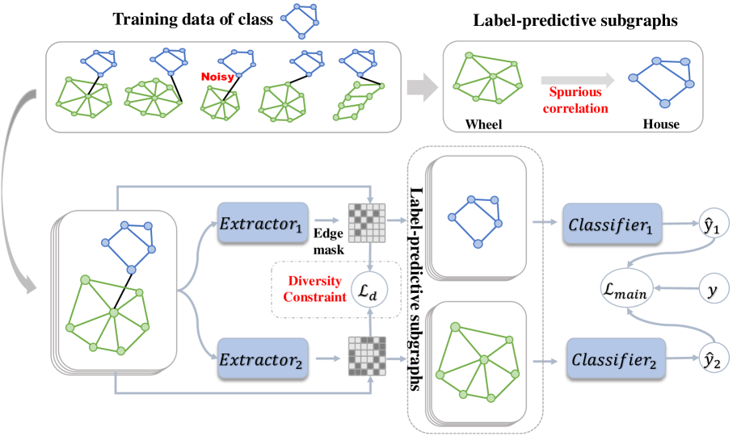

Figure 1. Overall framework of our method when the size of collections is two. The green subgraph (wheel pattern) and the blue subgraph (house pattern) are all label-predictive subgraphs and there exists a strong spurious correlation between these two structrual patterns. We train two models and impose them to attend to different label-predictive subgraph patterns using diversity regularization.

### 3.4. Model Architecture

Then, we describe the architecture of each model within the collection, where each model uniformly shares an identical architectural design and contributes to the learning objective.

#### 3.4.1. Predictive subgraph extractor

The first part is predictive subgraph extractor. We need to learn a graph mask matrix M∈{0,1}N×N𝑀superscript01𝑁𝑁M\in\{0,1\}^{N\times N}italic\_M ∈ { 0 , 1 } start\_POSTSUPERSCRIPT italic\_N × italic\_N end\_POSTSUPERSCRIPT to mask out the predictive subgraph and use it for the subsequent task. It is noteworthy to mention that we are not demand the extractor to extract a invariant subgraph but any predictive subgraph, which can be spurious subgraph or invariant subgraph.

We first encodes the input graph G𝐺Gitalic\_G via a GNN into a set of node representations {zi}vi∈Vsubscriptsubscript𝑧𝑖subscript𝑣𝑖𝑉\{z\_{i}\}\_{v\_{i}\in V}{ italic\_z start\_POSTSUBSCRIPT italic\_i end\_POSTSUBSCRIPT } start\_POSTSUBSCRIPT italic\_v start\_POSTSUBSCRIPT italic\_i end\_POSTSUBSCRIPT ∈ italic\_V end\_POSTSUBSCRIPT. For each edge (vi,vj)∈Esubscript𝑣𝑖subscript𝑣𝑗𝐸(v\_{i},v\_{j})\in E( italic\_v start\_POSTSUBSCRIPT italic\_i end\_POSTSUBSCRIPT , italic\_v start\_POSTSUBSCRIPT italic\_j end\_POSTSUBSCRIPT ) ∈ italic\_E, an MLP layer equipped with a sigmoid function is employed to map the concatenated representation of node pair (zi,zj)subscript𝑧𝑖subscript𝑧𝑗(z\_{i},z\_{j})( italic\_z start\_POSTSUBSCRIPT italic\_i end\_POSTSUBSCRIPT , italic\_z start\_POSTSUBSCRIPT italic\_j end\_POSTSUBSCRIPT ) into the masking probability of the edge between them pi⁢j∈[0,1]subscript𝑝𝑖𝑗01p\_{ij}\in[0,1]italic\_p start\_POSTSUBSCRIPT italic\_i italic\_j end\_POSTSUBSCRIPT ∈ [ 0 , 1 ]:

| (1) |  | Z=[⋯,zi,⋯,zj,⋯]⊤=G⁢N⁢Nm⁢a⁢s⁢k⁢(G)∈ℝn×d,𝑍superscript  ⋯subscript𝑧𝑖⋯subscript𝑧𝑗⋯ top𝐺𝑁subscript𝑁𝑚𝑎𝑠𝑘𝐺superscriptℝ𝑛𝑑\displaystyle Z=\left[\cdots,z\_{i},\cdots,z\_{j},\cdots\right]^{\top}=GNN\_{mask% }(G)\in\mathbb{R}^{n\times d},italic\_Z = [ ⋯ , italic\_z start\_POSTSUBSCRIPT italic\_i end\_POSTSUBSCRIPT , ⋯ , italic\_z start\_POSTSUBSCRIPT italic\_j end\_POSTSUBSCRIPT , ⋯ ] start\_POSTSUPERSCRIPT ⊤ end\_POSTSUPERSCRIPT = italic\_G italic\_N italic\_N start\_POSTSUBSCRIPT italic\_m italic\_a italic\_s italic\_k end\_POSTSUBSCRIPT ( italic\_G ) ∈ blackboard\_R start\_POSTSUPERSCRIPT italic\_n × italic\_d end\_POSTSUPERSCRIPT , |  |
| --- | --- | --- | --- |
| (2) |  | pi⁢j=σ⁢(M⁢L⁢Pm⁢a⁢s⁢k⁢([zi,zj])).subscript𝑝𝑖𝑗𝜎𝑀𝐿subscript𝑃𝑚𝑎𝑠𝑘subscript𝑧𝑖subscript𝑧𝑗\displaystyle p\_{ij}=\sigma(MLP\_{mask}([z\_{i},z\_{j}])).italic\_p start\_POSTSUBSCRIPT italic\_i italic\_j end\_POSTSUBSCRIPT = italic\_σ ( italic\_M italic\_L italic\_P start\_POSTSUBSCRIPT italic\_m italic\_a italic\_s italic\_k end\_POSTSUBSCRIPT ( [ italic\_z start\_POSTSUBSCRIPT italic\_i end\_POSTSUBSCRIPT , italic\_z start\_POSTSUBSCRIPT italic\_j end\_POSTSUBSCRIPT ] ) ) . |  |
| --- | --- | --- | --- |

where d𝑑ditalic\_d denotes the hidden dimension, σ⁢(⋅)𝜎⋅\sigma(\cdot)italic\_σ ( ⋅ ) denotes the sigmoid function, and [⋅,⋅]⋅⋅[\cdot,\cdot][ ⋅ , ⋅ ] denotes the concatenation.
For molecule dataset, the edge representation ei⁢jsubscript𝑒𝑖𝑗e\_{ij}italic\_e start\_POSTSUBSCRIPT italic\_i italic\_j end\_POSTSUBSCRIPT is also introduced to calculate the pi⁢jsubscript𝑝𝑖𝑗p\_{ij}italic\_p start\_POSTSUBSCRIPT italic\_i italic\_j end\_POSTSUBSCRIPT:

| (3) |  | pi⁢j=σ(MLPm⁢a⁢s⁢k([zi⊕ei⁢j,zj⊕ei⁢j]),p\_{ij}=\sigma(MLP\_{mask}([z\_{i}\oplus e\_{ij},z\_{j}\oplus e\_{ij}]),italic\_p start\_POSTSUBSCRIPT italic\_i italic\_j end\_POSTSUBSCRIPT = italic\_σ ( italic\_M italic\_L italic\_P start\_POSTSUBSCRIPT italic\_m italic\_a italic\_s italic\_k end\_POSTSUBSCRIPT ( [ italic\_z start\_POSTSUBSCRIPT italic\_i end\_POSTSUBSCRIPT ⊕ italic\_e start\_POSTSUBSCRIPT italic\_i italic\_j end\_POSTSUBSCRIPT , italic\_z start\_POSTSUBSCRIPT italic\_j end\_POSTSUBSCRIPT ⊕ italic\_e start\_POSTSUBSCRIPT italic\_i italic\_j end\_POSTSUBSCRIPT ] ) , |  |
| --- | --- | --- | --- |

where ⊕direct-sum\oplus⊕ denotes the element-wise sum of vectors.

Consequently, in each forward pass of the training process, we extract a predictive subgraph by sampling from Bernoulli distributions, denoted as mi⁢j∼B⁢e⁢r⁢n⁢(pi⁢j)similar-tosubscript𝑚𝑖𝑗𝐵𝑒𝑟𝑛subscript𝑝𝑖𝑗m\_{ij}\sim Bern(p\_{ij})italic\_m start\_POSTSUBSCRIPT italic\_i italic\_j end\_POSTSUBSCRIPT ∼ italic\_B italic\_e italic\_r italic\_n ( italic\_p start\_POSTSUBSCRIPT italic\_i italic\_j end\_POSTSUBSCRIPT ). Due to the inherent non-differentiability of Bernoulli sampling, direct sampling from B⁢e⁢r⁢n⁢(pi⁢j)𝐵𝑒𝑟𝑛subscript𝑝𝑖𝑗Bern(p\_{ij})italic\_B italic\_e italic\_r italic\_n ( italic\_p start\_POSTSUBSCRIPT italic\_i italic\_j end\_POSTSUBSCRIPT ) can not be optimized. To ensure the gradient of mi⁢jsubscript𝑚𝑖𝑗m\_{ij}italic\_m start\_POSTSUBSCRIPT italic\_i italic\_j end\_POSTSUBSCRIPT remains calculable, we apply the Gumbel-Sigmoid technique for sampling as:

| (4) |  | qi⁢j=G⁢u⁢m⁢b⁢e⁢l−S⁢i⁢g⁢m⁢o⁢i⁢d⁢(pi⁢j)=σ⁢(log⁡(pi⁢j)+𝔾τ),subscript𝑞𝑖𝑗𝐺𝑢𝑚𝑏𝑒𝑙𝑆𝑖𝑔𝑚𝑜𝑖𝑑subscript𝑝𝑖𝑗𝜎subscript𝑝𝑖𝑗𝔾𝜏q\_{ij}=Gumbel-Sigmoid(p\_{ij})=\sigma\left(\frac{\log(p\_{ij})+\mathbb{G}}{\tau}% \right),italic\_q start\_POSTSUBSCRIPT italic\_i italic\_j end\_POSTSUBSCRIPT = italic\_G italic\_u italic\_m italic\_b italic\_e italic\_l - italic\_S italic\_i italic\_g italic\_m italic\_o italic\_i italic\_d ( italic\_p start\_POSTSUBSCRIPT italic\_i italic\_j end\_POSTSUBSCRIPT ) = italic\_σ ( divide start\_ARG roman\_log ( italic\_p start\_POSTSUBSCRIPT italic\_i italic\_j end\_POSTSUBSCRIPT ) + blackboard\_G end\_ARG start\_ARG italic\_τ end\_ARG ) , |  |
| --- | --- | --- | --- |

| (5) |  | qi⁢j′={1if ⁢qi⁢j>0.5,0if ⁢qi⁢j≤0.5,subscriptsuperscript𝑞′𝑖𝑗cases1if subscript𝑞𝑖𝑗0.50if subscript𝑞𝑖𝑗0.5q^{\prime}\_{ij}=\begin{cases}1&\text{if\quad}q\_{ij}>0.5,\\ 0&\text{if\quad}q\_{ij}\leq 0.5,\end{cases}italic\_q start\_POSTSUPERSCRIPT ′ end\_POSTSUPERSCRIPT start\_POSTSUBSCRIPT italic\_i italic\_j end\_POSTSUBSCRIPT = { start\_ROW start\_CELL 1 end\_CELL start\_CELL if italic\_q start\_POSTSUBSCRIPT italic\_i italic\_j end\_POSTSUBSCRIPT > 0.5 , end\_CELL end\_ROW start\_ROW start\_CELL 0 end\_CELL start\_CELL if italic\_q start\_POSTSUBSCRIPT italic\_i italic\_j end\_POSTSUBSCRIPT ≤ 0.5 , end\_CELL end\_ROW |  |
| --- | --- | --- | --- |

| (6) |  | mi⁢j=qi⁢j′+pi⁢j−pi⁢j⟂,subscript𝑚𝑖𝑗subscriptsuperscript𝑞′𝑖𝑗subscript𝑝𝑖𝑗superscriptsubscript𝑝𝑖𝑗perpendicular-tom\_{ij}=q^{\prime}\_{ij}+p\_{ij}-p\_{ij}^{\perp},italic\_m start\_POSTSUBSCRIPT italic\_i italic\_j end\_POSTSUBSCRIPT = italic\_q start\_POSTSUPERSCRIPT ′ end\_POSTSUPERSCRIPT start\_POSTSUBSCRIPT italic\_i italic\_j end\_POSTSUBSCRIPT + italic\_p start\_POSTSUBSCRIPT italic\_i italic\_j end\_POSTSUBSCRIPT - italic\_p start\_POSTSUBSCRIPT italic\_i italic\_j end\_POSTSUBSCRIPT start\_POSTSUPERSCRIPT ⟂ end\_POSTSUPERSCRIPT , |  |
| --- | --- | --- | --- |

where 𝔾=−log⁡(−log⁡(U))𝔾𝑈\mathbb{G}=-\log(-\log(U))blackboard\_G = - roman\_log ( - roman\_log ( italic\_U ) ) represents the Gumbel distribution, in which U∼U⁢n⁢i⁢f⁢o⁢r⁢m⁢(0,1)similar-to𝑈𝑈𝑛𝑖𝑓𝑜𝑟𝑚01U\sim Uniform(0,1)italic\_U ∼ italic\_U italic\_n italic\_i italic\_f italic\_o italic\_r italic\_m ( 0 , 1 ). Given the non-differentiable nature of qi⁢j′subscriptsuperscript𝑞′𝑖𝑗q^{\prime}\_{ij}italic\_q start\_POSTSUPERSCRIPT ′ end\_POSTSUPERSCRIPT start\_POSTSUBSCRIPT italic\_i italic\_j end\_POSTSUBSCRIPT, we implement the straight-through trick (as delineated in equation ([6](https://arxiv.org/html/2408.04400v1#S3.E6 "In 3.4.1. Predictive subgraph extractor ‣ 3.4. Model Architecture ‣ 3. Method ‣ DIVE: Subgraph Disagreement for Graph Out-of-Distribution Generalization"))) to confer a gradient onto mi⁢jsubscript𝑚𝑖𝑗m\_{ij}italic\_m start\_POSTSUBSCRIPT italic\_i italic\_j end\_POSTSUBSCRIPT. The symbol ⟂perpendicular-to\perp⟂ signifies the cessation of gradient propagation.

The extracted predictive subgraph can be denoted as an induced adjacent matrix AP=M⊙Asubscript𝐴𝑃direct-product𝑀𝐴A\_{P}=M\odot Aitalic\_A start\_POSTSUBSCRIPT italic\_P end\_POSTSUBSCRIPT = italic\_M ⊙ italic\_A, where M𝑀Mitalic\_M denotes the learned mask matrix, composed of elements mi⁢jsubscript𝑚𝑖𝑗m\_{ij}italic\_m start\_POSTSUBSCRIPT italic\_i italic\_j end\_POSTSUBSCRIPT. A𝐴Aitalic\_A is the adjacent matrix of original graph G𝐺Gitalic\_G, and ⊙direct-product\odot⊙ symbolizes the element-wise multiplication. The subgraph corresponding to APsubscript𝐴𝑃A\_{P}italic\_A start\_POSTSUBSCRIPT italic\_P end\_POSTSUBSCRIPT is denoted as GPsubscript𝐺𝑃G\_{P}italic\_G start\_POSTSUBSCRIPT italic\_P end\_POSTSUBSCRIPT.

#### 3.4.2. Subgraph encoder and classifier

After obtaining the predictive subgraph GPsubscript𝐺𝑃G\_{P}italic\_G start\_POSTSUBSCRIPT italic\_P end\_POSTSUBSCRIPT, we train a GNN model to map the induced subgraph into representation hgsubscriptℎ𝑔h\_{g}italic\_h start\_POSTSUBSCRIPT italic\_g end\_POSTSUBSCRIPT, which is fed into the following MLP layer to conduct classification or regression. Formally,

| (7) |  | 𝐇=[h1,⋯,hn]⊤=G⁢N⁢Nf⁢e⁢a⁢t⁢(GP),𝐇superscript  subscriptℎ1⋯subscriptℎ𝑛 top𝐺𝑁subscript𝑁𝑓𝑒𝑎𝑡subscript𝐺𝑃\displaystyle\mathbf{H}=\left[h\_{1},\cdots,h\_{n}\right]^{\top}=GNN\_{feat}(G\_{P% }),bold\_H = [ italic\_h start\_POSTSUBSCRIPT 1 end\_POSTSUBSCRIPT , ⋯ , italic\_h start\_POSTSUBSCRIPT italic\_n end\_POSTSUBSCRIPT ] start\_POSTSUPERSCRIPT ⊤ end\_POSTSUPERSCRIPT = italic\_G italic\_N italic\_N start\_POSTSUBSCRIPT italic\_f italic\_e italic\_a italic\_t end\_POSTSUBSCRIPT ( italic\_G start\_POSTSUBSCRIPT italic\_P end\_POSTSUBSCRIPT ) , |  |
| --- | --- | --- | --- |
| (8) |  | hG=R⁢E⁢A⁢D⁢O⁢U⁢T⁢(𝐇),subscriptℎ𝐺𝑅𝐸𝐴𝐷𝑂𝑈𝑇𝐇\displaystyle h\_{G}=READOUT(\mathbf{H}),italic\_h start\_POSTSUBSCRIPT italic\_G end\_POSTSUBSCRIPT = italic\_R italic\_E italic\_A italic\_D italic\_O italic\_U italic\_T ( bold\_H ) , |  |
| --- | --- | --- | --- |
| (9) |  | y^=M⁢L⁢P⁢(hG)∈𝒴.^𝑦𝑀𝐿𝑃subscriptℎ𝐺𝒴\displaystyle\hat{y}=MLP(h\_{G})\in\mathcal{Y}.over^ start\_ARG italic\_y end\_ARG = italic\_M italic\_L italic\_P ( italic\_h start\_POSTSUBSCRIPT italic\_G end\_POSTSUBSCRIPT ) ∈ caligraphic\_Y . |  |
| --- | --- | --- | --- |

#### 3.4.3. Main task loss

The main task loss can be denoted as:

| (10) |  | ℒm⁢a⁢i⁢n=ℛ⁢(Y^,Y),subscriptℒ𝑚𝑎𝑖𝑛ℛ^𝑌𝑌\mathcal{L}\_{main}=\mathcal{R}(\hat{Y},Y),caligraphic\_L start\_POSTSUBSCRIPT italic\_m italic\_a italic\_i italic\_n end\_POSTSUBSCRIPT = caligraphic\_R ( over^ start\_ARG italic\_Y end\_ARG , italic\_Y ) , |  |
| --- | --- | --- | --- |

where ℛℛ\mathcal{R}caligraphic\_R represents the task-tailored loss function. For regression tasks, this function implemented with the mean squared error, whereas for classification tasks, it is the cross-entropy function.

### 3.5. Diversity via Subgraph Disagreement

To infuse diversity into the models within the collection, we purposefully advocate for each model to focus on distinct subgraphs. Assume the collection contain m𝑚mitalic\_m models, the set of predictive masks corresponding to each model can be denoted as

| (11) |  | SM={M1,⋯,Mm}.subscript𝑆𝑀subscript𝑀1⋯subscript𝑀𝑚S\_{M}=\left\{{M}\_{1},\cdots,{M}\_{m}\right\}.italic\_S start\_POSTSUBSCRIPT italic\_M end\_POSTSUBSCRIPT = { italic\_M start\_POSTSUBSCRIPT 1 end\_POSTSUBSCRIPT , ⋯ , italic\_M start\_POSTSUBSCRIPT italic\_m end\_POSTSUBSCRIPT } . |  |
| --- | --- | --- | --- |

We apply a jaccard loss as diversity regularizer to penalize the overlapping of each pair of predictive mask in the set:

| (12) |  | ℒd=∑i,jMi∩MjMi∪Mj/∑i,j1.\mathcal{L}\_{d}=\left.\sum\_{i,j}\frac{M\_{i}\cap M\_{j}}{M\_{i}\cup M\_{j}}\middle% /\right.\sum\_{i,j}1.caligraphic\_L start\_POSTSUBSCRIPT italic\_d end\_POSTSUBSCRIPT = ∑ start\_POSTSUBSCRIPT italic\_i , italic\_j end\_POSTSUBSCRIPT divide start\_ARG italic\_M start\_POSTSUBSCRIPT italic\_i end\_POSTSUBSCRIPT ∩ italic\_M start\_POSTSUBSCRIPT italic\_j end\_POSTSUBSCRIPT end\_ARG start\_ARG italic\_M start\_POSTSUBSCRIPT italic\_i end\_POSTSUBSCRIPT ∪ italic\_M start\_POSTSUBSCRIPT italic\_j end\_POSTSUBSCRIPT end\_ARG / ∑ start\_POSTSUBSCRIPT italic\_i , italic\_j end\_POSTSUBSCRIPT 1 . |  |
| --- | --- | --- | --- |

where i,j∈{1,2,…,m},i≠jformulae-sequence

𝑖𝑗
12…𝑚𝑖𝑗i,j\in\{1,2,\ldots,m\},i\neq jitalic\_i , italic\_j ∈ { 1 , 2 , … , italic\_m } , italic\_i ≠ italic\_j are indices of different models.

### 3.6. Learning Objective

Combining main task loss on each model and diversity regularizer, the total loss of the collection containing m𝑚mitalic\_m models is defined as:

| (13) |  | ℒ=1m⁢∑i=1mℒm⁢a⁢i⁢ni+λ⁢ℒd,ℒ1𝑚superscriptsubscript𝑖1𝑚superscriptsubscriptℒ𝑚𝑎𝑖𝑛𝑖𝜆subscriptℒ𝑑\mathcal{L}=\frac{1}{m}\sum\_{i=1}^{m}\mathcal{L}\_{main}^{i}+\lambda\mathcal{L}% \_{d},caligraphic\_L = divide start\_ARG 1 end\_ARG start\_ARG italic\_m end\_ARG ∑ start\_POSTSUBSCRIPT italic\_i = 1 end\_POSTSUBSCRIPT start\_POSTSUPERSCRIPT italic\_m end\_POSTSUPERSCRIPT caligraphic\_L start\_POSTSUBSCRIPT italic\_m italic\_a italic\_i italic\_n end\_POSTSUBSCRIPT start\_POSTSUPERSCRIPT italic\_i end\_POSTSUPERSCRIPT + italic\_λ caligraphic\_L start\_POSTSUBSCRIPT italic\_d end\_POSTSUBSCRIPT , |  |
| --- | --- | --- | --- |

where λ𝜆\lambdaitalic\_λ is the hyper-parameter to control the weight of diversity regularization and we set it as 0.5 for all the experiments.

### 3.7. Model Selection

We employ an OOD validation set for model selection, opting for the model that exhibits the highest validation accuracy across our collection for inference on the test set. The use of an OOD validation set has become a standard practice in contemporary graph-based OOD methods for model selection (Xiang et al., [2023](https://arxiv.org/html/2408.04400v1#bib.bib50); Chen et al., [2023](https://arxiv.org/html/2408.04400v1#bib.bib7)). In our experiment, the baseline results were chosen using the same validation set as our method, ensuring absolute fairness. We have also included the results using the in-distribution (ID) validation set to further demonstrate the efficacy of our methodologies. These results are available at appendix [D](https://arxiv.org/html/2408.04400v1#A4 "Appendix D The results using ID validation set ‣ DIVE: Subgraph Disagreement for Graph Out-of-Distribution Generalization").

1

Input: Dt⁢r⁢a⁢i⁢nsubscript𝐷𝑡𝑟𝑎𝑖𝑛D\_{train}italic\_D start\_POSTSUBSCRIPT italic\_t italic\_r italic\_a italic\_i italic\_n end\_POSTSUBSCRIPT: training set. Dv⁢a⁢lsubscript𝐷𝑣𝑎𝑙D\_{val}italic\_D start\_POSTSUBSCRIPT italic\_v italic\_a italic\_l end\_POSTSUBSCRIPT: validation set. Θ⟵{h1∘t1,⋯,hm∘tm}⟵Θsubscriptℎ1subscript𝑡1⋯subscriptℎ𝑚subscript𝑡𝑚\Theta\longleftarrow\{h\_{1}\circ t\_{1},\cdots,h\_{m}\circ t\_{m}\}roman\_Θ ⟵ { italic\_h start\_POSTSUBSCRIPT 1 end\_POSTSUBSCRIPT ∘ italic\_t start\_POSTSUBSCRIPT 1 end\_POSTSUBSCRIPT , ⋯ , italic\_h start\_POSTSUBSCRIPT italic\_m end\_POSTSUBSCRIPT ∘ italic\_t start\_POSTSUBSCRIPT italic\_m end\_POSTSUBSCRIPT }: the parameter space of predictor collection.

Output: h∗∘t∗superscriptℎsuperscript𝑡h^{\*}\circ t^{\*}italic\_h start\_POSTSUPERSCRIPT ∗ end\_POSTSUPERSCRIPT ∘ italic\_t start\_POSTSUPERSCRIPT ∗ end\_POSTSUPERSCRIPT: the best preditor

2

3Initialize the parameter ΘΘ\Thetaroman\_Θ;

4while *not converged* do

5      
for *Each Batch Gt⁢r⁢a⁢i⁢nBsuperscriptsubscript𝐺𝑡𝑟𝑎𝑖𝑛𝐵G\_{train}^{B}italic\_G start\_POSTSUBSCRIPT italic\_t italic\_r italic\_a italic\_i italic\_n end\_POSTSUBSCRIPT start\_POSTSUPERSCRIPT italic\_B end\_POSTSUPERSCRIPT in Dt⁢r⁢a⁢i⁢nsubscript𝐷𝑡𝑟𝑎𝑖𝑛D\_{train}italic\_D start\_POSTSUBSCRIPT italic\_t italic\_r italic\_a italic\_i italic\_n end\_POSTSUBSCRIPT* do

6            
for *each model hi∘ti∈Θsubscriptℎ𝑖subscript𝑡𝑖Θh\_{i}\circ t\_{i}\in\Thetaitalic\_h start\_POSTSUBSCRIPT italic\_i end\_POSTSUBSCRIPT ∘ italic\_t start\_POSTSUBSCRIPT italic\_i end\_POSTSUBSCRIPT ∈ roman\_Θ* do

                  
Mi⟵ti⁢(Gt⁢r⁢a⁢i⁢nB)⟵subscript𝑀𝑖subscript𝑡𝑖superscriptsubscript𝐺𝑡𝑟𝑎𝑖𝑛𝐵M\_{i}\longleftarrow t\_{i}(G\_{train}^{B})italic\_M start\_POSTSUBSCRIPT italic\_i end\_POSTSUBSCRIPT ⟵ italic\_t start\_POSTSUBSCRIPT italic\_i end\_POSTSUBSCRIPT ( italic\_G start\_POSTSUBSCRIPT italic\_t italic\_r italic\_a italic\_i italic\_n end\_POSTSUBSCRIPT start\_POSTSUPERSCRIPT italic\_B end\_POSTSUPERSCRIPT ) // get subgraph mask for each model 

7                  

                  Gpi⟵Mi⊙Gt⁢r⁢a⁢i⁢nB⟵superscriptsubscript𝐺𝑝𝑖direct-productsubscript𝑀𝑖superscriptsubscript𝐺𝑡𝑟𝑎𝑖𝑛𝐵G\_{p}^{i}\longleftarrow M\_{i}\odot G\_{train}^{B}italic\_G start\_POSTSUBSCRIPT italic\_p end\_POSTSUBSCRIPT start\_POSTSUPERSCRIPT italic\_i end\_POSTSUPERSCRIPT ⟵ italic\_M start\_POSTSUBSCRIPT italic\_i end\_POSTSUBSCRIPT ⊙ italic\_G start\_POSTSUBSCRIPT italic\_t italic\_r italic\_a italic\_i italic\_n end\_POSTSUBSCRIPT start\_POSTSUPERSCRIPT italic\_B end\_POSTSUPERSCRIPT // get the label-predictive subgraph 

8                  

                  Y^⟵hi⁢(Gpi)⟵^𝑌subscriptℎ𝑖superscriptsubscript𝐺𝑝𝑖\hat{Y}\longleftarrow h\_{i}(G\_{p}^{i})over^ start\_ARG italic\_Y end\_ARG ⟵ italic\_h start\_POSTSUBSCRIPT italic\_i end\_POSTSUBSCRIPT ( italic\_G start\_POSTSUBSCRIPT italic\_p end\_POSTSUBSCRIPT start\_POSTSUPERSCRIPT italic\_i end\_POSTSUPERSCRIPT ) // get the prediction 

9                  

                  ℒm⁢a⁢i⁢ni⟵ℛ⁢(Y^,Y)⟵superscriptsubscriptℒ𝑚𝑎𝑖𝑛𝑖ℛ^𝑌𝑌\mathcal{L}\_{main}^{i}\longleftarrow\mathcal{R}(\hat{Y},Y)caligraphic\_L start\_POSTSUBSCRIPT italic\_m italic\_a italic\_i italic\_n end\_POSTSUBSCRIPT start\_POSTSUPERSCRIPT italic\_i end\_POSTSUPERSCRIPT ⟵ caligraphic\_R ( over^ start\_ARG italic\_Y end\_ARG , italic\_Y ) // calculate the loss of main task 

10                  

                  SMsubscript𝑆𝑀S\_{M}italic\_S start\_POSTSUBSCRIPT italic\_M end\_POSTSUBSCRIPT.append(Misubscript𝑀𝑖M\_{i}italic\_M start\_POSTSUBSCRIPT italic\_i end\_POSTSUBSCRIPT) // add mask to the mask set 

11                  

12            

            ℒd=∑i,jMi∩MjMi∪Mj/∑i,j1.\mathcal{L}\_{d}=\left.\sum\_{i,j}\frac{M\_{i}\cap M\_{j}}{M\_{i}\cup M\_{j}}\middle%
/\right.\sum\_{i,j}1.caligraphic\_L start\_POSTSUBSCRIPT italic\_d end\_POSTSUBSCRIPT = ∑ start\_POSTSUBSCRIPT italic\_i , italic\_j end\_POSTSUBSCRIPT divide start\_ARG italic\_M start\_POSTSUBSCRIPT italic\_i end\_POSTSUBSCRIPT ∩ italic\_M start\_POSTSUBSCRIPT italic\_j end\_POSTSUBSCRIPT end\_ARG start\_ARG italic\_M start\_POSTSUBSCRIPT italic\_i end\_POSTSUBSCRIPT ∪ italic\_M start\_POSTSUBSCRIPT italic\_j end\_POSTSUBSCRIPT end\_ARG / ∑ start\_POSTSUBSCRIPT italic\_i , italic\_j end\_POSTSUBSCRIPT 1 . // calculate the diversity loss 

13            

            ℒ=1m⁢∑i=1mℒm⁢a⁢i⁢ni+λ⁢ℒdℒ1𝑚superscriptsubscript𝑖1𝑚superscriptsubscriptℒ𝑚𝑎𝑖𝑛𝑖𝜆subscriptℒ𝑑\mathcal{L}=\frac{1}{m}\sum\_{i=1}^{m}\mathcal{L}\_{main}^{i}+\lambda\mathcal{L}%
\_{d}caligraphic\_L = divide start\_ARG 1 end\_ARG start\_ARG italic\_m end\_ARG ∑ start\_POSTSUBSCRIPT italic\_i = 1 end\_POSTSUBSCRIPT start\_POSTSUPERSCRIPT italic\_m end\_POSTSUPERSCRIPT caligraphic\_L start\_POSTSUBSCRIPT italic\_m italic\_a italic\_i italic\_n end\_POSTSUBSCRIPT start\_POSTSUPERSCRIPT italic\_i end\_POSTSUPERSCRIPT + italic\_λ caligraphic\_L start\_POSTSUBSCRIPT italic\_d end\_POSTSUBSCRIPT // calculate the total loss 

14            

            Θ⟵Θ−α⁢ΔΘ⁢(ℒ)⟵ΘΘ𝛼subscriptΔΘℒ\Theta\longleftarrow\Theta-\alpha\Delta\_{\Theta}(\mathcal{L})roman\_Θ ⟵ roman\_Θ - italic\_α roman\_Δ start\_POSTSUBSCRIPT roman\_Θ end\_POSTSUBSCRIPT ( caligraphic\_L ) // update the paramter 

15            

16      

Select the best predictor h∗∘t∗superscriptℎsuperscript𝑡h^{\*}\circ t^{\*}italic\_h start\_POSTSUPERSCRIPT ∗ end\_POSTSUPERSCRIPT ∘ italic\_t start\_POSTSUPERSCRIPT ∗ end\_POSTSUPERSCRIPT using the validation accuracy.

Algorithm 1 Training algorithm for DIVE

## 4. Experiment

In this section, we conduct extensive experiments to answer the research questions. (RQ1): Can our method DIVE achieve better OOD generalization performance against SOTA baselines?
(RQ2):Does our method extract subgraphs more accurately than the current methods?
(RQ3): Does our regularization really bring diversity to the models in the collection? Is there a model in the collection capable of recognizing invariant structural patterns?
(RQ4):What influence does the number of models have on the performance?
(RQ5):Does our method robust to the weight of diversity loss?

### 4.1. Experimental Setup

#### 4.1.1. Datasets

We employ GOOD and DrugOOD benchmark of graph OOD performance evaluation.

- •
  
  GOOD (Gui et al., [2022](https://arxiv.org/html/2408.04400v1#bib.bib12)), GOOD is a systematic graph OOD benchmark. It contains two types of distribution shift, covariate shift and concept shift. In covariate shift, the distribution of input differs. Formally, Pt⁢r⁢a⁢i⁢n⁢(G)≠Pt⁢e⁢s⁢t⁢(G)subscript𝑃𝑡𝑟𝑎𝑖𝑛𝐺subscript𝑃𝑡𝑒𝑠𝑡𝐺P\_{train}(G)\neq P\_{test}(G)italic\_P start\_POSTSUBSCRIPT italic\_t italic\_r italic\_a italic\_i italic\_n end\_POSTSUBSCRIPT ( italic\_G ) ≠ italic\_P start\_POSTSUBSCRIPT italic\_t italic\_e italic\_s italic\_t end\_POSTSUBSCRIPT ( italic\_G ) and Pt⁢r⁢a⁢i⁢n⁢(Y|G)=Pt⁢e⁢s⁢t⁢(Y|G)subscript𝑃𝑡𝑟𝑎𝑖𝑛conditional𝑌𝐺subscript𝑃𝑡𝑒𝑠𝑡conditional𝑌𝐺P\_{train}(Y|G)=P\_{test}(Y|G)italic\_P start\_POSTSUBSCRIPT italic\_t italic\_r italic\_a italic\_i italic\_n end\_POSTSUBSCRIPT ( italic\_Y | italic\_G ) = italic\_P start\_POSTSUBSCRIPT italic\_t italic\_e italic\_s italic\_t end\_POSTSUBSCRIPT ( italic\_Y | italic\_G ). While concept shift occurs when the conditional distribution changes as Pt⁢r⁢a⁢i⁢n(Y|G)≠Ptest(Y|G)P\_{train}(Y|G)\neq P\_{test(}Y|G)italic\_P start\_POSTSUBSCRIPT italic\_t italic\_r italic\_a italic\_i italic\_n end\_POSTSUBSCRIPT ( italic\_Y | italic\_G ) ≠ italic\_P start\_POSTSUBSCRIPT italic\_t italic\_e italic\_s italic\_t ( end\_POSTSUBSCRIPT italic\_Y | italic\_G ) and Pt⁢r⁢a⁢i⁢n⁢(G)=Pt⁢e⁢s⁢t⁢(G)subscript𝑃𝑡𝑟𝑎𝑖𝑛𝐺subscript𝑃𝑡𝑒𝑠𝑡𝐺P\_{train}(G)=P\_{test}(G)italic\_P start\_POSTSUBSCRIPT italic\_t italic\_r italic\_a italic\_i italic\_n end\_POSTSUBSCRIPT ( italic\_G ) = italic\_P start\_POSTSUBSCRIPT italic\_t italic\_e italic\_s italic\_t end\_POSTSUBSCRIPT ( italic\_G ). Since these two types of distribution shift both contain the spurious correlation, we consider both case in our experiments. We choose four graph-level datasets GOODMotif, GOODHIV, GOODZINC and GOODSST2 to evaluate the graph generalization ability. There are 4 domain in these 4 datasets: basis, scaffold, size and length. The details of the four datasets can be found at appendix [A](https://arxiv.org/html/2408.04400v1#A1 "Appendix A The details of datasets ‣ DIVE: Subgraph Disagreement for Graph Out-of-Distribution Generalization").
- •
  
  DrugOOD is an OOD benchmark for AI-aided drug discovery, offering three environment-splitting strategies: assay, scaffold, and size. These strategies are applied to two measurements, IC50 and EC50. Since the scaffold and size domains overlap with the GOOD benchmark, we focus exclusively on testing the model’s generalization ability in the assay domain of IC50 measurement in the DrugOOD benchmark.

#### 4.1.2. Baselines

We adopted 14 OOD algorithms as baselines including nine graph-specific methods. First, we introduce the general OOD algorithms used for Euclidean data. We utilize two invariant learning baselines based on the invariant prediction assumption. IRM (Arjovsky et al., [2019](https://arxiv.org/html/2408.04400v1#bib.bib2)) seeks data representations that perform well across all environments by penalizing features distributions that require different optimal linear classifier for each environment. VREx (Krueger et al., [2021](https://arxiv.org/html/2408.04400v1#bib.bib18)) reducing the variance of risk in test environments by minimizing the risk variances in training environments. Additionally, we implement two domain adaptation algorithms aimed at minimizing feature discrepancies. DANN (Ganin et al., [2015](https://arxiv.org/html/2408.04400v1#bib.bib10)) adversarially trains a regular classifier and a domain classifier to render features in distinguishable. Deep Coral (Sun and Saenko, [2016](https://arxiv.org/html/2408.04400v1#bib.bib37)) minimizes the deviation of covariant matrices from different domains to encourage features similarity across domains. GroupDRO (Sagawa et al., [2020](https://arxiv.org/html/2408.04400v1#bib.bib29)) addresses the issue of distribution minorities lacking sufficient training through fair optimization, also known as risk interpolation, by explicitly minimizing the loss in the worst training environment. These five methods all need environment labels information.

To evaluate the performance of current OOD methods specifically for graphs, we include nine graph OOD methods. Mixup (Wang et al., [2021](https://arxiv.org/html/2408.04400v1#bib.bib44)) is a data augmentation method designed for graph data. DIR (Wu et al., [2021](https://arxiv.org/html/2408.04400v1#bib.bib46)) selects a subset of graph representations as causal rationales and uses interventional data augmentation to create multiple environments. GSAT (Miao et al., [2022](https://arxiv.org/html/2408.04400v1#bib.bib24)) proposes to build an interpretable graph learning method through attention mechanism and information bottleneck and inject stochasticity into the attention to select label-relevant subgraphs. CIGA (Chen et al., [2022](https://arxiv.org/html/2408.04400v1#bib.bib8)) proposes an information-theoretic objective to extract the desired invariant subgraphs from the lens of causality. GREA (Liu et al., [2022](https://arxiv.org/html/2408.04400v1#bib.bib22)) identifies subgraph structures called rationales by environment replacement to create virtual data points to improve generalizability and interpretability. CAL (Sui et al., [2022](https://arxiv.org/html/2408.04400v1#bib.bib36)) proposes a causal attention learning strategy for graph classification to encourage GNNs to exploit causal features while ignoring the shortcut paths. DisC (Fan et al., [2022](https://arxiv.org/html/2408.04400v1#bib.bib9)) analyzes the generalization problem of GNNs in a causal view and proposes a disentangling framework for graphs to learn causal and bias substructure. MoleOOD (Yang et al., [2022](https://arxiv.org/html/2408.04400v1#bib.bib52)) investigates the OOD problem on molecules and designs an environment inference model and a substructure attention model to learn environment-invariant molecular substructures. iMoLD (Xiang et al., [2023](https://arxiv.org/html/2408.04400v1#bib.bib50)) introduce a residual vector quantization module that mitigates the over-fitting to training data distributions while preserving the expressivity of encoders.

#### 4.1.3. Evaluation metrics

Consistent with the settings in GOOD benchmark (Gui et al., [2022](https://arxiv.org/html/2408.04400v1#bib.bib12)), We present the accuracy (ACC) for GOODMotif and GOODSST2, and report ROC-AUC score for GOOD-HIV and DrugOOD, as they are binary classification tasks. Additionally, we report the Mean Average Error (MAE) for GOODZINC dataset since it’s regression task. Our experiments are conducted 10 times using different random seeds. Models are selected based on their performance in the validation dataset, and we report the mean and standard deviations on the test set.

#### 4.1.4. Implementation Details

For the training confiuration settings, we employ the Adam optimizer with a weight decay of 0 and a dropout rate of 0.5. The GNN models consist of three convolutional layers. Mean global pooling and the Rectified Linear Unit (ReLU) activation function are utilized, with a hidden layer dimension of 300. The batch size is set to 32, the maximum number of epochs is 300, and the initial learning rate is 1e-3. During the training process, all models are trained until convergence is achieved. In terms of computational resources, we typically employ one NVIDIA GeForce RTX 3090 for each individual experiment. For the hyperparamtere selection, indeed, one main advantage of our method is that our method does not need laborious hyper-paramter tuning. Our method only has one hyper-parameter: the weight λ𝜆\lambdaitalic\_λ of diveristy loss, and we set is as 0.5 for all settings.

### 4.2. Result Comparison and Analysis

Table 1. Results of synthetic datasets and text-attributed datasets. We use the accuracy ACC (%) as the evaluation metric. The best and the second-best results are highlighted in bold and underline respectively. DIVE-N means that the size of the predictor collection is N.

| Method | GOOD-Motif ↑↑\uparrow↑ | | | | GOOD-SST2 ↑↑\uparrow↑ | |
| --- | --- | --- | --- | --- | --- | --- |
|  | basis | | size | | length | |
|  | covariate | concept | covariate | concept | covariate | concept |
| ERM | 63.80(10.36) | 81.31(0.69) | 53.46(4.08) | 70.83(0.79) | 80.52(1.13) | 72.92(1.10) |
| IRM | 59.93(11.46) | 80.37(0.80) | 53.68(4.11) | 70.15(0.64) | 80.75(1.17) | 77.45(2.37) |
| VREx | 66.53(4.04) | 81.34(0.75) | 54.47(3.42) | 70.58(1.16) | 80.20(1.39) | 72.92(0.95) |
| GroupDRO | 61.96(8.27) | 81.00(0.60) | 51.69(2.22) | 70.35(0.40) | 81.67(0.45) | 72.51(0.79) |
| Coral | 66.23(9.01) | 81.47(0.49) | 53.71(2.75) | 70.52(0.59) | 78.94(1.22) | 72.98(0.46) |
| DANN | 51.54(7.28) | 81.43(0.60) | 51.86(2.44) | 70.74(0.65) | 80.53(1.40) | 74.10(1.49) |
| Mixup | 69.67(5.86) | 77.64(0.58) | 51.31(2.56) | 68.21(0.89) | 80.77(1.03) | 72.57(0.76) |
| DIR | 39.99(5.50) | 82.96(4.47) | 44.83(4.00) | 54.96(9.32) | 81.55(1.06) | 67.98(3.07) |
| GSAT | 55.13(5.41) | 75.30(1.57) | 60.76(5.94) | 59.00(3.42) | 81.49(0.76) | 74.54(1.40) |
| CIGA | 67.15(8.19) | 77.48(2.54) | 54.42(3.11) | 70.65(4.81) | 80.44(1.24) | 71.18(1.91) |
| DIVE-2 | 84.05(5.25) | 92.01(1.47) | 73.73(2.41) | 71.02(1.12) | 83.08(1.01) | 75.74(1.14) |
| DIVE-3 | 85.77(4.32) | 89.05(2.34) | 75.05(3.36) | 72.01(4.15) | 83.44(1.21) | 75.89(1.33) |
| DIVE-4 | 80.23(3.45) | 88.90(2.88) | 68.77(4.64) | 70.10(4.71) | 83.71(1.33) | 75.67(1.28) |
| ΔΔ\Deltaroman\_Δ*Improve.* | 23.10 % | 10.90% | 23.46% | 1.66% | 2.49% | -2.01% |
| w/o diversity | 70.13(5.41) | 78.30(1.01) | 61.71(2.09) | 58.00(1.04) | 81.01(0.75) | 73.24(1.21) |

Table 2. Overall performance of molecular datasets. We compare the performance of 14 methods on three molecular datasets. The results of GOODHIV and DrugOOD are reported in terms of ROC-AUC. The results of GOODZINC are reported using MAE. - denotes abnormal results caused by under-fitting declared in GOOD benchmark, and / denotes that the method cannot be applied to this dataset.

| Method | GOOD-ZINC ↓↓\downarrow↓ | | | | GOOD-HIV↑↑\uparrow↑ | | | | DrugOOD↑↑\uparrow↑ |
| --- | --- | --- | --- | --- | --- | --- | --- | --- | --- |
|  | scaffold | | size | | scaffold | | size | | assay |
|  | covariate | concept | covariate | concept | covariate | concept | covariate | concept | covariate |
| ERM | 0.1802(0.0174) | 0.1301(0.0052) | 0.2319(0.0072) | 0.1325(0.0085) | 69.55(2.39) | 72.48(1.26) | 59.19(2.29) | 61.91(2.29) | 71.63(0.76) |
| IRM | 0.2164(0.0160) | 0.1339(0.0043) | 0.6984(0.2809) | 0.1336(0.0055) | 70.17(2.78) | 71.78(1.37) | 59.94(1.59) | -(-) | 71.15(0.57) |
| VREx | 0.1815(0.0154) | 0.1287(0.0053) | 0.2270(0.0136) | 0.1311(0.0067) | 69.34(3.54) | 72.21(1.42) | 58.49(2.28) | 61.21(2.00) | 72.32(0.58) |
| GroupDRO | 0.1870(0.0128) | 0.1323(0.0041) | 0.2377(0.0147) | 0.1333(0.0064) | 68.15(2.84) | 71.48(1.27) | 57.75(2.86) | 59.77(1.95) | 71.57(0.48) |
| Coral | 0.1769(0.0152) | 0.1303(0.0057) | 0.2292(0.0090) | 0.1261(0.0060) | 70.69(2.25) | 72.96(1.06) | 59.39(2.90) | 60.29(2.50) | 71.28(0.91) |
| DANN | 0.1746(0.0084) | 0.1269(0.0042) | 0.2326(0.0140) | 0.1348(0.0091) | 69.43(2.42) | 71.70(0.90) | 62.38(2.65) | 65.15(3.13) | 69.84(1.41) |
| Mixup | 0.2066(0.0123) | 0.1391(0.0071) | 0.2531(0.0150) | 0.1547(0.0082) | 70.65(1.86) | 71.89(1.73) | 59.11(3.11) | 62.80(2.43) | 71.49(1.08) |
| DIR | 0.3682(0.0639) | 0.2543(0.0454) | 0.4578(0.0412) | 0.3146(0.1225) | 68.44(2.51) | 71.40(1.48) | 57.67(3.75) | 74.39(1.45) | 69.84(1.41) |
| GSAT | 0.1418(0.0077) | 0.1066(0.0046) | 0.2101(0.0095) | 0.1038(0.0030) | 70.07(1.76) | 72.51(0.97) | 60.73(2.39) | 56.96(1.76) | 70.59(0.43) |
| CIGA | - | | | | 69.40(2.39) | 70.79(1.55) | 61.81(1.68) | 72.80(1.35) | 71.86(1.37) |
| GREA | 0.1691(0.0159) | 0.1157(0.0084) | 0.2100(0.0081) | 0.1273(0.0044) | 71.98(2.87) | 70.76(1.16) | 60.11(1.07) | 60.96(1.55) | 70.23(1.17) |
| CAL | - | | | | 69.12 (1.10) | 72.49(1.05) | 59.34(2.14) | 56.16(4.73) | 70.09(1.03) |
| DisC | - | | | | 58.85(7.26) | 64.82(6.78) | 49.33(3.84) | 74.11(6.69) | 61.40(2.56) |
| MoleOOD | 0.2752(0.0288) | 0.1996(0.0136) | 0.3468(0.0366) | 0.2275(0.2183) | 69.39(3.43) | 69.08(1.35) | 58.63(1.78) | 55.90(4.93) | 71.62(0.52) |
| iMoLD | 0.1410(0.0054) | 0.1014(0.0040) | 0.1863(0.0139) | 0.1029(0.0067) | 72.93(2.29) | 74.32(1.63) | 62.86(2.58) | 77.43(1.32) | 71.86(1.37) |
| DIVE-2 | 0.1279(0.0045) | 0.0674(0.0051) | 0.1305(0.0038) | 0.0531(0.0061) | 72.87(1.33) | 72.51(2.56) | 63.80(2.21) | 78.09(3.12) | 73.20(1.33) |
| DIVE-3 | 0.1245(0.0043) | 0.0644(0.0061) | 0.1250(0.0071) | 0.0529(0.0054) | 73.33(1.65) | 73.30(1.45) | 64.03(2.47) | 77.78(4.54) | 73.55(1.32) |
| DIVE-4 | 0.1201(0.0038) | 0.0581(0.0042) | 0.1256(0.0040) | 0.0501(0.0041) | 69.89(1.93) | 71.56(1.98) | 62.88(1.90) | 74.22(3.43) | 72.67(1.11) |
| ΔΔ\Deltaroman\_Δ*Improve.* | 14.80% | 42.70% | 32.90% | 51.31% | 0.54% | -1.37% | 1.86% | 0.84% | 2.29% |
| w/o diversity | 0.1518(0.0072) | 0.1166(0.0045) | 0.2204(0.0044) | 0.1236(0.0030) | 70.07(1.76) | 71.36(0.97) | 60.73(2.39) | 56.96(1.76) | 70.33(2.15) |

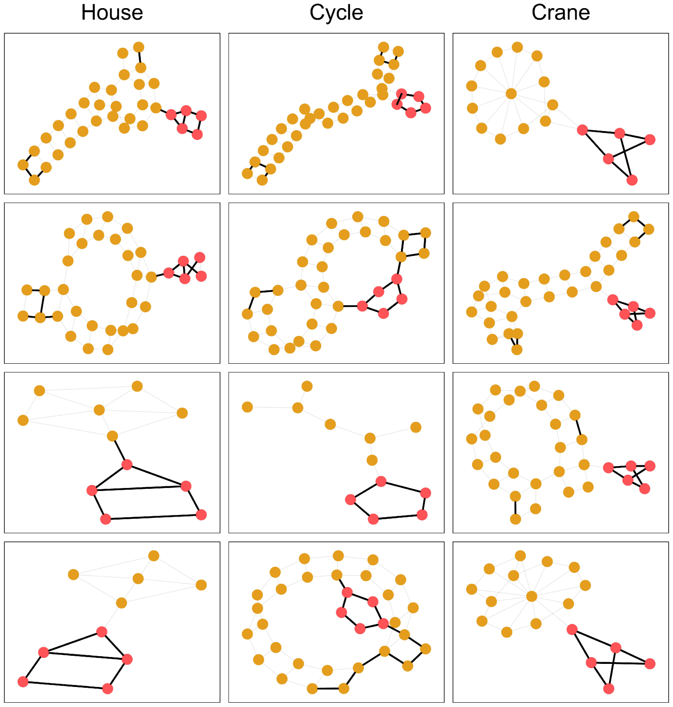

(a) Subgraph extracted by model 0.

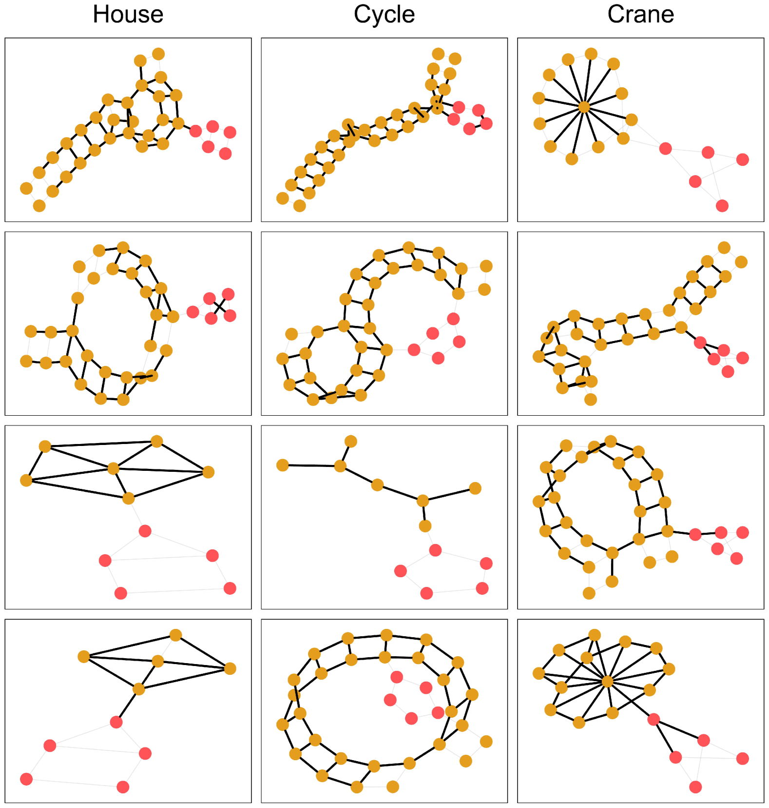

(b) Subgraph extracted by model 1.

Figure 2. Visualization of the subgraph masks generated by different models in the collections. We train two model using our algorithm on GOODMotif dataset (basis-concept setting) and visualize the subgraph extracted by each model on the test set. Nodes colored pink are ground-truth subgraph nodes and each column represents a graph class. Subfigures (a) and (b), located as the identical position, correspond to each other and represent the same graph instance. It can be observed that model 0 attends to the correct subgrah while model 1 attends to the spurious one.

#### 4.2.1. Main task results (RQ1)

In this section, our goal is to address Research Question 1 (RQ1) by conducting a comparative analysis of our approach, DIVE, against various baseline methodologies. The performance of DIVE in contrast to the current state-of-the-art (SOTA) methods is delineated in Tables [2](https://arxiv.org/html/2408.04400v1#S4.T2 "Table 2 ‣ 4.2. Result Comparison and Analysis ‣ 4. Experiment ‣ DIVE: Subgraph Disagreement for Graph Out-of-Distribution Generalization") and [1](https://arxiv.org/html/2408.04400v1#S4.T1 "Table 1 ‣ 4.2. Result Comparison and Analysis ‣ 4. Experiment ‣ DIVE: Subgraph Disagreement for Graph Out-of-Distribution Generalization"). DIVE achieves superior outcomes in 13 out of 15 scenarios across five datasets. In the two remaining scenarios, it secures the second-best positions. It is noteworthy that the Invariant Risk Minimization (IRM) method requires environmental labels for each instance during training. Consequently, excluding methods necessitating environmental labels, our approach secures the top position in 14 out of 15 cases. A significant enhancement is observed in the datasets GOOD-Motif and GOOD-ZINC. Specifically, in GOOD-ZINC dataset, DIVE marks an impressive 51.31% improvement in the size-concept scenario, which may imply that our method is more competitive on regression datsets. Unlike most existing methods that excel in limited scenarios but experience substantial performance declines in others, DIVE consistently demonstrates top-tier performance across a majority of senarios. This underscores the efficacy of DIVE in extracting invariant subgraphs.

Conversely, subgraph-mixup methodologies, including mixup, DIR, GREA, and Disc, generally underperform across the board, frequently yielding results inferior to Empirical Risk Minimization (ERM). This suggests that current subgraph-mixup approaches fail to accurately isolate invariant subgraphs, and the incorporation of mixup can intensify the issue of spurious correlations if the extracted subgraph harbor spurious information. Furthermore, the representative information bottleneck method, GSAT, fails to achieve satisfactory outcomes across these datasets. This indicates a limitation of the information bottleneck technique in distinguishing between invariant and merely predictive features, thereby rendering it ineffective in addressing spurious correlations.

Additionally, MoleOOD, which necessitates the inference of environmental labels, also shows poor performance on three datasets. This highlights the complexities and challenges associated with inferring environment labels, where inaccuracies in inferred labels can detrimentally affect the overall results.

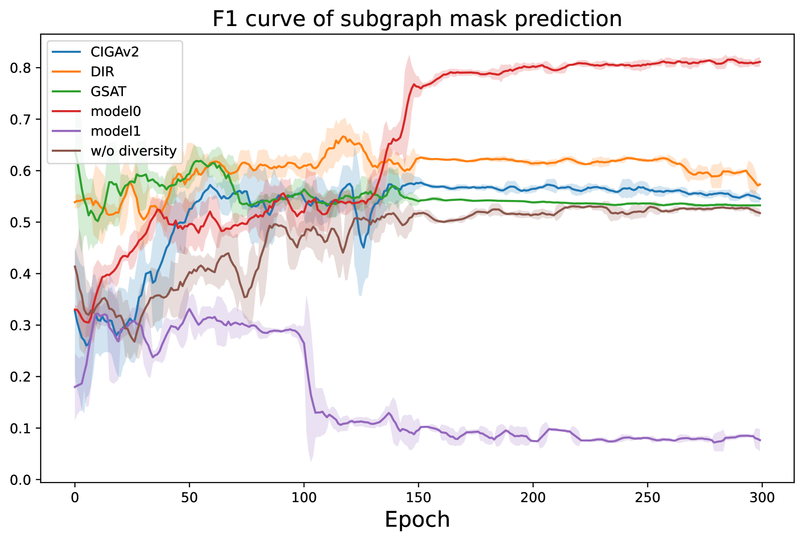

Figure 3. F1 curve of the subgraph mask prediction. For each method, we run the experiment for 5 times and the shadowed area represents standard deviation.

#### 4.2.2. The inadequacy of the current method in precisely extracting subgraphs (RQ2).

To directly compare our method with current method that based on subgraph extraction in terms of invariant subgraph extraction ability, we conducted comparative analysis with the DIR, GSAT, and CIGA methods, evaluating the efficacy of true subgraph extraction. Analogous to our technique, these three methodologies learn an adjacency matrix mask to extract the subgraph. Since GOOD-Motif dataset annotates the ground-truth subgraph mask for each graph instance, we conduct the experiment on this dataset. We computed the F1 score of subgraph mask prediction for each graph instance within the dataset and calculate the mean F1 score. We train a collection with two models incorporating the diversity regularization. As illustrated in Figure [3](https://arxiv.org/html/2408.04400v1#S4.F3 "Figure 3 ‣ 4.2.1. Main task results (RQ1) ‣ 4.2. Result Comparison and Analysis ‣ 4. Experiment ‣ DIVE: Subgraph Disagreement for Graph Out-of-Distribution Generalization"), the majority of current methods achieve at most a F1 score of 0.6. As elucidated in the introduction, this signifies the current methods’ inability to accurately extract the correct subgraphs. Under these circumstances, employing the mixup technique strengthen the spurious correlation. whereas our approach surpasses this threshold, attaining a F1 score exceeding 0.8 for subgraph mask prediction. In the absence of diversity regularization, our method’s performance diminishes, achieving a F1 score around 0.5. However, with diversity regularization, there is a notable improvement in the F1 score of one model within the ensemble, consistently rising to surpass 0.8. Conversely, due to the influence of diversity regularization, the other model becomes predisposed towards the spurious aspects, resulting in a progressive decline in its F1 score to 0.1.

#### 4.2.3. Results on diversity of the collections (RQ3)

We present a visualization of the predictive subgraph identified by DIVE within GOODMotif (basis-concept scenario) test set. In this scenario, each graph in the dataset is synthesized by integrating a base graph (ladder, wheel, tree) with a motif (tree, cycle, crane), where the motif exclusively determines the label of the graph. In the training dataset, the base graph exhibits a high degree of spurious correlation with the label. We demonstrate the subgraph learned on GOODMotif dataset’s test set to ascertain if the models in the collection can focus on different subgraphs. We visualize four subgraph masks produced by models in the collection for each class. As illustrated in Figure [2](https://arxiv.org/html/2408.04400v1#S4.F2 "Figure 2 ‣ 4.2. Result Comparison and Analysis ‣ 4. Experiment ‣ DIVE: Subgraph Disagreement for Graph Out-of-Distribution Generalization"), the two models in the collection concentrate on distinct parts. Model 0 focuses on the motif part, which is crucial for determining the label. Conversely, model 1 primarily focuses on the spurious part and is likely to make incorrect predictions on the test set, as the spurious correlation is present only in the training set and not in the test set.Additionally, we display the distribution of subgraph mask precision and recall for various models within the collection as Figure [4](https://arxiv.org/html/2408.04400v1#S4.F4 "Figure 4 ‣ 4.2.5. The impact of size of the collection (RQ4) ‣ 4.2. Result Comparison and Analysis ‣ 4. Experiment ‣ DIVE: Subgraph Disagreement for Graph Out-of-Distribution Generalization"). It becomes evident that model 0 exhibits markedly higher precision and recall compared to model 1. The bulk of precision and recall values for model 1 are concentrated near zero, indicating that model 1 is overly influenced by the base graph and disregards the critical subgraph. In contrast, model 0 displays precisely the opposite behavior because of the subgraph diversity regularization. We also present the metric curves for different models in the collection, which is detailed at appendix [B](https://arxiv.org/html/2408.04400v1#A2 "Appendix B Training and test metric curves ‣ DIVE: Subgraph Disagreement for Graph Out-of-Distribution Generalization").

#### 4.2.4. Ablation study (RQ3)

We carry out the ablation study to examine the discrepancy in performance between our approach with and without the implementation of diversity regularization. As evidenced by the final row of Tables [1](https://arxiv.org/html/2408.04400v1#S4.T1 "Table 1 ‣ 4.2. Result Comparison and Analysis ‣ 4. Experiment ‣ DIVE: Subgraph Disagreement for Graph Out-of-Distribution Generalization") and [2](https://arxiv.org/html/2408.04400v1#S4.T2 "Table 2 ‣ 4.2. Result Comparison and Analysis ‣ 4. Experiment ‣ DIVE: Subgraph Disagreement for Graph Out-of-Distribution Generalization"), the absence of diversity regularization leads to a considerable decline in performance across all scenarios of every dataset. This indicates that diversity regularization is essential for our methods to attain superior generalization capabilities.

#### 4.2.5. The impact of size of the collection (RQ4)

We report the results when the size of collections is [2,3,4] in table [1](https://arxiv.org/html/2408.04400v1#S4.T1 "Table 1 ‣ 4.2. Result Comparison and Analysis ‣ 4. Experiment ‣ DIVE: Subgraph Disagreement for Graph Out-of-Distribution Generalization") and table [2](https://arxiv.org/html/2408.04400v1#S4.T2 "Table 2 ‣ 4.2. Result Comparison and Analysis ‣ 4. Experiment ‣ DIVE: Subgraph Disagreement for Graph Out-of-Distribution Generalization"). It was observed that on GOODMotif dataset, either 2 or 3 models suffice for our methodology to attain commendable out-of-distribution (OOD) performance, whereas employing 4 models leads to a decline in performance. This can be attributed to the fact that GOODMotif dataset is synthetic, with each graph instance only being a composite of a base graph and a motif, hence limiting the structural pattern variability. Most optimal results are achieved with 3 models, as the basic graph structure (spurious part) can be bifurcated into two segments, exemplified by the division of the wheel graph into the edges of the wheel’s outer rim and the hub’s edges. However, an increase in the number of models does not contribute to the identification of more predictive structural patterns. On the real datasets, it was observed that our methodology attains optimal performance with a collection size of 4 for GOODZINC dataset. Conversely, for other datasets, a collection of 3 models suffices to reach optimal outcomes. This discrepancy can likely be attributed to the considerable size of GOODZINC, which encompasses approximately 250,000 samples, in contrast to other datasets that contain no more than 100,000 samples each. Consequently, GOODZINC dataset may possess more predictive structural patterns, rendering additional models beneficial in uncovering more of these predictive patterns.

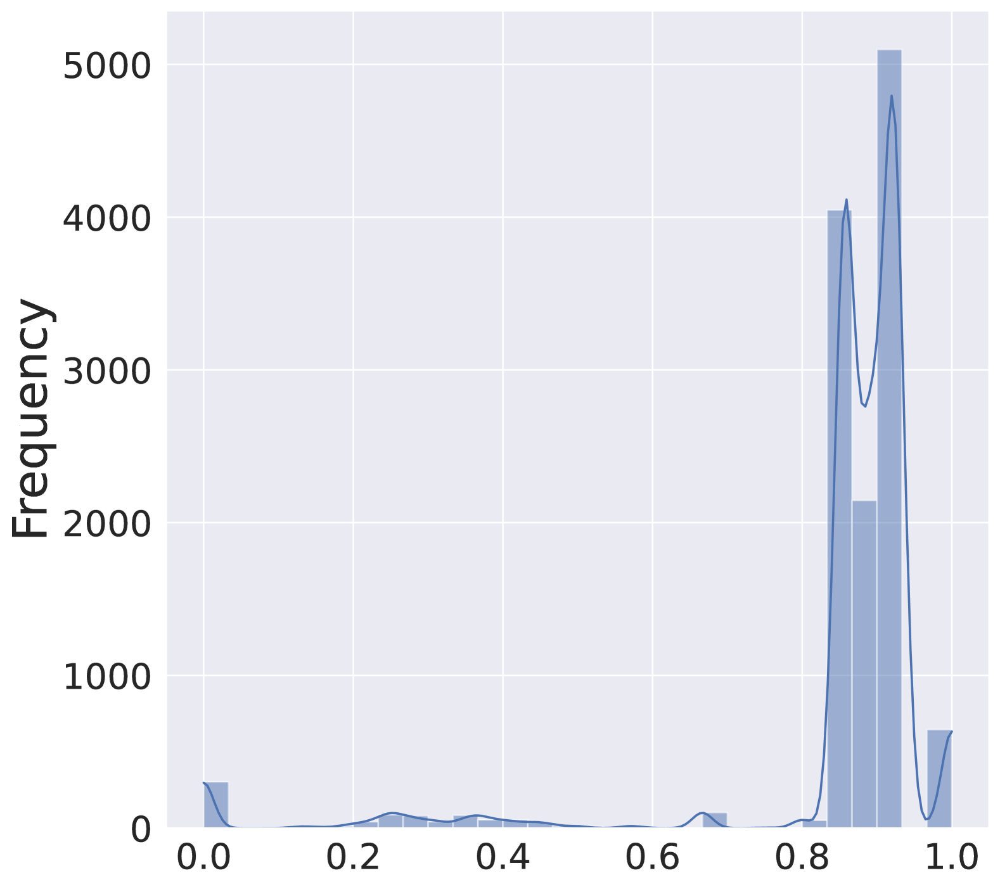

(a) precision of model 0

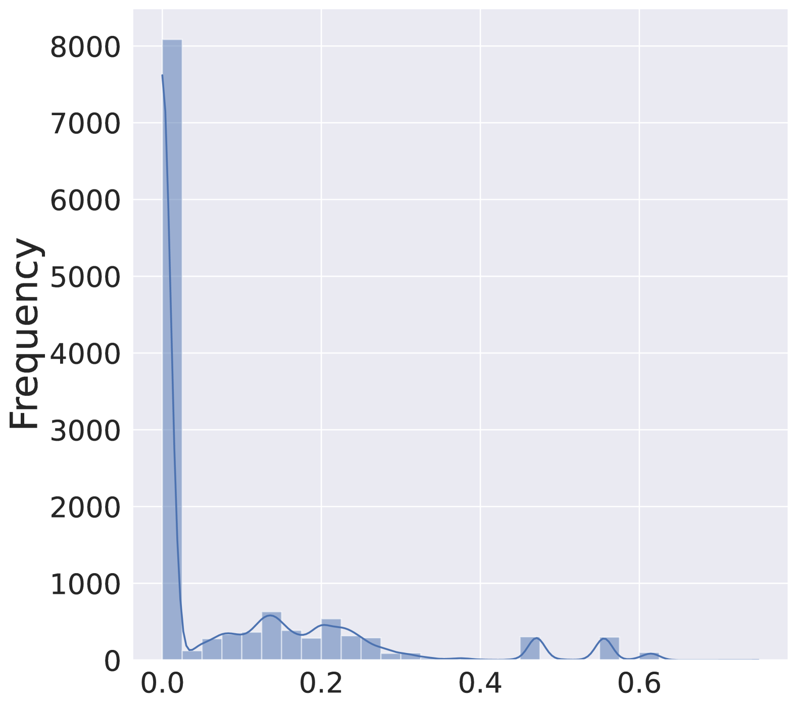

(b) precision of model 1

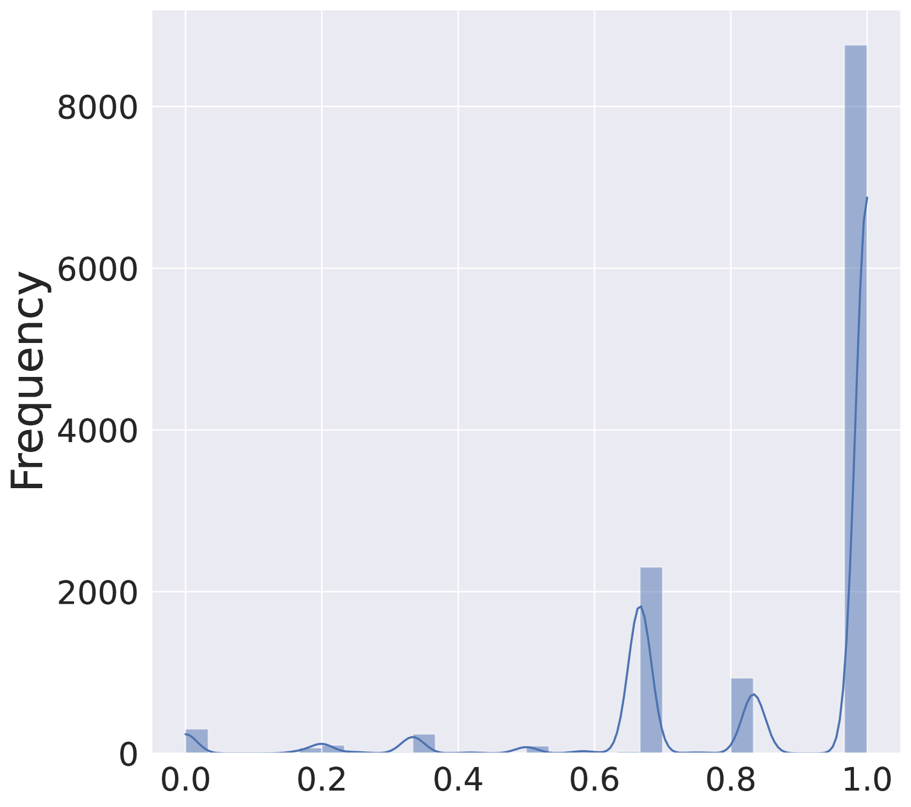

(c) recall of model 0

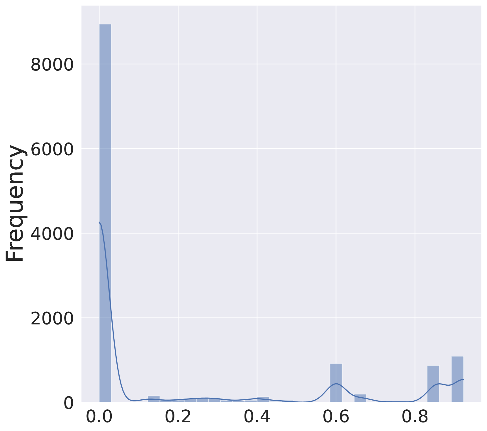

(d) recall of model 1

Figure 4. Distribution of the subgraph mask precision and recall of different models in the collection. 

#### 4.2.6. Hyperparameter analysis (RQ5)

Without losing the generality, we conduct the sensitivity analysis on two datasets: GOODZINC and GOODSST2. We show our model’s performance when the λ𝜆\lambdaitalic\_λ is [0.01, 0.1, 0.5, 1, 2]. Figure [5](https://arxiv.org/html/2408.04400v1#S4.F5 "Figure 5 ‣ 4.2.6. Hyperparameter analysis (RQ5) ‣ 4.2. Result Comparison and Analysis ‣ 4. Experiment ‣ DIVE: Subgraph Disagreement for Graph Out-of-Distribution Generalization") shows that the performance of our methods is insensitive to the hyperparameter λ𝜆\lambdaitalic\_λ in Eq. [13](https://arxiv.org/html/2408.04400v1#S3.E13 "In 3.6. Learning Objective ‣ 3. Method ‣ DIVE: Subgraph Disagreement for Graph Out-of-Distribution Generalization").

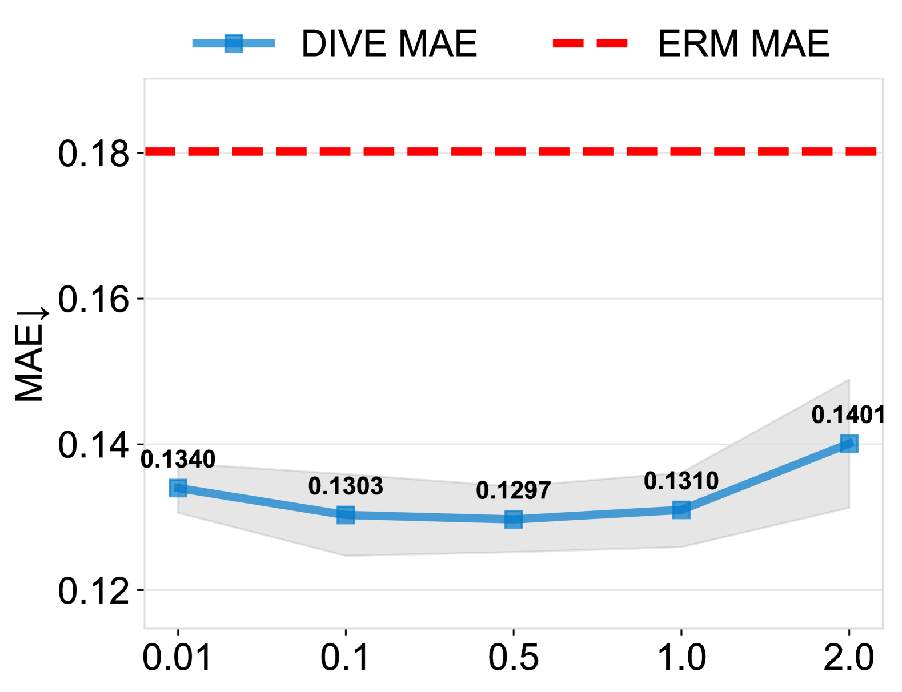

(a) Performance on GOODZINC

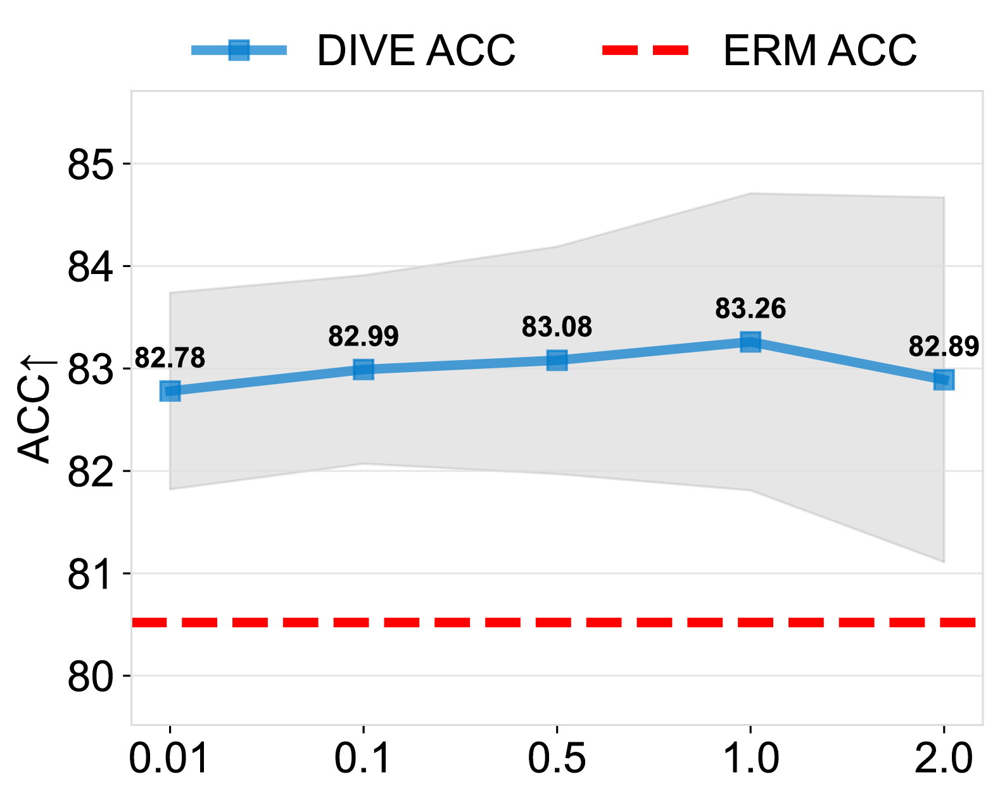

(b) Performance on GOODSST2

Figure 5. Performance using different λ𝜆\lambdaitalic\_λ on GOODZINC and GOODSST2. We conduct the experiment 5 times for each λ𝜆\lambdaitalic\_λ and the grey shaded area represents standard deviation.

## 5. Conclusion

In this study, we introduce a new learning paradigm named DIVE, designed to address the graph out-of-distribution challenge. This approach involves the development of an ensemble of diverse models capable of focusing on all label-predictive subgraphs, thereby reducing the impact of simplicity bias during training. We employ a subgraph diversity regularization technique to promote the variation in structural patterns recognized by the models. Comprehensive experiments conducted on one synthetic dataset and four real-world datasets underscore the exceptional performance of DIVE.

###### Acknowledgements.

This work is sponsored by the National Key Research and Development Program (2023YFC3305203), and the National Natural Science Foundation of China (NSFC) (62206291, 62141608).

## References

- (1)
- Arjovsky et al. (2019)
  Martin Arjovsky, Léon Bottou, Ishaan Gulrajani, and David Lopez-Paz. 2019.
  
  Invariant risk minimization.
  
  *arXiv preprint arXiv:1907.02893* (2019).
- Bemis and Murcko (1996)
  Guy W. Bemis and Mark A. Murcko. 1996.
  
  The properties of known drugs. 1. Molecular frameworks.
  
  *Journal of medicinal chemistry* 39 15 (1996), 2887–93.
  
  <https://api.semanticscholar.org/CorpusID:19424664>
- Breiman (2004)
  L. Breiman. 2004.
  
  Bagging predictors.
  
  *Machine Learning* 24 (2004), 123–140.
  
  <https://api.semanticscholar.org/CorpusID:47328136>
- Chen et al. (2021)
  Deli Chen, Yankai Lin, Guangxiang Zhao, Xuancheng Ren, Peng Li, Jie Zhou, and Xu Sun. 2021.
  
  Topology-imbalance learning for semi-supervised node classification.
  
  *Advances in Neural Information Processing Systems* 34 (2021), 29885–29897.
- Chen et al. (2020)
  Fenxiao Chen, Yun-Cheng Wang, Bin Wang, and C-C Jay Kuo. 2020.
  
  Graph representation learning: a survey.
  
  *APSIPA Transactions on Signal and Information Processing* 9 (2020), e15.
- Chen et al. (2023)
  Yongqiang Chen, Yatao Bian, Kaiwen Zhou, Binghui Xie, Bo Han, and James Cheng. 2023.
  
  Does Invariant Graph Learning via Environment Augmentation Learn Invariance?
  
  *ArXiv* abs/2310.19035 (2023).
  
  <https://api.semanticscholar.org/CorpusID:264820290>
- Chen et al. (2022)
  Yongqiang Chen, Yonggang Zhang, Yatao Bian, Han Yang, MA Kaili, Binghui Xie, Tongliang Liu, Bo Han, and James Cheng. 2022.
  
  Learning causally invariant representations for out-of-distribution generalization on graphs.
  
  *Advances in Neural Information Processing Systems* 35 (2022), 22131–22148.
- Fan et al. (2022)
  Shaohua Fan, Xiao Wang, Yanhu Mo, Chuan Shi, and Jian Tang. 2022.
  
  Debiasing Graph Neural Networks via Learning Disentangled Causal Substructure.
  
  *ArXiv* abs/2209.14107 (2022).
  
  <https://api.semanticscholar.org/CorpusID:252567836>
- Ganin et al. (2015)
  Yaroslav Ganin, Evgeniya Ustinova, Hana Ajakan, Pascal Germain, Hugo Larochelle, François Laviolette, Mario Marchand, and Victor S. Lempitsky. 2015.
  
  Domain-Adversarial Training of Neural Networks.
  
  *CoRR* abs/1505.07818 (2015).
  
  arXiv:1505.07818
  <http://arxiv.org/abs/1505.07818>
- Gómez-Bombarelli et al. (2016)
  Rafael Gómez-Bombarelli, David Duvenaud, José Miguel Hernández-Lobato, Jorge Aguilera-Iparraguirre, Timothy D. Hirzel, Ryan P. Adams, and Alán Aspuru-Guzik. 2016.
  
  Automatic chemical design using a data-driven continuous representation of molecules.
  
  *CoRR* abs/1610.02415 (2016).
  
  arXiv:1610.02415
  <http://arxiv.org/abs/1610.02415>
- Gui et al. (2022)
  Shurui Gui, Xiner Li, Limei Wang, and Shuiwang Ji. 2022.
  
  GOOD: A Graph Out-of-Distribution Benchmark. In *Advances in Neural Information Processing Systems 35: Annual Conference on Neural Information Processing Systems 2022, NeurIPS 2022, New Orleans, LA, USA, November 28 - December 9, 2022*, Sanmi Koyejo, S. Mohamed, A. Agarwal, Danielle Belgrave, K. Cho, and A. Oh (Eds.).
  
  <http://papers.nips.cc/paper_files/paper/2022/hash/0dc91de822b71c66a7f54fa121d8cbb9-Abstract-Datasets_and_Benchmarks.html>
- Hua et al. (2022)
  Hua Hua, Jun Yan, Xi Fang, Weiquan Huang, Huilin Yin, and Wancheng Ge. 2022.
  
  Causal Information Bottleneck Boosts Adversarial Robustness of Deep Neural Network.
  
  *ArXiv* abs/2210.14229 (2022).
  
  <https://doi.org/10.48550/arXiv.2210.14229>
- Jain et al. (2023)
  Samyak Jain, Sravanti Addepalli, Pawan Kumar Sahu, Priya Dey, and R. Venkatesh Babu. 2023.
  
  DART: Diversify-Aggregate-Repeat Training Improves Generalization of Neural Networks.
  
  *2023 IEEE/CVF Conference on Computer Vision and Pattern Recognition (CVPR)* (2023), 16048–16059.
  
  <https://api.semanticscholar.org/CorpusID:257233097>
- Jia et al. (2023)
  Tianrui Jia, Haoyang Li, Cheng Yang, Tao Tao, and Chuan Shi. 2023.
  
  Graph Invariant Learning with Subgraph Co-mixup for Out-Of-Distribution Generalization.
  
  *ArXiv* abs/2312.10988 (2023).
  
  <https://api.semanticscholar.org/CorpusID:266359297>
- Jin et al. (2018)
  Wengong Jin, Regina Barzilay, and Tommi S. Jaakkola. 2018.
  
  Junction Tree Variational Autoencoder for Molecular Graph Generation. In *Proceedings of the 35th International Conference on Machine Learning, ICML 2018, Stockholmsmässan, Stockholm, Sweden, July 10-15, 2018* *(Proceedings of Machine Learning Research, Vol. 80)*, Jennifer G. Dy and Andreas Krause (Eds.). PMLR, 2328–2337.
  
  <http://proceedings.mlr.press/v80/jin18a.html>
- Kariyappa and Qureshi (2019)
  Sanjay Kariyappa and Moinuddin K. Qureshi. 2019.
  
  Improving Adversarial Robustness of Ensembles with Diversity Training.
  
  *ArXiv* abs/1901.09981 (2019).
  
  <https://api.semanticscholar.org/CorpusID:59336268>
- Krueger et al. (2021)
  David Krueger, Ethan Caballero, Joern-Henrik Jacobsen, Amy Zhang, Jonathan Binas, Dinghuai Zhang, Remi Le Priol, and Aaron Courville. 2021.
  
  Out-of-distribution generalization via risk extrapolation (rex). In *International Conference on Machine Learning*. PMLR, 5815–5826.
- Kusner et al. (2017)
  Matt J. Kusner, Brooks Paige, and José Miguel Hernández-Lobato. 2017.
  
  Grammar Variational Autoencoder. In *Proceedings of the 34th International Conference on Machine Learning, ICML 2017, Sydney, NSW, Australia, 6-11 August 2017* *(Proceedings of Machine Learning Research, Vol. 70)*, Doina Precup and Yee Whye Teh (Eds.). PMLR, 1945–1954.
  
  <http://proceedings.mlr.press/v70/kusner17a.html>
- Lee et al. (2023)
  Yoonho Lee, Huaxiu Yao, and Chelsea Finn. 2023.
  
  Diversify and Disambiguate: Out-of-Distribution Robustness via Disagreement. In *International Conference on Learning Representations*.
  
  <https://api.semanticscholar.org/CorpusID:259298733>
- Li et al. (2022)
  Haoyang Li, Ziwei Zhang, Xin Wang, and Wenwu Zhu. 2022.
  
  Learning invariant graph representations for out-of-distribution generalization.
  
  *Advances in Neural Information Processing Systems* 35 (2022), 11828–11841.
- Liu et al. (2022)
  Gang Liu, Tong Zhao, Jiaxin Xu, Tengfei Luo, and Meng Jiang. 2022.
  
  Graph rationalization with environment-based augmentations. In *Proceedings of the 28th ACM SIGKDD Conference on Knowledge Discovery and Data Mining*. 1069–1078.
- Liu et al. (2023)
  Zemin Liu, Trung-Kien Nguyen, and Yuan Fang. 2023.
  
  On Generalized Degree Fairness in Graph Neural Networks. In *Thirty-Seventh AAAI Conference on Artificial Intelligence, AAAI 2023, Thirty-Fifth Conference on Innovative Applications of Artificial Intelligence, IAAI 2023, Thirteenth Symposium on Educational Advances in Artificial Intelligence, EAAI 2023, Washington, DC, USA, February 7-14, 2023*, Brian Williams, Yiling Chen, and Jennifer Neville (Eds.). AAAI Press, 4525–4533.
  
  <https://doi.org/10.1609/AAAI.V37I4.25574>
- Miao et al. (2022)
  Siqi Miao, Mia Liu, and Pan Li. 2022.
  
  Interpretable and generalizable graph learning via stochastic attention mechanism. In *International Conference on Machine Learning*. PMLR, 15524–15543.
- Pagliardini et al. (2022)
  Matteo Pagliardini, Martin Jaggi, Franccois Fleuret, and Sai Praneeth Karimireddy. 2022.
  
  Agree to Disagree: Diversity through Disagreement for Better Transferability.
  
  *ArXiv* abs/2202.04414 (2022).
  
  <https://api.semanticscholar.org/CorpusID:246679938>
- Park et al. (2021)
  Joonhyung Park, Jaeyun Song, and Eunho Yang. 2021.
  
  Graphens: Neighbor-aware ego network synthesis for class-imbalanced node classification. In *International conference on learning representations*.
- Ramé and Cord (2021)
  Alexandre Ramé and Matthieu Cord. 2021.
  
  DICE: Diversity in Deep Ensembles via Conditional Redundancy Adversarial Estimation.
  
  *ArXiv* abs/2101.05544 (2021).
  
  <https://api.semanticscholar.org/CorpusID:231603232>
- Ross et al. (2019)
  Andrew Slavin Ross, Weiwei Pan, Leo Anthony Celi, and Finale Doshi-Velez. 2019.
  
  Ensembles of Locally Independent Prediction Models. In *AAAI Conference on Artificial Intelligence*.
  
  <https://api.semanticscholar.org/CorpusID:207780271>
- Sagawa et al. (2020)
  Shiori Sagawa, Pang Wei Koh, Tatsunori B. Hashimoto, and Percy Liang. 2020.
  
  Distributionally Robust Neural Networks. In *8th International Conference on Learning Representations, ICLR 2020, Addis Ababa, Ethiopia, April 26-30, 2020*. OpenReview.net.
  
  <https://openreview.net/forum?id=ryxGuJrFvS>
- Shah et al. (2020)
  Harshay Shah, Kaustav Tamuly, Aditi Raghunathan, Prateek Jain, and Praneeth Netrapalli. 2020.
  
  The Pitfalls of Simplicity Bias in Neural Networks.
  
  *ArXiv* abs/2006.07710 (2020).
  
  <https://api.semanticscholar.org/CorpusID:219687117>
- Shomer et al. (2023)
  Harry Shomer, Wei Jin, Wentao Wang, and Jiliang Tang. 2023.
  
  Toward Degree Bias in Embedding-Based Knowledge Graph Completion. In *Proceedings of the ACM Web Conference 2023, WWW 2023, Austin, TX, USA, 30 April 2023 - 4 May 2023*, Ying Ding, Jie Tang, Juan F. Sequeda, Lora Aroyo, Carlos Castillo, and Geert-Jan Houben (Eds.). ACM, 705–715.
  
  <https://doi.org/10.1145/3543507.3583544>
- Simon (1954)
  Herbert A Simon. 1954.
  
  Spurious correlation: A causal interpretation.
  
  *Journal of the American statistical Association* 49, 267 (1954), 467–479.
- Sinha et al. (2020)
  Samarth Sinha, Homanga Bharadhwaj, Anirudh Goyal, H. Larochelle, Animesh Garg, and Florian Shkurti. 2020.
  
  DIBS: Diversity inducing Information Bottleneck in Model Ensembles.
  
  *ArXiv* abs/2003.04514 (2020).
  
  <https://api.semanticscholar.org/CorpusID:212645760>
- Song et al. (2022)
  Jaeyun Song, Joonhyung Park, and Eunho Yang. 2022.
  
  TAM: topology-aware margin loss for class-imbalanced node classification. In *International Conference on Machine Learning*. PMLR, 20369–20383.
- Stickland and Murray (2020)
  Asa Cooper Stickland and Iain Murray. 2020.
  
  Diverse Ensembles Improve Calibration.
  
  *ArXiv* abs/2007.04206 (2020).
  
  <https://api.semanticscholar.org/CorpusID:220403617>
- Sui et al. (2022)
  Yongduo Sui, Xiang Wang, Jiancan Wu, Min Lin, Xiangnan He, and Tat-Seng Chua. 2022.
  
  Causal attention for interpretable and generalizable graph classification. In *Proceedings of the 28th ACM SIGKDD Conference on Knowledge Discovery and Data Mining*. 1696–1705.
- Sun and Saenko (2016)
  Baochen Sun and Kate Saenko. 2016.
  
  Deep CORAL: Correlation Alignment for Deep Domain Adaptation. In *Computer Vision - ECCV 2016 Workshops - Amsterdam, The Netherlands, October 8-10 and 15-16, 2016, Proceedings, Part III* *(Lecture Notes in Computer Science, Vol. 9915)*, Gang Hua and Hervé Jégou (Eds.). 443–450.
  
  <https://doi.org/10.1007/978-3-319-49409-8_35>
- Tang et al. (2020)
  Xianfeng Tang, Huaxiu Yao, Yiwei Sun, Yiqi Wang, Jiliang Tang, Charu C. Aggarwal, Prasenjit Mitra, and Suhang Wang. 2020.
  
  Investigating and Mitigating Degree-Related Biases in Graph Convoltuional Networks. In *CIKM ’20: The 29th ACM International Conference on Information and Knowledge Management, Virtual Event, Ireland, October 19-23, 2020*, Mathieu d’Aquin, Stefan Dietze, Claudia Hauff, Edward Curry, and Philippe Cudré-Mauroux (Eds.). ACM, 1435–1444.
  
  <https://doi.org/10.1145/3340531.3411872>
- Teney et al. (2021)
  Damien Teney, Ehsan Abbasnejad, Simon Lucey, and Anton van den Hengel. 2021.
  
  Evading the Simplicity Bias: Training a Diverse Set of Models Discovers Solutions with Superior OOD Generalization.
  
  *2022 IEEE/CVF Conference on Computer Vision and Pattern Recognition (CVPR)* (2021), 16740–16751.
  
  <https://api.semanticscholar.org/CorpusID:234469843>
- Tishby et al. (2000)
  Naftali Tishby, Fernando C Pereira, and William Bialek. 2000.
  
  The information bottleneck method.
  
  *ArXiv* physics/0004057 (2000).
  
  <https://api.semanticscholar.org/CorpusID:8936496>
- Ueda and Nakano (1996)
  Naonori Ueda and Ryohei Nakano. 1996.
  
  Generalization error of ensemble estimators.
  
  *Proceedings of International Conference on Neural Networks (ICNN’96)* 1 (1996), 90–95 vol.1.
  
  <https://api.semanticscholar.org/CorpusID:61567032>
- Vapnik (1991)
  Vladimir Naumovich Vapnik. 1991.
  
  Principles of Risk Minimization for Learning Theory. In *Neural Information Processing Systems*.
  
  <https://api.semanticscholar.org/CorpusID:15348764>
- Wang et al. (2024)
  Liang Wang, Xiang Tao, Qiang Liu, and Shu Wu. 2024.
  
  Rethinking Graph Masked Autoencoders through Alignment and Uniformity.
  
  *arXiv preprint arXiv:2402.07225* (2024).
- Wang et al. (2021)
  Yiwei Wang, Wei Wang, Yuxuan Liang, Yujun Cai, and Bryan Hooi. 2021.
  
  Mixup for node and graph classification. In *Proceedings of the Web Conference 2021*. 3663–3674.
- Wigh et al. (2022)
  Daniel S Wigh, Jonathan M Goodman, and Alexei A Lapkin. 2022.
  
  A review of molecular representation in the age of machine learning.
  
  *Wiley Interdisciplinary Reviews: Computational Molecular Science* 12, 5 (2022), e1603.
- Wu et al. (2021)
  Yingxin Wu, Xiang Wang, An Zhang, Xiangnan He, and Tat-Seng Chua. 2021.
  
  Discovering Invariant Rationales for Graph Neural Networks. In *International Conference on Learning Representations*.
- Wu et al. (2017)
  Zhenqin Wu, Bharath Ramsundar, Evan N. Feinberg, Joseph Gomes, Caleb Geniesse, Aneesh S. Pappu, Karl Leswing, and Vijay S. Pande. 2017.
  
  MoleculeNet: A Benchmark for Molecular Machine Learning.
  
  *CoRR* abs/1703.00564 (2017).
  
  arXiv:1703.00564
  <http://arxiv.org/abs/1703.00564>
- Xia et al. (2024)
  Yuwei Xia, Ding Wang, Qiang Liu, Liang Wang, Shu Wu, and Xiaoyu Zhang. 2024.
  
  Enhancing Temporal Knowledge Graph Forecasting with Large Language Models via Chain-of-History Reasoning.
  
  *arXiv preprint arXiv:2402.14382* (2024).
- Xia et al. (2023)
  Yuwei Xia, Mengqi Zhang, Qiang Liu, Shu Wu, and Xiao-Yu Zhang. 2023.
  
  Metatkg: Learning evolutionary meta-knowledge for temporal knowledge graph reasoning.
  
  *arXiv preprint arXiv:2302.00893* (2023).
- Xiang et al. (2023)
  Zhuang Xiang, Qiang Zhang, Keyan Ding, Yatao Bian, Xiao Wang, Jingsong Lv, Hongyang Chen, and Huajun Chen. 2023.
  
  Learning Invariant Molecular Representation in Latent Discrete Space.
  
  *ArXiv* abs/2310.14170 (2023).
  
  <https://api.semanticscholar.org/CorpusID:264426035>
- Yan et al. (2024)
  Divin Yan, Gengchen Wei, Chen Yang, Shengzhong Zhang, et al. 2024.
  
  Rethinking Semi-Supervised Imbalanced Node Classification from Bias-Variance Decomposition.
  
  *Advances in Neural Information Processing Systems* 36 (2024).
- Yang et al. (2022)
  Nianzu Yang, Kaipeng Zeng, Qitian Wu, Xiaosong Jia, and Junchi Yan. 2022.
  
  Learning substructure invariance for out-of-distribution molecular representations.
  
  *Advances in Neural Information Processing Systems* 35 (2022), 12964–12978.
- Yu et al. (2020)
  Junchi Yu, Tingyang Xu, Yu Rong, Yatao Bian, Junzhou Huang, and Ran He. 2020.
  
  Graph Information Bottleneck for Subgraph Recognition.
  
  *ArXiv* abs/2010.05563 (2020).
  
  <https://api.semanticscholar.org/CorpusID:222291521>
- Yuan et al. (2023a)
  Haonan Yuan, Qingyun Sun, Xingcheng Fu, Ziwei Zhang, Cheng Ji, Hao Peng, and Jianxin Li. 2023a.
  
  Environment-Aware Dynamic Graph Learning for Out-of-Distribution Generalization.
  
  *ArXiv* abs/2311.11114 (2023).
  
  <https://api.semanticscholar.org/CorpusID:265294460>
- Yuan et al. (2023b)
  Hao Yuan, Haiyang Yu, Shurui Gui, and Shuiwang Ji. 2023b.
  
  Explainability in Graph Neural Networks: A Taxonomic Survey.
  
  *IEEE Trans. Pattern Anal. Mach. Intell.* 45, 5 (2023), 5782–5799.
  
  <https://doi.org/10.1109/TPAMI.2022.3204236>
- Zhang et al. (2023a)
  Jinghao Zhang, Qiang Liu, Shu Wu, and Liang Wang. 2023a.
  
  Mining Stable Preferences: Adaptive Modality Decorrelation for Multimedia Recommendation. In *Proceedings of the 46th International ACM SIGIR Conference on Research and Development in Information Retrieval*. 443–452.
- Zhang et al. (2021)
  Jinghao Zhang, Yanqiao Zhu, Qiang Liu, Shu Wu, Shuhui Wang, and Liang Wang. 2021.
  
  Mining latent structures for multimedia recommendation. In *Proceedings of the 29th ACM international conference on multimedia*. 3872–3880.
- Zhang et al. (2023b)
  Mengqi Zhang, Yuwei Xia, Qiang Liu, Shu Wu, and Liang Wang. 2023b.
  
  Learning latent relations for temporal knowledge graph reasoning. In *Proceedings of the 61st Annual Meeting of the Association for Computational Linguistics (Volume 1: Long Papers)*. 12617–12631.
- Zhang et al. (2022)
  Zuobai Zhang, Minghao Xu, Arian Jamasb, Vijil Chenthamarakshan, Aurelie Lozano, Payel Das, and Jian Tang. 2022.
  
  Protein representation learning by geometric structure pretraining.
  
  *arXiv preprint arXiv:2203.06125* (2022).
- Zhu et al. (2021)
  Yanqiao Zhu, Yichen Xu, Feng Yu, Qiang Liu, Shu Wu, and Liang Wang. 2021.
  
  Graph contrastive learning with adaptive augmentation. In *Proceedings of the Web Conference 2021*. 2069–2080.

| Methods | GOOD-Motif | | | | GOOD-ZINC | | | | GOOD-SST2 | |
| --- | --- | --- | --- | --- | --- | --- | --- | --- | --- | --- |
| basis | | size | | scaffold | | size | | length | |
| covariate | concept | covariate | concept | covariate | concept | covariate | concept | covariate | concept |
| ERM | 69.97(1.94) | 80.87(0.65) | 51.28(1.94) | 69.41(0.91) | 0.1825(0.0129) | 0.1328(0.0060) | 0.2569(0.0138) | 0.1418(0.0057) | 77.76(1.14) | 67.26(0.05) |
| GSAT | 63.33(5.34) | 76.43(2.13) | 43.20(6.45) | 49.01(2.66) | 0.1634(0.0234) | 0.1342(0.0058) | 0.2418(0.0098) | 0.1309(0.0116) | 72.56(2.77) | 61.45(2.56) |
| DIR | 59.08(14.23) | 67.57(2.71) | 42.61(1.31) | 53.21(4.03) | 0.6155(0.0589) | 0.3883(0.1019) | 0.6011(0.0147) | 0.3130(0.0747) | 74.76(2.31) | 63.61(1.32) |
| CIGA | 55.12(10.12) | 61.58(3.12) | 44.69(4.35) | 51.45(5.69) | - | - | - |  | 63.78(2.02) | 56.92(2.54) |
| DIVE-2 | 81.50(6.23) | 89.54(1.34) | 63.66(1.54) | 70.12(2.30) | 0.1290(0.0433) | 0.0697(0.0688) | 0.1328(0.0071) | 0.0631(0.0081) | 82.38(1.45) | 72.78(1.22) |

Table 3. The results on ID validation set

## Appendix A The details of datasets

The details of the four datasets from the GOOD benchmark are as follows:

- •
  
  GOODMotif is a synthetic datasets motivated by Spurious-Motif and is designed for structural shifts. Each graph in the dataset is generated by connecting a base graph and a motif, and the label is determined by the motif solely. The graphs are generated using five label irrelevant base graphs and three label determinant motifs(house, cycle, and crane). The base graph type and the size is utilized to split the domain.
- •
  
  GOODHIV is a small-scale, real-world molecular dataset derived from MoleculeNet(Wu et al., [2017](https://arxiv.org/html/2408.04400v1#bib.bib47)). It consists of molecular graphs where nodes represent atoms and edges signify chemical bonds. The primary objective is to ascertain whether a molecule is capable of inhibiting HIV replication. The dataset is organized based on two domain selections: scaffold and size. The first criterion, Bemis-Murcko scaffold(Bemis and Murcko, [1996](https://arxiv.org/html/2408.04400v1#bib.bib3)), refers to the two-dimensional structural foundation of a molecule. The second criterion pertains to the number of nodes in a molecular graph, a fundamental structural characteristic.
- •
  
  GOODZINC is a real-world molecular property regression dataset from the ZINC database(Gómez-Bombarelli et al., [2016](https://arxiv.org/html/2408.04400v1#bib.bib11)). It comprises molecular graphs, each with a maximum of 38 heavy atoms. The primary task involved is predicting the constrained solubility(Jin et al., [2018](https://arxiv.org/html/2408.04400v1#bib.bib16); Kusner et al., [2017](https://arxiv.org/html/2408.04400v1#bib.bib19)) of the molecules.
- •
  
  GOODSST2 is a real-world natural language sentimental analysis dataset adapted from Yuan et al.(Yuan et al., [2023b](https://arxiv.org/html/2408.04400v1#bib.bib55)). The dataset forms a binary classification task to predict the sentiment polarity of a sentence. The domains are split according to the sentence length.

## Appendix B Training and test metric curves

Figure [6](https://arxiv.org/html/2408.04400v1#A2.F6 "Figure 6 ‣ Appendix B Training and test metric curves ‣ DIVE: Subgraph Disagreement for Graph Out-of-Distribution Generalization") shows the training and test metric curves on the GOODMotif (basis-concept scenario) and GOODZINC (scaffod-concept scenario). In the training stage, models in the collections can all achieve good performance and they attend to different label-predictive subgraphs. In the test stage, because the spurious correlation between the label and spurious subgraph diminish, only the model that attend to the real invariant subgraph can achieve a good performance.

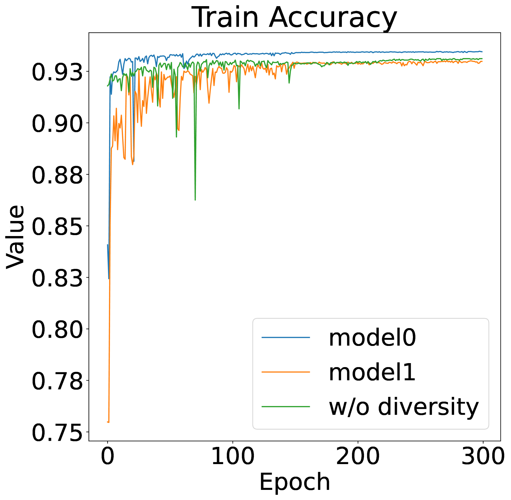

(a) Train ACC on GOOD-Motif

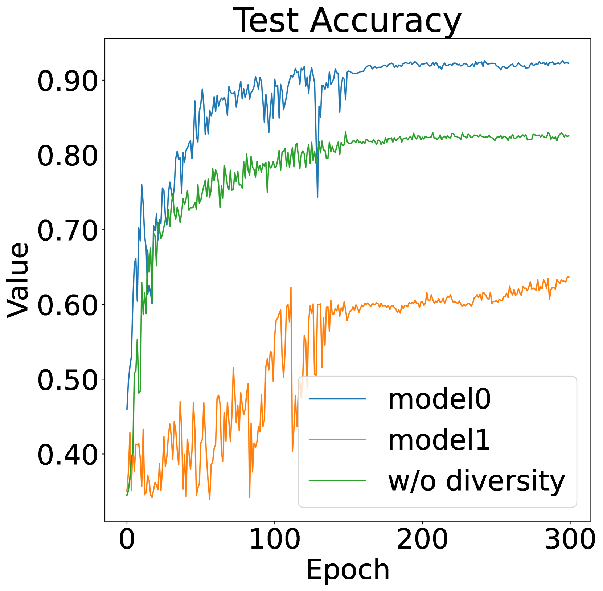

(b) Test ACC on GOOD-Motif

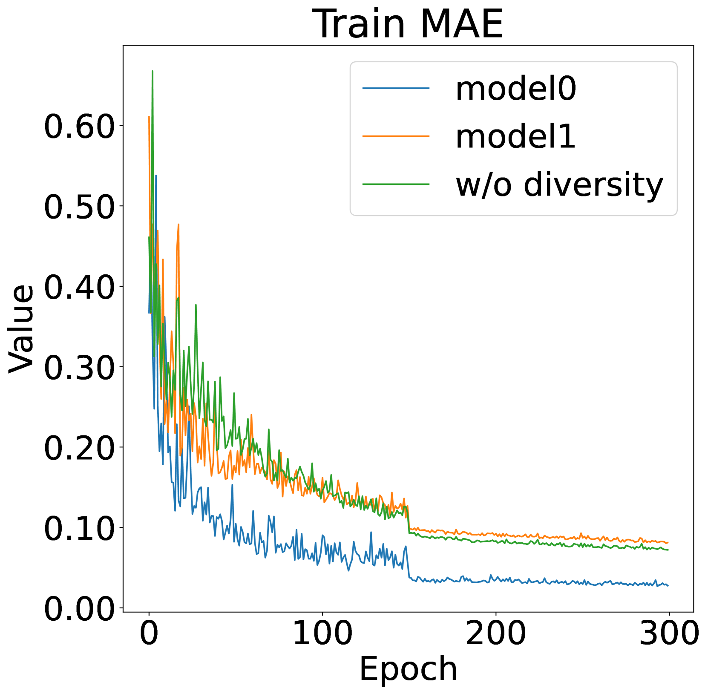

(c) Train MAE on GOOD-ZINC

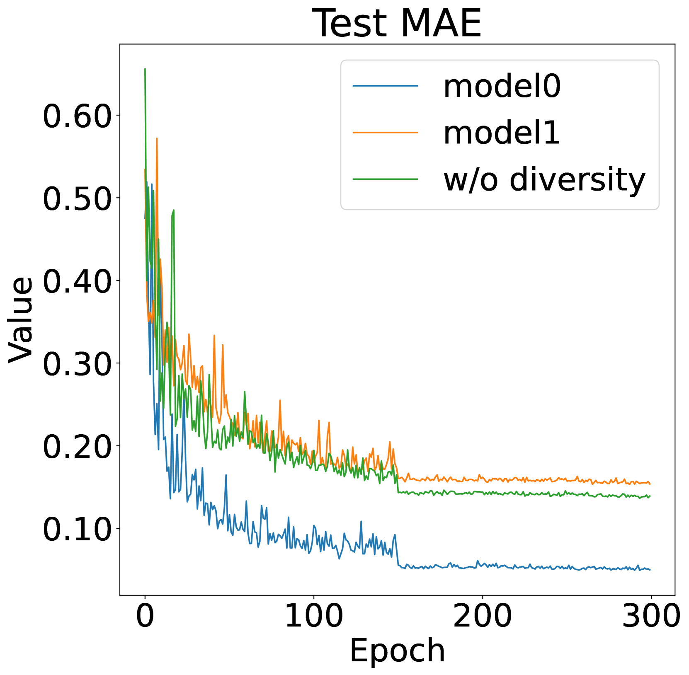

(d) Test MAE on GOOD-ZINC

Figure 6. Train and Test metric curve of different models in the collections.

## Appendix C Extra related work

### C.1. Graph long tail learning

Graph long-tail learning(Chen et al., [2021](https://arxiv.org/html/2408.04400v1#bib.bib5); Song et al., [2022](https://arxiv.org/html/2408.04400v1#bib.bib34); Park et al., [2021](https://arxiv.org/html/2408.04400v1#bib.bib26); Yan et al., [2024](https://arxiv.org/html/2408.04400v1#bib.bib51)) specifically deals with the problems posed by imbalanced data distributions where some classes of graph data are significantly underrepresented. This imbalance can mirror, and often exacerbates, the challenges faced in OOD generalization. Essentially, models trained on such skewed distributions might not only struggle with minority classes but also perform poorly when encountering unseen or novel distributions, as often happens in OOD scenarios.

## Appendix D The results using ID validation set

Although the use of an out-of-distribution (OOD) validation set is a standard practice, and all baselines in our experiments adhere to this by employing the same OOD validation set, we have additionally conducted experiments using an in-distribution (ID) validation set to further demonstrate the effectiveness of DIVE. Our findings indicate that the improvements are even more pronounced when using the ID validation set. Specifically, the enhancement over CIGA is approximately 40% in GOOD-Motif and around 10% in GOODSST2. These results underscore the high precision of our current method when evaluated on the ID validation set. Our approach successfully extracts both spurious and invariant subgraphs, with the invariant subgraph predictor proving to be more indicative of both ID and OOD data (as depicted in Figure [6](https://arxiv.org/html/2408.04400v1#A2.F6 "Figure 6 ‣ Appendix B Training and test metric curves ‣ DIVE: Subgraph Disagreement for Graph Out-of-Distribution Generalization"), where the invariant predictor model 0 achieves superior performance on both the test and training sets). Consequently, even when using ID data for validation, a robust predictor that encapsulates invariant information is more readily identified, and the performance does not significantly deteriorate compared to using an OOD validation set.

