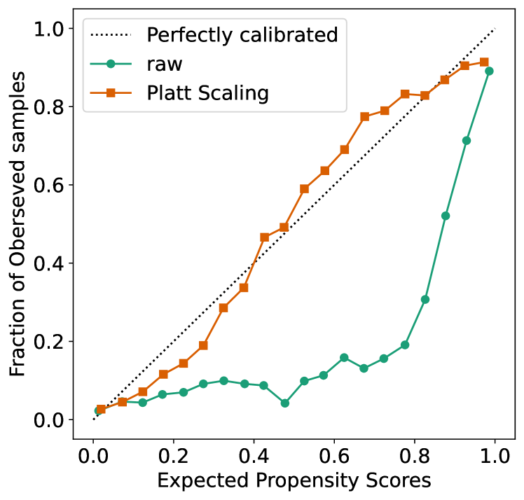
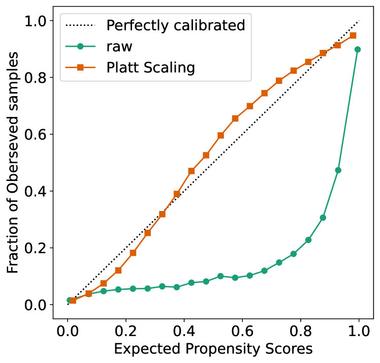
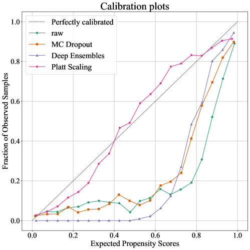
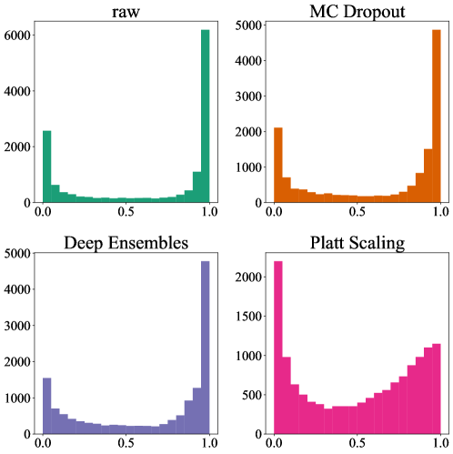
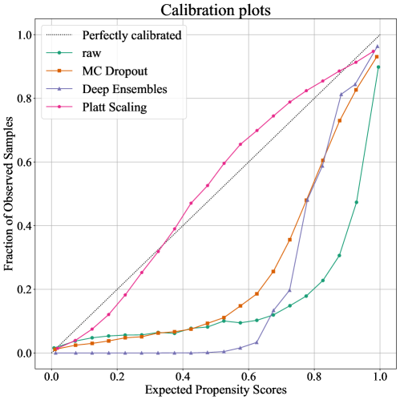
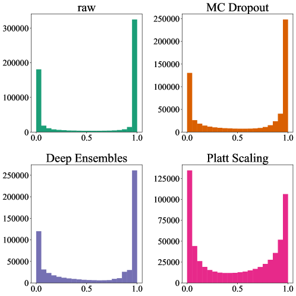

# Uncertainty Calibration for Counterfactual Propensity Estimation in Recommendation

# Uncertainty Calibration for Counterfactual Propensity Estimation in Recommendation

Wenbo Hu,  Xin Sun,  Qiang Liu, 
  
Le Wu,  Liang Wang
This work is jointly supported by National Natural Science Foundation of China (No. 62306098), the Open Projects Program of State Key Laboratory of Multimodal Artificial Intelligence Systems and the Fundamental Research Funds for the Central Universities (No. JZ2024HGTB0256).Wenbo Hu and Le Wu are with the School of Computer and Information, Hefei University of Technology, Hefei, China (Email: {wenbohu,lewu}@hfut.edu.cn). Xin Sun is with the University of Science and Technology of China (Email: sunxin000@mail.ustc.edu.cn) . Qiang Liu and Liang Wang are with the Institute of Automation, Chinese Academy of Sciences(Email: {qiang.liu,wangliang}@nlpr.ia.ac.cn).The first two authors contributed equally. Corresponding author: Qiang Liu.

###### Abstract

Post-click conversion rate (CVR) is a reliable indicator of online customers’ preferences, making it crucial for developing recommender systems. A major challenge in predicting CVR is severe selection bias, arising from users’ inherent self-selection behavior and the system’s item selection process. To mitigate this issue, the inverse propensity score (IPS) is employed to weight the prediction error of each observed instance. However, current propensity score estimations are unreliable due to the lack of a quality measure. To address this, we evaluate the quality of propensity scores from the perspective of uncertainty calibration, proposing the use of expected calibration error (ECE) as a measure of propensity-score quality. We argue that the performance of IPS-based recommendations is hampered by miscalibration in propensity estimation. We introduce a model-agnostic calibration framework for propensity-based debiasing of CVR predictions. Theoretical analysis on bias and generalization bounds demonstrates the superiority of calibrated propensity estimates over uncalibrated ones. Experiments conducted on the Coat, Yahoo and KuaiRand datasets show improved uncertainty calibration, as evidenced by lower ECE values, leading to enhanced CVR prediction outcomes.

###### Index Terms:

Post-click conversion rate, inverse propensity score, expected calibrated error, uncertainty calibration.

## I Introduction

The post-click conversion rate (CVR) represents the likelihood of a user consuming an online item after clicking on it. Predicting CVR is essentially a counterfactual problem, as it involves estimating the conversion rates of all user-item pairs under the hypothetical scenario that all items are clicked by all users. However, this scenario contradicts reality due to selection bias. Users freely choose which items to rate, resulting in observed user-item feedback that is not representative of all possible user-item pairs. Consequently, the feedback data is often missing not at random (MNAR) [[1](https://arxiv.org/html/2303.12973v2#bib.bib1), [2](https://arxiv.org/html/2303.12973v2#bib.bib2), [3](https://arxiv.org/html/2303.12973v2#bib.bib3), [4](https://arxiv.org/html/2303.12973v2#bib.bib4), [5](https://arxiv.org/html/2303.12973v2#bib.bib5)].

(a) Coat Shopping

(b) Yahoo R3!

Figure 1: For recommendation with MNAR on the Coat shopping dataset, we use the raw inverse propensity estimator with and without the platt scaling calibration and give the scatter plot of the expected propensity vs the fraction of observed ratings. The diagonal line is the perfect uncertainty calibration result. As can be seen, the raw propensity estimations are severely miscalibrated.

To address this problem, the inverse propensity score (IPS) approach is employed to handle selection bias [[6](https://arxiv.org/html/2303.12973v2#bib.bib6), [7](https://arxiv.org/html/2303.12973v2#bib.bib7)]. This approach treats recommendation as an intervention, analogous to treating a patient with a specific drug. In both scenarios, we have only partial knowledge of how certain treatments (items) benefit certain patients (users), with outcomes for most patient-treatment (user-item) pairs remaining unobserved. For recommendations, IPS inversely scores the prediction error of each feedback using the propensity of that feedback [[8](https://arxiv.org/html/2303.12973v2#bib.bib8), [9](https://arxiv.org/html/2303.12973v2#bib.bib9)]. Doubly robust (DR) learning approaches, which combine IPS and error imputation (EIB) methods, also achieve state-of-the-art performance in debiasing CVR prediction [[10](https://arxiv.org/html/2303.12973v2#bib.bib10), [11](https://arxiv.org/html/2303.12973v2#bib.bib11), [1](https://arxiv.org/html/2303.12973v2#bib.bib1), [2](https://arxiv.org/html/2303.12973v2#bib.bib2)]. The robustness and accuracy of propensity estimates are crucial for propensity-based debiasing in recommendation systems. Unfortunately, there is no systematic investigation into reliable quality measures for propensity scores. As a result, miscalibrated propensity score estimates are often overlooked, potentially diminishing the effectiveness of debiasing methods.

In machine learning methods widely used in recommendation systems, uncertainty quantification is often poorly characterized, leading to over-confident predictions. This issue is prevalent not only in deep learning models [[12](https://arxiv.org/html/2303.12973v2#bib.bib12)] but also in shallow models, such as logistic regression [[13](https://arxiv.org/html/2303.12973v2#bib.bib13)]. The uncertainty of personalized ranking probabilities can be learned through uncertainty calibration methods [[14](https://arxiv.org/html/2303.12973v2#bib.bib14), [15](https://arxiv.org/html/2303.12973v2#bib.bib15)] and applied in online advertising systems [[16](https://arxiv.org/html/2303.12973v2#bib.bib16), [17](https://arxiv.org/html/2303.12973v2#bib.bib17)].

Despite this, propensity scores are frequently miscalibrated, limiting the effectiveness of IPS, even though IPS has been validated in recommendation systems and other applications. As illustrated in Fig. [1](https://arxiv.org/html/2303.12973v2#S1.F1 "Figure 1 ‣ I Introduction ‣ Uncertainty Calibration for Counterfactual Propensity Estimation in Recommendation"), expected propensity scores are not calibrated with the fraction of observed samples, deviating from perfect calibration (the diagonal line). In terms of uncertainty calibration, expected propensity scores, such as 95%, should correspond to the same level of observed sample fraction (95%). The uncertainty originates from inaccurate propensity score predictions, leading to inaccurate recommendations when dealing with MNAR data using miscalibrated propensity scores.

In this paper, we propose using expected calibration error (ECE) as a quality measure for the reliability of propensity scores and highlight the miscalibration issue in current propensity estimation. Additionally, we introduce a model-agnostic uncertainty calibration framework for propensity estimation. Extensive experiments demonstrate that lower ECE values in propensity scores result in better CVR prediction outcomes.

The contribution of this paper are as follows:

- •
  
  We identify the miscalibration issue in propensity estimation and propose using ECE as a quality measure for the reliability of propensity scores.
- •
  
  We demonstrate that miscalibration of propensity scores limits the debiasing performance of propensity-based CVR prediction and propose a thoughtful uncertainty calibration methodology for propensity scores.
- •
  
  We provide theoretical analysis and experimental results to show the superiority of uncertainty-calibrated propensity scores for unbiased CVR prediction.

## II Preliminaries

In this section, we introduce the preliminaries of counterfactual propensity estimation and uncertainty quantification.
Table I in Supplemental Materials describes the main symbols used in this paper.

### II-A Propensity-based Debiasing Recommendation

Let 𝒰={u1,u2,…,um}𝒰subscript𝑢1subscript𝑢2…subscript𝑢𝑚\mathcal{U}=\{u\_{1},u\_{2},\dots,u\_{m}\}caligraphic\_U = { italic\_u start\_POSTSUBSCRIPT 1 end\_POSTSUBSCRIPT , italic\_u start\_POSTSUBSCRIPT 2 end\_POSTSUBSCRIPT , … , italic\_u start\_POSTSUBSCRIPT italic\_m end\_POSTSUBSCRIPT } and ℐ={i1,i2,…,in}ℐsubscript𝑖1subscript𝑖2…subscript𝑖𝑛\mathcal{I}=\{i\_{1},i\_{2},\dots,i\_{n}\}caligraphic\_I = { italic\_i start\_POSTSUBSCRIPT 1 end\_POSTSUBSCRIPT , italic\_i start\_POSTSUBSCRIPT 2 end\_POSTSUBSCRIPT , … , italic\_i start\_POSTSUBSCRIPT italic\_n end\_POSTSUBSCRIPT } be the sets of m𝑚mitalic\_m users and n𝑛nitalic\_n items. The set of user-item pairs is denoted as 𝒟=𝒰×ℐ𝒟𝒰ℐ\mathcal{D}=\mathcal{U}\times\mathcal{I}caligraphic\_D = caligraphic\_U × caligraphic\_I. We use 𝐑∈{0,1}m×n𝐑superscript01𝑚𝑛\mathbf{R}\in\{0,1\}^{m\times n}bold\_R ∈ { 0 , 1 } start\_POSTSUPERSCRIPT italic\_m × italic\_n end\_POSTSUPERSCRIPT to represent the conversion matrix where each entry ru,isubscript𝑟

𝑢𝑖r\_{u,i}italic\_r start\_POSTSUBSCRIPT italic\_u , italic\_i end\_POSTSUBSCRIPT indicates an observed conversion label. Let 𝐑^∈[0,1]m×n^𝐑superscript01𝑚𝑛\hat{\mathbf{R}}\in[0,1]^{m\times n}over^ start\_ARG bold\_R end\_ARG ∈ [ 0 , 1 ] start\_POSTSUPERSCRIPT italic\_m × italic\_n end\_POSTSUPERSCRIPT be the predicted conversion rate matrix and each entry r^u,i∈[0,1]subscript^𝑟

𝑢𝑖01\hat{r}\_{u,i}\in[0,1]over^ start\_ARG italic\_r end\_ARG start\_POSTSUBSCRIPT italic\_u , italic\_i end\_POSTSUBSCRIPT ∈ [ 0 , 1 ] represent the predicted conversion rate, which is obtained by the conversion model fθsubscript𝑓𝜃f\_{\theta}italic\_f start\_POSTSUBSCRIPT italic\_θ end\_POSTSUBSCRIPT with parameter θ𝜃\thetaitalic\_θ. Additionally, we denote ou,isubscript𝑜

𝑢𝑖o\_{u,i}italic\_o start\_POSTSUBSCRIPT italic\_u , italic\_i end\_POSTSUBSCRIPT as the click event indicator and 𝒪𝒪\mathcal{O}caligraphic\_O as the click label matrix. We denote the observed conversion label matrix as 𝐑𝐨=𝐑⊙𝒪superscript𝐑𝐨direct-product𝐑𝒪\mathbf{R^{o}}=\mathbf{R}\odot\mathcal{O}bold\_R start\_POSTSUPERSCRIPT bold\_o end\_POSTSUPERSCRIPT = bold\_R ⊙ caligraphic\_O, where ⊙direct-product\odot⊙ is hadamard product operator. If all conversion labels are available , the prediction errors 𝐄={eu,i|(u,i)∈𝒟}𝐄conditional-setsubscript𝑒

𝑢𝑖𝑢𝑖𝒟\mathbf{E}=\{e\_{u,i}|(u,i)\in\mathcal{D}\}bold\_E = { italic\_e start\_POSTSUBSCRIPT italic\_u , italic\_i end\_POSTSUBSCRIPT | ( italic\_u , italic\_i ) ∈ caligraphic\_D } can be calculated, the ideal loss function is:

|  | ℒi⁢d⁢e⁢a⁢l⁢(𝐑^,𝐑)=1|𝒟|⁢∑u,i∈𝒟eu,i,subscriptℒ𝑖𝑑𝑒𝑎𝑙^𝐑𝐑1𝒟subscript  𝑢𝑖 𝒟subscript𝑒  𝑢𝑖\mathcal{L}\_{ideal}(\mathbf{\hat{R}},\mathbf{R})=\frac{1}{|\mathcal{D}|}\sum\_{% u,i\in\mathcal{D}}e\_{u,i},caligraphic\_L start\_POSTSUBSCRIPT italic\_i italic\_d italic\_e italic\_a italic\_l end\_POSTSUBSCRIPT ( over^ start\_ARG bold\_R end\_ARG , bold\_R ) = divide start\_ARG 1 end\_ARG start\_ARG | caligraphic\_D | end\_ARG ∑ start\_POSTSUBSCRIPT italic\_u , italic\_i ∈ caligraphic\_D end\_POSTSUBSCRIPT italic\_e start\_POSTSUBSCRIPT italic\_u , italic\_i end\_POSTSUBSCRIPT , |  | (1) |
| --- | --- | --- | --- |

where eu,isubscript𝑒

𝑢𝑖e\_{u,i}italic\_e start\_POSTSUBSCRIPT italic\_u , italic\_i end\_POSTSUBSCRIPT is the prediction error and we adopt the cross entropy in this paper.
We adopt the cross entropy eu,i=C⁢E⁢(ru,i,r^u,i)=−ru,i⁢log⁡r^u,i−(1−ru,i)⁢log⁡(1−r^u,i)subscript𝑒

𝑢𝑖𝐶𝐸subscript𝑟

𝑢𝑖subscript^𝑟

𝑢𝑖subscript𝑟

𝑢𝑖subscript^𝑟

𝑢𝑖1subscript𝑟

𝑢𝑖1subscript^𝑟

𝑢𝑖e\_{u,i}=CE(r\_{u,i},\hat{r}\_{u,i})=-r\_{u,i}\log\hat{r}\_{u,i}-(1-r\_{u,i})\log(1-%
\hat{r}\_{u,i})italic\_e start\_POSTSUBSCRIPT italic\_u , italic\_i end\_POSTSUBSCRIPT = italic\_C italic\_E ( italic\_r start\_POSTSUBSCRIPT italic\_u , italic\_i end\_POSTSUBSCRIPT , over^ start\_ARG italic\_r end\_ARG start\_POSTSUBSCRIPT italic\_u , italic\_i end\_POSTSUBSCRIPT ) = - italic\_r start\_POSTSUBSCRIPT italic\_u , italic\_i end\_POSTSUBSCRIPT roman\_log over^ start\_ARG italic\_r end\_ARG start\_POSTSUBSCRIPT italic\_u , italic\_i end\_POSTSUBSCRIPT - ( 1 - italic\_r start\_POSTSUBSCRIPT italic\_u , italic\_i end\_POSTSUBSCRIPT ) roman\_log ( 1 - over^ start\_ARG italic\_r end\_ARG start\_POSTSUBSCRIPT italic\_u , italic\_i end\_POSTSUBSCRIPT ).

In practice, only part of the conversion label are available. The naive estimate of ideal loss function is to averages the prediction errors of the available items:

|  | ℒn⁢a⁢i⁢v⁢e⁢(𝐑^,𝐑)=1|𝒟|⁢∑ou,i=1,u,i∈𝒟eu,i=1|𝒟|⁢∑(u,i)∈𝒟ou,i⁢eu,i.subscriptℒ𝑛𝑎𝑖𝑣𝑒^𝐑𝐑1𝒟subscriptformulae-sequencesubscript𝑜  𝑢𝑖  1𝑢𝑖𝒟subscript𝑒  𝑢𝑖1𝒟subscript𝑢𝑖𝒟subscript𝑜  𝑢𝑖subscript𝑒  𝑢𝑖\mathcal{L}\_{naive}(\mathbf{\hat{R}},\mathbf{R})=\frac{1}{|\mathcal{D}|}\sum\_{% o\_{u,i}=1,u,i\in\mathcal{D}}e\_{u,i}=\frac{1}{|\mathcal{D}|}\sum\_{(u,i)\in% \mathcal{D}}o\_{u,i}e\_{u,i}.caligraphic\_L start\_POSTSUBSCRIPT italic\_n italic\_a italic\_i italic\_v italic\_e end\_POSTSUBSCRIPT ( over^ start\_ARG bold\_R end\_ARG , bold\_R ) = divide start\_ARG 1 end\_ARG start\_ARG | caligraphic\_D | end\_ARG ∑ start\_POSTSUBSCRIPT italic\_o start\_POSTSUBSCRIPT italic\_u , italic\_i end\_POSTSUBSCRIPT = 1 , italic\_u , italic\_i ∈ caligraphic\_D end\_POSTSUBSCRIPT italic\_e start\_POSTSUBSCRIPT italic\_u , italic\_i end\_POSTSUBSCRIPT = divide start\_ARG 1 end\_ARG start\_ARG | caligraphic\_D | end\_ARG ∑ start\_POSTSUBSCRIPT ( italic\_u , italic\_i ) ∈ caligraphic\_D end\_POSTSUBSCRIPT italic\_o start\_POSTSUBSCRIPT italic\_u , italic\_i end\_POSTSUBSCRIPT italic\_e start\_POSTSUBSCRIPT italic\_u , italic\_i end\_POSTSUBSCRIPT . |  | (2) |
| --- | --- | --- | --- |

The naive estimator is biased when the conversion labels are Missing Not At Random which is resulted from the selection biases of the real recommendation system [[18](https://arxiv.org/html/2303.12973v2#bib.bib18)], i.e.,

|  | 𝔼𝒪⁢[ℒn⁢a⁢i⁢v⁢e⁢(𝐑^,𝐑)]≠ℒi⁢d⁢e⁢a⁢l⁢(𝐑^,𝐑).subscript𝔼𝒪delimited-[]subscriptℒ𝑛𝑎𝑖𝑣𝑒^𝐑𝐑subscriptℒ𝑖𝑑𝑒𝑎𝑙^𝐑𝐑\mathbb{E}\_{\mathcal{O}}[\mathcal{L}\_{naive}(\mathbf{\hat{R}},\mathbf{R})]\neq% \mathcal{L}\_{ideal}(\mathbf{\hat{R}},\mathbf{R}).blackboard\_E start\_POSTSUBSCRIPT caligraphic\_O end\_POSTSUBSCRIPT [ caligraphic\_L start\_POSTSUBSCRIPT italic\_n italic\_a italic\_i italic\_v italic\_e end\_POSTSUBSCRIPT ( over^ start\_ARG bold\_R end\_ARG , bold\_R ) ] ≠ caligraphic\_L start\_POSTSUBSCRIPT italic\_i italic\_d italic\_e italic\_a italic\_l end\_POSTSUBSCRIPT ( over^ start\_ARG bold\_R end\_ARG , bold\_R ) . |  | (3) |
| --- | --- | --- | --- |

To reduce the selection bias of the naive estimator, the inverse propensity score considers reweighting the error of the observed ratings of the inverse propensity score [[8](https://arxiv.org/html/2303.12973v2#bib.bib8), [19](https://arxiv.org/html/2303.12973v2#bib.bib19)]. In CVR prediction task, pu,isubscript𝑝

𝑢𝑖p\_{u,i}italic\_p start\_POSTSUBSCRIPT italic\_u , italic\_i end\_POSTSUBSCRIPT represents the probability of a user u𝑢uitalic\_u clicks an item i𝑖iitalic\_i and pu,i=ℙ⁢(ou,i=1)=𝔼⁢[ou,i]subscript𝑝

𝑢𝑖ℙsubscript𝑜

𝑢𝑖1𝔼delimited-[]subscript𝑜

𝑢𝑖p\_{u,i}=\mathbb{P}(o\_{u,i}=1)=\mathbb{E}[o\_{u,i}]italic\_p start\_POSTSUBSCRIPT italic\_u , italic\_i end\_POSTSUBSCRIPT = blackboard\_P ( italic\_o start\_POSTSUBSCRIPT italic\_u , italic\_i end\_POSTSUBSCRIPT = 1 ) = blackboard\_E [ italic\_o start\_POSTSUBSCRIPT italic\_u , italic\_i end\_POSTSUBSCRIPT ], which is also known as click-through rate (CTR) in the CVR prediction task setting.
Specifically, the pu,isubscript𝑝

𝑢𝑖p\_{u,i}italic\_p start\_POSTSUBSCRIPT italic\_u , italic\_i end\_POSTSUBSCRIPT is estimated using a machine learning classifier gϕsubscript𝑔italic-ϕg\_{\phi}italic\_g start\_POSTSUBSCRIPT italic\_ϕ end\_POSTSUBSCRIPT, such as naive Bayes. We call the model gϕsubscript𝑔italic-ϕg\_{\phi}italic\_g start\_POSTSUBSCRIPT italic\_ϕ end\_POSTSUBSCRIPT as propensity estimation model. The estimated value of pu,isubscript𝑝

𝑢𝑖p\_{u,i}italic\_p start\_POSTSUBSCRIPT italic\_u , italic\_i end\_POSTSUBSCRIPT is denoted as p^u,isubscript^𝑝

𝑢𝑖\hat{p}\_{u,i}over^ start\_ARG italic\_p end\_ARG start\_POSTSUBSCRIPT italic\_u , italic\_i end\_POSTSUBSCRIPT. The matrices 𝒫𝒫\mathcal{P}caligraphic\_P and 𝒫^^𝒫\mathcal{\hat{P}}over^ start\_ARG caligraphic\_P end\_ARG represent the propensity score matrix and estimated propensity score matrix, respectively.
With the inverse propensity scores, the prediction error of IPS is obtained via:

|  | ℒIPS⁢(𝐑^,𝐑)=1|𝒟|⁢∑(u,i)∈𝒟ou,i⁢eu,ip^u,i.subscriptℒIPS^𝐑𝐑1𝒟subscript𝑢𝑖𝒟subscript𝑜  𝑢𝑖subscript𝑒  𝑢𝑖subscript^𝑝  𝑢𝑖\mathcal{L}\_{\textrm{IPS}}(\mathbf{\hat{R}},\mathbf{R})=\frac{1}{|\mathcal{D}|% }\sum\_{(u,i)\in\mathcal{D}}\frac{o\_{u,i}e\_{u,i}}{\hat{p}\_{u,i}}.caligraphic\_L start\_POSTSUBSCRIPT IPS end\_POSTSUBSCRIPT ( over^ start\_ARG bold\_R end\_ARG , bold\_R ) = divide start\_ARG 1 end\_ARG start\_ARG | caligraphic\_D | end\_ARG ∑ start\_POSTSUBSCRIPT ( italic\_u , italic\_i ) ∈ caligraphic\_D end\_POSTSUBSCRIPT divide start\_ARG italic\_o start\_POSTSUBSCRIPT italic\_u , italic\_i end\_POSTSUBSCRIPT italic\_e start\_POSTSUBSCRIPT italic\_u , italic\_i end\_POSTSUBSCRIPT end\_ARG start\_ARG over^ start\_ARG italic\_p end\_ARG start\_POSTSUBSCRIPT italic\_u , italic\_i end\_POSTSUBSCRIPT end\_ARG . |  | (4) |
| --- | --- | --- | --- |

A more recent progress, the doubly robust estimator, is to combine the IPS and the error-imputation-based (EIB) estimators via joint learning to have the best of the both worlds [[10](https://arxiv.org/html/2303.12973v2#bib.bib10), [1](https://arxiv.org/html/2303.12973v2#bib.bib1)]. Given the imputed errors 𝐄^={e^u,i|(u,i)∈𝒟}^𝐄conditional-setsubscript^𝑒

𝑢𝑖𝑢𝑖𝒟\mathbf{\hat{E}}=\{\hat{e}\_{u,i}|(u,i)\in\mathcal{D}\}over^ start\_ARG bold\_E end\_ARG = { over^ start\_ARG italic\_e end\_ARG start\_POSTSUBSCRIPT italic\_u , italic\_i end\_POSTSUBSCRIPT | ( italic\_u , italic\_i ) ∈ caligraphic\_D } , its loss function is formulated as:

|  | ℒDR⁢(𝐑^,𝐑)=1|𝒟|⁢∑u,i∈𝒟(e^u,i+ou,i⁢(eu,i−e^u,i)p^u,i).subscriptℒDR^𝐑𝐑1𝒟subscript  𝑢𝑖 𝒟subscript^𝑒  𝑢𝑖subscript𝑜  𝑢𝑖subscript𝑒  𝑢𝑖subscript^𝑒  𝑢𝑖subscript^𝑝  𝑢𝑖\mathcal{L}\_{\text{DR}}(\mathbf{\hat{R}},\mathbf{R})=\frac{1}{|\mathcal{D}|}% \sum\_{u,i\in\mathcal{D}}\left(\hat{e}\_{u,i}+\frac{o\_{u,i}(e\_{u,i}-\hat{e}\_{u,i% })}{\hat{p}\_{u,i}}\right).caligraphic\_L start\_POSTSUBSCRIPT DR end\_POSTSUBSCRIPT ( over^ start\_ARG bold\_R end\_ARG , bold\_R ) = divide start\_ARG 1 end\_ARG start\_ARG | caligraphic\_D | end\_ARG ∑ start\_POSTSUBSCRIPT italic\_u , italic\_i ∈ caligraphic\_D end\_POSTSUBSCRIPT ( over^ start\_ARG italic\_e end\_ARG start\_POSTSUBSCRIPT italic\_u , italic\_i end\_POSTSUBSCRIPT + divide start\_ARG italic\_o start\_POSTSUBSCRIPT italic\_u , italic\_i end\_POSTSUBSCRIPT ( italic\_e start\_POSTSUBSCRIPT italic\_u , italic\_i end\_POSTSUBSCRIPT - over^ start\_ARG italic\_e end\_ARG start\_POSTSUBSCRIPT italic\_u , italic\_i end\_POSTSUBSCRIPT ) end\_ARG start\_ARG over^ start\_ARG italic\_p end\_ARG start\_POSTSUBSCRIPT italic\_u , italic\_i end\_POSTSUBSCRIPT end\_ARG ) . |  | (5) |
| --- | --- | --- | --- |

Doubly robust joint learning(DR-JL) approach[[10](https://arxiv.org/html/2303.12973v2#bib.bib10)] estimates the CVR prediction model fθsubscript𝑓𝜃f\_{\theta}italic\_f start\_POSTSUBSCRIPT italic\_θ end\_POSTSUBSCRIPT and error imputation model e^u,i=hψ⁢(xu,i)subscript^𝑒

𝑢𝑖subscriptℎ𝜓subscript𝑥

𝑢𝑖\hat{e}\_{u,i}=h\_{\psi}(x\_{u,i})over^ start\_ARG italic\_e end\_ARG start\_POSTSUBSCRIPT italic\_u , italic\_i end\_POSTSUBSCRIPT = italic\_h start\_POSTSUBSCRIPT italic\_ψ end\_POSTSUBSCRIPT ( italic\_x start\_POSTSUBSCRIPT italic\_u , italic\_i end\_POSTSUBSCRIPT ) alternately: given ψ^^𝜓\hat{\psi}over^ start\_ARG italic\_ψ end\_ARG , θ𝜃\thetaitalic\_θ is updated by minimizing Eqn. [5](https://arxiv.org/html/2303.12973v2#S2.E5 "In II-A Propensity-based Debiasing Recommendation ‣ II Preliminaries ‣ Uncertainty Calibration for Counterfactual Propensity Estimation in Recommendation"); given θ^^𝜃\hat{\theta}over^ start\_ARG italic\_θ end\_ARG, ψ𝜓\psiitalic\_ψ is updated by minimizing:

|  | ℒeD⁢R−J⁢L⁢(ψ)=∑u,i∈𝒟ou,i⁢(e^u,i−eu,i)2p^u,isuperscriptsubscriptℒ𝑒𝐷𝑅𝐽𝐿𝜓subscript  𝑢𝑖 𝒟subscript𝑜  𝑢𝑖superscriptsubscript^𝑒  𝑢𝑖subscript𝑒  𝑢𝑖2subscript^𝑝  𝑢𝑖\mathcal{L}\_{e}^{DR-JL}(\psi)=\sum\_{u,i\in\mathcal{D}}\frac{o\_{u,i}\left(\hat{% e}\_{u,i}-e\_{u,i}\right)^{2}}{\hat{p}\_{u,i}}caligraphic\_L start\_POSTSUBSCRIPT italic\_e end\_POSTSUBSCRIPT start\_POSTSUPERSCRIPT italic\_D italic\_R - italic\_J italic\_L end\_POSTSUPERSCRIPT ( italic\_ψ ) = ∑ start\_POSTSUBSCRIPT italic\_u , italic\_i ∈ caligraphic\_D end\_POSTSUBSCRIPT divide start\_ARG italic\_o start\_POSTSUBSCRIPT italic\_u , italic\_i end\_POSTSUBSCRIPT ( over^ start\_ARG italic\_e end\_ARG start\_POSTSUBSCRIPT italic\_u , italic\_i end\_POSTSUBSCRIPT - italic\_e start\_POSTSUBSCRIPT italic\_u , italic\_i end\_POSTSUBSCRIPT ) start\_POSTSUPERSCRIPT 2 end\_POSTSUPERSCRIPT end\_ARG start\_ARG over^ start\_ARG italic\_p end\_ARG start\_POSTSUBSCRIPT italic\_u , italic\_i end\_POSTSUBSCRIPT end\_ARG |  | (6) |
| --- | --- | --- | --- |

Recently, the more robust doubly robust (MRDR) method [[1](https://arxiv.org/html/2303.12973v2#bib.bib1)] enhances the robustness of DR-JL by optimizing the variance of the DR estimator with the imputation model. Specifically, MRDR keeps the loss of the CVR prediction model in Eqn. [5](https://arxiv.org/html/2303.12973v2#S2.E5 "In II-A Propensity-based Debiasing Recommendation ‣ II Preliminaries ‣ Uncertainty Calibration for Counterfactual Propensity Estimation in Recommendation") unchanged, which replacing the loss of the imputation model in Eqn. [6](https://arxiv.org/html/2303.12973v2#S2.E6 "In II-A Propensity-based Debiasing Recommendation ‣ II Preliminaries ‣ Uncertainty Calibration for Counterfactual Propensity Estimation in Recommendation") with the following loss

|  | ℒeM⁢R⁢D⁢R⁢(θ)=∑(u,i)∈𝒟ou,i⁢(e^u,i−eu,i)2p^u,i⋅1−p^u,ip^u,isuperscriptsubscriptℒ𝑒𝑀𝑅𝐷𝑅𝜃subscript𝑢𝑖𝒟⋅subscript𝑜  𝑢𝑖superscriptsubscript^𝑒  𝑢𝑖subscript𝑒  𝑢𝑖2subscript^𝑝  𝑢𝑖1subscript^𝑝  𝑢𝑖subscript^𝑝  𝑢𝑖\mathcal{L}\_{e}^{MRDR}(\theta)=\sum\_{(u,i)\in\mathcal{D}}\frac{o\_{u,i}\left(% \hat{e}\_{u,i}-e\_{u,i}\right)^{2}}{\hat{p}\_{u,i}}\cdot\frac{1-\hat{p}\_{u,i}}{% \hat{p}\_{u,i}}caligraphic\_L start\_POSTSUBSCRIPT italic\_e end\_POSTSUBSCRIPT start\_POSTSUPERSCRIPT italic\_M italic\_R italic\_D italic\_R end\_POSTSUPERSCRIPT ( italic\_θ ) = ∑ start\_POSTSUBSCRIPT ( italic\_u , italic\_i ) ∈ caligraphic\_D end\_POSTSUBSCRIPT divide start\_ARG italic\_o start\_POSTSUBSCRIPT italic\_u , italic\_i end\_POSTSUBSCRIPT ( over^ start\_ARG italic\_e end\_ARG start\_POSTSUBSCRIPT italic\_u , italic\_i end\_POSTSUBSCRIPT - italic\_e start\_POSTSUBSCRIPT italic\_u , italic\_i end\_POSTSUBSCRIPT ) start\_POSTSUPERSCRIPT 2 end\_POSTSUPERSCRIPT end\_ARG start\_ARG over^ start\_ARG italic\_p end\_ARG start\_POSTSUBSCRIPT italic\_u , italic\_i end\_POSTSUBSCRIPT end\_ARG ⋅ divide start\_ARG 1 - over^ start\_ARG italic\_p end\_ARG start\_POSTSUBSCRIPT italic\_u , italic\_i end\_POSTSUBSCRIPT end\_ARG start\_ARG over^ start\_ARG italic\_p end\_ARG start\_POSTSUBSCRIPT italic\_u , italic\_i end\_POSTSUBSCRIPT end\_ARG |  | (7) |
| --- | --- | --- | --- |

This substitution can help reduce the variance of Eqn. [5](https://arxiv.org/html/2303.12973v2#S2.E5 "In II-A Propensity-based Debiasing Recommendation ‣ II Preliminaries ‣ Uncertainty Calibration for Counterfactual Propensity Estimation in Recommendation") and hence get a more robust estimator.

### II-B Trustworthy Machine Learning and Probability Uncertainty for Relibility

Machine learning, particularly deep learning methods, has achieved pervasive success in various domains, including vision, speech, natural language processing, control, and computer Go [[20](https://arxiv.org/html/2303.12973v2#bib.bib20), [21](https://arxiv.org/html/2303.12973v2#bib.bib21)]. Despite their dominant prediction performance across these areas [[20](https://arxiv.org/html/2303.12973v2#bib.bib20), [22](https://arxiv.org/html/2303.12973v2#bib.bib22)], such as computer vision, natural language processing, and recommendation systems, deep learning models often produce overconfident and miscalibrated predictions [[12](https://arxiv.org/html/2303.12973v2#bib.bib12)]. Overconfident predictions can undermine the accuracy, robustness, and reliability of these models.
Therefore, it is imperative to characterize the uncertainty in deep learning models [[23](https://arxiv.org/html/2303.12973v2#bib.bib23), [24](https://arxiv.org/html/2303.12973v2#bib.bib24)]. Safety-critical tasks are ubiquitous, including autonomous driving [[25](https://arxiv.org/html/2303.12973v2#bib.bib25)], medical diagnoses [[26](https://arxiv.org/html/2303.12973v2#bib.bib26)], weather forecasting [[27](https://arxiv.org/html/2303.12973v2#bib.bib27)], load forecasting [[28](https://arxiv.org/html/2303.12973v2#bib.bib28)], social network analysis [[29](https://arxiv.org/html/2303.12973v2#bib.bib29)], anomaly detection [[30](https://arxiv.org/html/2303.12973v2#bib.bib30)], and traffic flow forecasting [[31](https://arxiv.org/html/2303.12973v2#bib.bib31)]. In these real-world application scenarios, diverse probabilistic uncertainties in model predictions arise from measurement noise, external changes, data missingness, etc. This necessitates that deep learning models not only produce accurate predictions but also provide insights into the reliability of these predictions in terms of uncertainty.

In machine learning, there are two types of uncertainty: *aleatoric* uncertainty and *epistemic* uncertainty (also known as data uncertainty and model uncertainty) [[23](https://arxiv.org/html/2303.12973v2#bib.bib23)]. Aleatoric uncertainty captures the inherent noise in the data, which may arise from sources such as sensor noise or motion noise. Epistemic uncertainty, on the other hand, pertains to the uncertainty in the model parameters and structure. It can be fully captured given sufficient data. In many scenarios, epistemic uncertainty is commonly referred to as model uncertainty.

### II-C Uncertainty Calibration for Deep Learning

To formalize, the propensity score is well-calibrated if it equals the correctness ratio of the available conversion labels [[32](https://arxiv.org/html/2303.12973v2#bib.bib32)]. For instance, if the propensity estimation model gϕsubscript𝑔italic-ϕg\_{\phi}italic\_g start\_POSTSUBSCRIPT italic\_ϕ end\_POSTSUBSCRIPT outputs 100 predictions, each with a confidence (i.e., uncalibrated propensity score) of 0.95, then 95% of the conversion labels are expected to be available. We define perfect calibration of propensity estimation as:

|  | ℙ⁢(o=1|p^=p)=p,∀p∈[0,1],formulae-sequenceℙ𝑜conditional1^𝑝𝑝𝑝for-all𝑝01\mathbb{P}(o=1|\hat{p}=p)=p,\quad\forall p\in[0,1],blackboard\_P ( italic\_o = 1 | over^ start\_ARG italic\_p end\_ARG = italic\_p ) = italic\_p , ∀ italic\_p ∈ [ 0 , 1 ] , |  | (8) |
| --- | --- | --- | --- |

where p^^𝑝\hat{p}over^ start\_ARG italic\_p end\_ARG is the output of gϕsubscript𝑔italic-ϕg\_{\phi}italic\_g start\_POSTSUBSCRIPT italic\_ϕ end\_POSTSUBSCRIPT. Miscalibration can be measured by the Expected Calibration Error (ECE), which is the expectation of the coverage probability difference of the prediction intervals. In practice, we partition propensity predictions into M𝑀Mitalic\_M bins of equal width and calculate the weighted sum of all bins via:

|  | ECE⁢(gϕ)=∑m=1M|Bm|n⁢|freq⁡(Bm)−conf⁡(Bm)|,ECEsubscriptgitalic-ϕsuperscriptsubscript𝑚1𝑀subscript𝐵𝑚𝑛freqsubscript𝐵𝑚confsubscript𝐵𝑚\mathrm{ECE(g\_{\phi})}=\sum\_{m=1}^{M}\frac{\left|B\_{m}\right|}{n}\left|% \operatorname{freq}\left(B\_{m}\right)-\operatorname{conf}\left(B\_{m}\right)% \right|,roman\_ECE ( roman\_g start\_POSTSUBSCRIPT italic\_ϕ end\_POSTSUBSCRIPT ) = ∑ start\_POSTSUBSCRIPT italic\_m = 1 end\_POSTSUBSCRIPT start\_POSTSUPERSCRIPT italic\_M end\_POSTSUPERSCRIPT divide start\_ARG | italic\_B start\_POSTSUBSCRIPT italic\_m end\_POSTSUBSCRIPT | end\_ARG start\_ARG italic\_n end\_ARG | roman\_freq ( italic\_B start\_POSTSUBSCRIPT italic\_m end\_POSTSUBSCRIPT ) - roman\_conf ( italic\_B start\_POSTSUBSCRIPT italic\_m end\_POSTSUBSCRIPT ) | , |  | (9) |
| --- | --- | --- | --- |

where n𝑛nitalic\_n is the number of samples and Bmsubscript𝐵𝑚B\_{m}italic\_B start\_POSTSUBSCRIPT italic\_m end\_POSTSUBSCRIPT is the set of indices of samples whose propensity prediction falls into the interval Im=(m−1M,mM]subscript𝐼𝑚𝑚1𝑀𝑚𝑀I\_{m}=(\frac{m-1}{M},\frac{m}{M}]italic\_I start\_POSTSUBSCRIPT italic\_m end\_POSTSUBSCRIPT = ( divide start\_ARG italic\_m - 1 end\_ARG start\_ARG italic\_M end\_ARG , divide start\_ARG italic\_m end\_ARG start\_ARG italic\_M end\_ARG ]. conf⁡(Bm)confsubscript𝐵𝑚\operatorname{conf}(B\_{m})roman\_conf ( italic\_B start\_POSTSUBSCRIPT italic\_m end\_POSTSUBSCRIPT ) and freq⁡(Bm)freqsubscript𝐵𝑚\operatorname{freq}(B\_{m})roman\_freq ( italic\_B start\_POSTSUBSCRIPT italic\_m end\_POSTSUBSCRIPT ) are defined as:

|  | conf⁡(Bm)=1|Bm|⁢∑u,i∈Bmp^u,iconfsubscript𝐵𝑚1subscript𝐵𝑚subscript  𝑢𝑖 subscript𝐵𝑚subscript^𝑝  𝑢𝑖\displaystyle\operatorname{conf}\left(B\_{m}\right)=\frac{1}{|B\_{m}|}\sum\_{u,i% \in B\_{m}}\hat{p}\_{u,i}roman\_conf ( italic\_B start\_POSTSUBSCRIPT italic\_m end\_POSTSUBSCRIPT ) = divide start\_ARG 1 end\_ARG start\_ARG | italic\_B start\_POSTSUBSCRIPT italic\_m end\_POSTSUBSCRIPT | end\_ARG ∑ start\_POSTSUBSCRIPT italic\_u , italic\_i ∈ italic\_B start\_POSTSUBSCRIPT italic\_m end\_POSTSUBSCRIPT end\_POSTSUBSCRIPT over^ start\_ARG italic\_p end\_ARG start\_POSTSUBSCRIPT italic\_u , italic\_i end\_POSTSUBSCRIPT |  | (10) |
| --- | --- | --- | --- |
|  | freq⁡(Bm)=1|Bm|⁢∑u,i∈Bm𝟏⁢(ou,i=1),freqsubscript𝐵𝑚1subscript𝐵𝑚subscript  𝑢𝑖 subscript𝐵𝑚1subscript𝑜  𝑢𝑖1\displaystyle\operatorname{freq}\left(B\_{m}\right)=\frac{1}{|B\_{m}|}\sum\_{u,i% \in B\_{m}}\mathbf{1}(o\_{u,i}=1),roman\_freq ( italic\_B start\_POSTSUBSCRIPT italic\_m end\_POSTSUBSCRIPT ) = divide start\_ARG 1 end\_ARG start\_ARG | italic\_B start\_POSTSUBSCRIPT italic\_m end\_POSTSUBSCRIPT | end\_ARG ∑ start\_POSTSUBSCRIPT italic\_u , italic\_i ∈ italic\_B start\_POSTSUBSCRIPT italic\_m end\_POSTSUBSCRIPT end\_POSTSUBSCRIPT bold\_1 ( italic\_o start\_POSTSUBSCRIPT italic\_u , italic\_i end\_POSTSUBSCRIPT = 1 ) , |  | (11) |
| --- | --- | --- | --- |

Regarding calibration methodologies, one effective approach is Bayesian generative modeling, with representative models including Bayesian neural networks and deep Gaussian processes [[33](https://arxiv.org/html/2303.12973v2#bib.bib33), [34](https://arxiv.org/html/2303.12973v2#bib.bib34)]. Bayesian neural networks are generally computationally expensive to train, so approximate methods have been developed, such as MC-Dropout [[23](https://arxiv.org/html/2303.12973v2#bib.bib23)] and deep ensembles [[35](https://arxiv.org/html/2303.12973v2#bib.bib35)]. Alternatively, uncertainties can be obtained from the calibration of inaccurate uncertainties. Methods employing scaling and binning for calibration are used for both classification and regression models [[36](https://arxiv.org/html/2303.12973v2#bib.bib36), [37](https://arxiv.org/html/2303.12973v2#bib.bib37), [12](https://arxiv.org/html/2303.12973v2#bib.bib12), [38](https://arxiv.org/html/2303.12973v2#bib.bib38), [39](https://arxiv.org/html/2303.12973v2#bib.bib39), [40](https://arxiv.org/html/2303.12973v2#bib.bib40), [41](https://arxiv.org/html/2303.12973v2#bib.bib41)]. An additional advantage of calibration methods is their model-agnostic nature, making them applicable to any IPS-based model.

## III Uncertainty Calibration for Propensity Estimation

In this section, we present our approach to counterfactual propensity estimation with uncertainty calibration. We also provide a theoretical guarantee for our uncertainty calibration model in recommendation systems with Missing Not At Random (MNAR) data.

### III-A Propensity Estimation Procedure

The propensity probability p𝑝pitalic\_p is critical for the inverse propensity score, which ensures the unbiasedness of the IPS estimator when the inverse propensity score is accurate [[42](https://arxiv.org/html/2303.12973v2#bib.bib42)]. Propensities are learned using a machine learning model gϕ:xu,i→pu,i:subscript𝑔italic-ϕ→subscript𝑥

𝑢𝑖subscript𝑝

𝑢𝑖g\_{\phi}:x\_{u,i}\rightarrow p\_{u,i}italic\_g start\_POSTSUBSCRIPT italic\_ϕ end\_POSTSUBSCRIPT : italic\_x start\_POSTSUBSCRIPT italic\_u , italic\_i end\_POSTSUBSCRIPT → italic\_p start\_POSTSUBSCRIPT italic\_u , italic\_i end\_POSTSUBSCRIPT, where pu,i∈[0,1]subscript𝑝

𝑢𝑖01p\_{u,i}\in[0,1]italic\_p start\_POSTSUBSCRIPT italic\_u , italic\_i end\_POSTSUBSCRIPT ∈ [ 0 , 1 ]. This model can be naive Bayes, logistic regression, or deep neural networks. We utilize neural networks to fit gϕsubscript𝑔italic-ϕg\_{\phi}italic\_g start\_POSTSUBSCRIPT italic\_ϕ end\_POSTSUBSCRIPT. The objective is to find model parameters ϕitalic-ϕ\phiitalic\_ϕ that maximize P⁢(𝒪|X,ϕ)𝑃conditional𝒪

𝑋italic-ϕP(\mathcal{O}|X,\phi)italic\_P ( caligraphic\_O | italic\_X , italic\_ϕ ), where xu,isubscript𝑥

𝑢𝑖x\_{u,i}italic\_x start\_POSTSUBSCRIPT italic\_u , italic\_i end\_POSTSUBSCRIPT is the vector encoding all observable information about a user-item pair and X𝑋Xitalic\_X is the set of such vectors. The loss function is given by:

|  | ℒgϕ=−∑(u,i)∈𝒟[ou,i⋅log⁡p^u,i+(1−ou,i)⋅log⁡(1−p^u,i)]subscriptℒsubscript𝑔italic-ϕsubscript𝑢𝑖𝒟delimited-[]⋅subscript𝑜  𝑢𝑖subscript^𝑝  𝑢𝑖⋅1subscript𝑜  𝑢𝑖1subscript^𝑝  𝑢𝑖\mathcal{L}\_{g\_{\phi}}=-\sum\_{(u,i)\in\mathcal{D}}[o\_{u,i}\cdot\log\hat{p}\_{u,% i}+(1-o\_{u,i})\cdot\log(1-\hat{p}\_{u,i})]caligraphic\_L start\_POSTSUBSCRIPT italic\_g start\_POSTSUBSCRIPT italic\_ϕ end\_POSTSUBSCRIPT end\_POSTSUBSCRIPT = - ∑ start\_POSTSUBSCRIPT ( italic\_u , italic\_i ) ∈ caligraphic\_D end\_POSTSUBSCRIPT [ italic\_o start\_POSTSUBSCRIPT italic\_u , italic\_i end\_POSTSUBSCRIPT ⋅ roman\_log over^ start\_ARG italic\_p end\_ARG start\_POSTSUBSCRIPT italic\_u , italic\_i end\_POSTSUBSCRIPT + ( 1 - italic\_o start\_POSTSUBSCRIPT italic\_u , italic\_i end\_POSTSUBSCRIPT ) ⋅ roman\_log ( 1 - over^ start\_ARG italic\_p end\_ARG start\_POSTSUBSCRIPT italic\_u , italic\_i end\_POSTSUBSCRIPT ) ] |  | (12) |
| --- | --- | --- | --- |

### III-B Uncertainty Calibration for Propensity Estimation

As illustrated in Fig. [1](https://arxiv.org/html/2303.12973v2#S1.F1 "Figure 1 ‣ I Introduction ‣ Uncertainty Calibration for Counterfactual Propensity Estimation in Recommendation"), raw propensity estimation models are generally miscalibrated, often producing overconfident probability predictions. To reduce biases and achieve calibrated propensity scores, we consider a model-agnostic uncertainty calibration q𝑞qitalic\_q in conjunction with the propensity learning model gϕsubscript𝑔italic-ϕg\_{\phi}italic\_g start\_POSTSUBSCRIPT italic\_ϕ end\_POSTSUBSCRIPT. Specifically, two model-agnostic methods are considered for propensity probability calibration: 1) uncertainty probability quantification and 2) post-processing uncertainty calibration.

#### III-B1 Uncertainty Probability Quantification for Propensity scores

The uncertainty probability quantification considers a generative probability quantification model q⁢(P|Θ)𝑞conditional𝑃Θq(P|\Theta)italic\_q ( italic\_P | roman\_Θ ), where ΘΘ\Thetaroman\_Θ represents the model parameters.

Due to the challenges and high computational cost associated with fully Bayesian models, we propose two approximate uncertainty quantification methods for propensity estimation: 1) Monte Carlo Dropout [[43](https://arxiv.org/html/2303.12973v2#bib.bib43)] and 2) deep ensembles [[35](https://arxiv.org/html/2303.12973v2#bib.bib35)].

Monte Carlo (MC) Dropout involves randomly deactivating neurons during testing in the originally trained deep neural network. Multiple samples (T𝑇Titalic\_T) are taken to produce an approximate posterior distribution through model averaging:

|  | q⁢(p|x,Θ)∼1T⁢∑tTqt⁢(p|x,gϕ⁢(x),Θt).similar-to𝑞conditional𝑝  𝑥Θ1𝑇superscriptsubscript𝑡𝑇subscript𝑞𝑡conditional𝑝  𝑥subscript𝑔italic-ϕ𝑥subscriptΘ𝑡q(p|x,\Theta)\sim\frac{1}{T}\sum\_{t}^{T}q\_{t}(p|x,g\_{\phi}(x),\Theta\_{t}).italic\_q ( italic\_p | italic\_x , roman\_Θ ) ∼ divide start\_ARG 1 end\_ARG start\_ARG italic\_T end\_ARG ∑ start\_POSTSUBSCRIPT italic\_t end\_POSTSUBSCRIPT start\_POSTSUPERSCRIPT italic\_T end\_POSTSUPERSCRIPT italic\_q start\_POSTSUBSCRIPT italic\_t end\_POSTSUBSCRIPT ( italic\_p | italic\_x , italic\_g start\_POSTSUBSCRIPT italic\_ϕ end\_POSTSUBSCRIPT ( italic\_x ) , roman\_Θ start\_POSTSUBSCRIPT italic\_t end\_POSTSUBSCRIPT ) . |  | (13) |
| --- | --- | --- | --- |

Deep Ensembles involve training multiple model replicas with different random initializations, without interactions during training. The approximate propensity probability distribution is obtained by combining and averaging the replicas as shown in Eqn. [13](https://arxiv.org/html/2303.12973v2#S3.E13 "In III-B1 Uncertainty Probability Quantification for Propensity scores ‣ III-B Uncertainty Calibration for Propensity Estimation ‣ III Uncertainty Calibration for Propensity Estimation ‣ Uncertainty Calibration for Counterfactual Propensity Estimation in Recommendation"). Compared to MC-Dropout, deep ensembles tend to perform better because the model ensembles learn distinct model distributions, whereas MC-Dropout only varies during the testing stage. However, deep ensembles are generally more computationally expensive since the models are trained multiple times.

#### III-B2 Post-processing Calibration for Propensity scores

In addition to direct uncertainty quantification, post-processing calibration can be applied to derive accurate predictive uncertainties from inaccurate softmax probabilities (or other model output probabilities) [[36](https://arxiv.org/html/2303.12973v2#bib.bib36), [12](https://arxiv.org/html/2303.12973v2#bib.bib12)].

Platt Scaling adjusts the original propensity outputs to learn accurate inverse propensities via:

|  | q⁢(gϕ⁢(x))=σ⁢(b⋅gϕ⁢(x)+c),𝑞subscript𝑔italic-ϕ𝑥𝜎⋅𝑏subscript𝑔italic-ϕ𝑥𝑐q(g\_{\phi}(x))=\sigma(b\cdot g\_{\phi}(x)+c),italic\_q ( italic\_g start\_POSTSUBSCRIPT italic\_ϕ end\_POSTSUBSCRIPT ( italic\_x ) ) = italic\_σ ( italic\_b ⋅ italic\_g start\_POSTSUBSCRIPT italic\_ϕ end\_POSTSUBSCRIPT ( italic\_x ) + italic\_c ) , |  | (14) |
| --- | --- | --- | --- |

where gϕ⁢(x)subscript𝑔italic-ϕ𝑥g\_{\phi}(x)italic\_g start\_POSTSUBSCRIPT italic\_ϕ end\_POSTSUBSCRIPT ( italic\_x ) represents the original propensity outputs, σ𝜎\sigmaitalic\_σ is the sigmoid function, and b,c

𝑏𝑐b,citalic\_b , italic\_c are learnable parameters of the sigmoid function [[36](https://arxiv.org/html/2303.12973v2#bib.bib36)]. Platt scaling is equivalent to class-conditional Gaussian likelihoods with the same variance. For multi-class classification, Platt scaling can be augmented with a temperature parameter to soften the softmax output, known as temperature scaling [[12](https://arxiv.org/html/2303.12973v2#bib.bib12)]. In this paper, we employ Platt scaling for the NMAR binary setting.

1

Input: X𝑋Xitalic\_X: set of item-user features, 𝒪𝒪\mathcal{O}caligraphic\_O: click label matrix, 𝐑𝐨superscript𝐑𝐨\mathbf{R^{o}}bold\_R start\_POSTSUPERSCRIPT bold\_o end\_POSTSUPERSCRIPT: observed conversion label matrix

Output: θ𝜃\thetaitalic\_θ

2
Initialize the parameter ϕ,θ

italic-ϕ𝜃\phi,\thetaitalic\_ϕ , italic\_θ;

3
for *number of steps for training propensity estimation model gϕsubscript𝑔italic-ϕg\_{\phi}italic\_g start\_POSTSUBSCRIPT italic\_ϕ end\_POSTSUBSCRIPT* do

4      
Sample a batch from X𝑋Xitalic\_X and 𝒪𝒪\mathcal{O}caligraphic\_O;

5      
Update ϕitalic-ϕ\phiitalic\_ϕ by descending along the gradient ∇ϕℒgϕ⁢(ϕ)subscript∇italic-ϕsubscriptℒsubscript𝑔italic-ϕitalic-ϕ\nabla\_{\phi}\mathcal{L}\_{g\_{\phi}}(\phi)∇ start\_POSTSUBSCRIPT italic\_ϕ end\_POSTSUBSCRIPT caligraphic\_L start\_POSTSUBSCRIPT italic\_g start\_POSTSUBSCRIPT italic\_ϕ end\_POSTSUBSCRIPT end\_POSTSUBSCRIPT ( italic\_ϕ );

6      

7

8if *Uncertainty Quantification is used* then

9      
Obtain multiple model ensemble/non-ensemble model using Eqn. [13](https://arxiv.org/html/2303.12973v2#S3.E13 "In III-B1 Uncertainty Probability Quantification for Propensity scores ‣ III-B Uncertainty Calibration for Propensity Estimation ‣ III Uncertainty Calibration for Propensity Estimation ‣ Uncertainty Calibration for Counterfactual Propensity Estimation in Recommendation");

10      

11else if *Post-processing Calibration is used* then

12      
Calibrating the overconfident predicts to calibrated ones using Eqn. [14](https://arxiv.org/html/2303.12973v2#S3.E14 "In III-B2 Post-processing Calibration for Propensity scores ‣ III-B Uncertainty Calibration for Propensity Estimation ‣ III Uncertainty Calibration for Propensity Estimation ‣ Uncertainty Calibration for Counterfactual Propensity Estimation in Recommendation");

13      

14Output propensity scores 𝒫^^𝒫\mathcal{\hat{P}}over^ start\_ARG caligraphic\_P end\_ARG using gϕsubscript𝑔italic-ϕg\_{\phi}italic\_g start\_POSTSUBSCRIPT italic\_ϕ end\_POSTSUBSCRIPT for observed samples;

15
for *number of steps training the CVR prediction model fθsubscript𝑓𝜃f\_{\theta}italic\_f start\_POSTSUBSCRIPT italic\_θ end\_POSTSUBSCRIPT* do

16      
Sample a batch from 𝐑𝐨superscript𝐑𝐨\mathbf{R^{o}}bold\_R start\_POSTSUPERSCRIPT bold\_o end\_POSTSUPERSCRIPT and 𝒫^^𝒫\mathcal{\hat{P}}over^ start\_ARG caligraphic\_P end\_ARG;

17      
Update θ𝜃\thetaitalic\_θ by descending along the gradient ∇θℒIPS⁢(θ)subscript∇𝜃subscriptℒIPS𝜃\nabla\_{\theta}\mathcal{L}\_{\textrm{IPS}}(\theta)∇ start\_POSTSUBSCRIPT italic\_θ end\_POSTSUBSCRIPT caligraphic\_L start\_POSTSUBSCRIPT IPS end\_POSTSUBSCRIPT ( italic\_θ );

18      

19

Algorithm 1 Uncertainty calibration for IPS in CVR prediction task

With the calibrated propensity scores, we can train the propensity-based CVR prediction debiasing model in two steps: first, train the propensity estimation model gϕsubscript𝑔italic-ϕg\_{\phi}italic\_g start\_POSTSUBSCRIPT italic\_ϕ end\_POSTSUBSCRIPT, obtain the calibrated propensity scores, and then train the CVR prediction model fθsubscript𝑓𝜃f\_{\theta}italic\_f start\_POSTSUBSCRIPT italic\_θ end\_POSTSUBSCRIPT using these inverse calibrated propensities. This process is detailed in Algorithm [1](https://arxiv.org/html/2303.12973v2#alg1 "In III-B2 Post-processing Calibration for Propensity scores ‣ III-B Uncertainty Calibration for Propensity Estimation ‣ III Uncertainty Calibration for Propensity Estimation ‣ Uncertainty Calibration for Counterfactual Propensity Estimation in Recommendation").

#### III-B3 Computational Complexity Analysis

The computational complexity of the calibration methods for propensity score estimation varies significantly across techniques. The choice of calibration method greatly impacts computational costs. Deep ensembles are likely the most computationally expensive due to the necessity of multiple training cycles, followed by Monte Carlo Dropout, which scales with the number of samples. Post-processing calibration methods typically involve lighter computations on the outputs of an existing model. Below is a comprehensive analysis of each method.

- •
  
  Monte Carlo Dropout involves sampling the model output multiple times (denoted as T𝑇Titalic\_T) with randomly deactivated neurons. Each sample incurs a forward pass through the neural network, thus making the computational cost proportional to T𝑇Titalic\_T times the cost of a single forward pass. The complexity is therefore O⁢(T×C)𝑂𝑇𝐶O(T\times C)italic\_O ( italic\_T × italic\_C ) where C𝐶Citalic\_C represents the computational cost of one forward pass through the network.
- •
  
  Deep Ensembles, on the other hand, requires training multiple independent models from scratch with different initializations. Assuming each model has a training complexity of O⁢(M)𝑂𝑀O(M)italic\_O ( italic\_M ), where M𝑀Mitalic\_M represents the training complexity of one model (typically including several epochs and forward-backward passes), and there are N𝑁Nitalic\_N such models, the total computational cost would be O⁢(N×M)𝑂𝑁𝑀O(N\times M)italic\_O ( italic\_N × italic\_M ). The cost can be substantially higher than Monte Carlo Dropout, especially if N𝑁Nitalic\_N and the complexity of individual model training are large. To mitigate the high computational demand of traditional deep ensembles, the BatchEnsemble method can be incorporated, which shares parameters across different models in the ensemble, thereby reducing both memory usage and computational overhead while preserving model diversity [[44](https://arxiv.org/html/2303.12973v2#bib.bib44)].
- •
  
  Post-Processing Calibration (e.g., Platt Scaling) involves adjusting the outputs of an already trained model using additional parameters (like b𝑏bitalic\_b and c𝑐citalic\_c in Platt scaling). The primary computational expense here is the forward pass to compute gϕ⁢(x)subscript𝑔italic-ϕ𝑥g\_{\phi}(x)italic\_g start\_POSTSUBSCRIPT italic\_ϕ end\_POSTSUBSCRIPT ( italic\_x ) and the subsequent optimization to learn the calibration parameters. This can generally be much less computationally intensive compared to the previous methods, as it typically involves simpler operations over the model’s outputs and potentially fewer parameters to optimize.

### III-C Theoretical Analysis of Uncertainty Calibration using Expected Calibration Errors

By calibrating the propensity uncertainty, the expected calibration error can be reduced, leading to improved CVR predictions. We now provide a theoretical analysis of the proposed method.

We first derive the bias of the IPS estimator in Eqn. [4](https://arxiv.org/html/2303.12973v2#S2.E4 "In II-A Propensity-based Debiasing Recommendation ‣ II Preliminaries ‣ Uncertainty Calibration for Counterfactual Propensity Estimation in Recommendation"):

###### Lemma 1.

Given inverse propensities of all user-item pairs p^u,isubscript^𝑝

𝑢𝑖\hat{p}\_{u,i}over^ start\_ARG italic\_p end\_ARG start\_POSTSUBSCRIPT italic\_u , italic\_i end\_POSTSUBSCRIPT, the bias of the IPS estimator in Eqn. [4](https://arxiv.org/html/2303.12973v2#S2.E4 "In II-A Propensity-based Debiasing Recommendation ‣ II Preliminaries ‣ Uncertainty Calibration for Counterfactual Propensity Estimation in Recommendation") and the propensity bias are:

|  | ℰIPS=|∑u,i∈𝒟∇u,ieu,i|𝒟||,subscriptℰIPSsubscript  𝑢𝑖 𝒟subscript∇  𝑢𝑖subscript𝑒  𝑢𝑖𝒟\displaystyle\mathcal{E}\_{\text{IPS}}=\left|\sum\_{u,i\in\mathcal{D}}\frac{% \nabla\_{u,i}e\_{u,i}}{|\mathcal{D}|}\right|,caligraphic\_E start\_POSTSUBSCRIPT IPS end\_POSTSUBSCRIPT = | ∑ start\_POSTSUBSCRIPT italic\_u , italic\_i ∈ caligraphic\_D end\_POSTSUBSCRIPT divide start\_ARG ∇ start\_POSTSUBSCRIPT italic\_u , italic\_i end\_POSTSUBSCRIPT italic\_e start\_POSTSUBSCRIPT italic\_u , italic\_i end\_POSTSUBSCRIPT end\_ARG start\_ARG | caligraphic\_D | end\_ARG | , |  | (15) |
| --- | --- | --- | --- |
|  | ∇=p^u,i−pu,ip^u,i.∇subscript^𝑝  𝑢𝑖subscript𝑝  𝑢𝑖subscript^𝑝  𝑢𝑖\displaystyle\nabla=\frac{\hat{p}\_{u,i}-p\_{u,i}}{\hat{p}\_{u,i}}.∇ = divide start\_ARG over^ start\_ARG italic\_p end\_ARG start\_POSTSUBSCRIPT italic\_u , italic\_i end\_POSTSUBSCRIPT - italic\_p start\_POSTSUBSCRIPT italic\_u , italic\_i end\_POSTSUBSCRIPT end\_ARG start\_ARG over^ start\_ARG italic\_p end\_ARG start\_POSTSUBSCRIPT italic\_u , italic\_i end\_POSTSUBSCRIPT end\_ARG . |  | (16) |
| --- | --- | --- | --- |

Lemma [1](https://arxiv.org/html/2303.12973v2#Thmlemma1 "Lemma 1. ‣ III-C Theoretical Analysis of Uncertainty Calibration using Expected Calibration Errors ‣ III Uncertainty Calibration for Propensity Estimation ‣ Uncertainty Calibration for Counterfactual Propensity Estimation in Recommendation"), as proved and cited from [[10](https://arxiv.org/html/2303.12973v2#bib.bib10)], demonstrates that the bias of the IPS estimator is proportional to the biases in propensity scores.It follows directly that if the IPS estimator is well-calibrated, the bias term in Lemma  [1](https://arxiv.org/html/2303.12973v2#Thmlemma1 "Lemma 1. ‣ III-C Theoretical Analysis of Uncertainty Calibration using Expected Calibration Errors ‣ III Uncertainty Calibration for Propensity Estimation ‣ Uncertainty Calibration for Counterfactual Propensity Estimation in Recommendation") will be zero, indicating that a well-calibrated IPS estimator yields an unbiased estimate.

###### Theorem 1.

For a calibrated IPS estimator, the bias is smaller than the uncalibrated IPS estimator:

|  | |∑u,i∈𝒟∇~u,i⁢eu,i|𝒟||≤|∑u,i∈𝒟∇u,ieu,i|𝒟||,subscript  𝑢𝑖 𝒟subscript~∇  𝑢𝑖subscript𝑒  𝑢𝑖𝒟subscript  𝑢𝑖 𝒟subscript∇  𝑢𝑖subscript𝑒  𝑢𝑖𝒟\left|\sum\_{u,i\in\mathcal{D}}\frac{\tilde{\nabla}\_{u,i}e\_{u,i}}{|\mathcal{D}|% }\right|\leq\left|\sum\_{u,i\in\mathcal{D}}\frac{{\nabla}\_{u,i}e\_{u,i}}{|% \mathcal{D}|}\right|,| ∑ start\_POSTSUBSCRIPT italic\_u , italic\_i ∈ caligraphic\_D end\_POSTSUBSCRIPT divide start\_ARG over~ start\_ARG ∇ end\_ARG start\_POSTSUBSCRIPT italic\_u , italic\_i end\_POSTSUBSCRIPT italic\_e start\_POSTSUBSCRIPT italic\_u , italic\_i end\_POSTSUBSCRIPT end\_ARG start\_ARG | caligraphic\_D | end\_ARG | ≤ | ∑ start\_POSTSUBSCRIPT italic\_u , italic\_i ∈ caligraphic\_D end\_POSTSUBSCRIPT divide start\_ARG ∇ start\_POSTSUBSCRIPT italic\_u , italic\_i end\_POSTSUBSCRIPT italic\_e start\_POSTSUBSCRIPT italic\_u , italic\_i end\_POSTSUBSCRIPT end\_ARG start\_ARG | caligraphic\_D | end\_ARG | , |  | (17) |
| --- | --- | --- | --- |

if the propensity is calibrated:

|  | ∇~u,i=p~u,i−pu,ip~u,i≤∇u⁢i,p~=q⁢(f⁢(x)),formulae-sequencesubscript~∇  𝑢𝑖subscript~𝑝  𝑢𝑖subscript𝑝  𝑢𝑖subscript~𝑝  𝑢𝑖subscript∇𝑢𝑖~𝑝𝑞𝑓𝑥\tilde{\nabla}\_{u,i}=\frac{\tilde{p}\_{u,i}-p\_{u,i}}{\tilde{p}\_{u,i}}\leq\nabla% \_{ui},\tilde{p}=q(f(x)),over~ start\_ARG ∇ end\_ARG start\_POSTSUBSCRIPT italic\_u , italic\_i end\_POSTSUBSCRIPT = divide start\_ARG over~ start\_ARG italic\_p end\_ARG start\_POSTSUBSCRIPT italic\_u , italic\_i end\_POSTSUBSCRIPT - italic\_p start\_POSTSUBSCRIPT italic\_u , italic\_i end\_POSTSUBSCRIPT end\_ARG start\_ARG over~ start\_ARG italic\_p end\_ARG start\_POSTSUBSCRIPT italic\_u , italic\_i end\_POSTSUBSCRIPT end\_ARG ≤ ∇ start\_POSTSUBSCRIPT italic\_u italic\_i end\_POSTSUBSCRIPT , over~ start\_ARG italic\_p end\_ARG = italic\_q ( italic\_f ( italic\_x ) ) , |  | (18) |
| --- | --- | --- | --- |

where q𝑞qitalic\_q is a specific uncertainty calibration method, such as MC-Dropout, deep ensembles and the platt scaling.

###### Proof.

For a calibrated propensity, the propensity bias has a smaller bias and then the estimator bias smaller according to Lemma [1](https://arxiv.org/html/2303.12973v2#Thmlemma1 "Lemma 1. ‣ III-C Theoretical Analysis of Uncertainty Calibration using Expected Calibration Errors ‣ III Uncertainty Calibration for Propensity Estimation ‣ Uncertainty Calibration for Counterfactual Propensity Estimation in Recommendation").
∎

Theorem [1](https://arxiv.org/html/2303.12973v2#Thmtheorem1 "Theorem 1. ‣ III-C Theoretical Analysis of Uncertainty Calibration using Expected Calibration Errors ‣ III Uncertainty Calibration for Propensity Estimation ‣ Uncertainty Calibration for Counterfactual Propensity Estimation in Recommendation") provides insights into the importance of uncertainty and Expected Calibration Error (ECE) in the Inverse Propensity Score (IPS) estimation. As demonstrated in the experiments, a significant reduction in the ECE of IPS leads to improved counterfactual recommendation results under Missing Not At Random (MNAR) conditions.

It has been rigorously analyzed in the literature that not only deep learning models but also shallow models, such as logistic regression, are inherently overconfident. The ECE of a well-specified logistic regression model is positive and cannot be completely eliminated. For further details, refer to [[45](https://arxiv.org/html/2303.12973v2#bib.bib45), [13](https://arxiv.org/html/2303.12973v2#bib.bib13)]. Consequently, the original IPS estimator is also susceptible to miscalibrated uncertainty and large bias.

###### Corollary 1.

The unbiased and better calibration arguments in Theorem [1](https://arxiv.org/html/2303.12973v2#Thmtheorem1 "Theorem 1. ‣ III-C Theoretical Analysis of Uncertainty Calibration using Expected Calibration Errors ‣ III Uncertainty Calibration for Propensity Estimation ‣ Uncertainty Calibration for Counterfactual Propensity Estimation in Recommendation") also holds for the doubly robust estimator in [[10](https://arxiv.org/html/2303.12973v2#bib.bib10)], which consists of the IPS estimator and the error-imputation-based estimator.

###### Proof.

It was shown in [[10](https://arxiv.org/html/2303.12973v2#bib.bib10)] that the bias term of the doubly estimator is also proportional to the IPS bias:

|  | ℰIPS=|∑u,i∈𝒟∇~u,i⁢δu,i|𝒟||,subscriptℰIPSsubscript  𝑢𝑖 𝒟subscript~∇  𝑢𝑖subscript𝛿  𝑢𝑖𝒟\mathcal{E}\_{\text{IPS}}=\left|\sum\_{u,i\in\mathcal{D}}\frac{\tilde{\nabla}\_{u% ,i}\delta\_{u,i}}{|\mathcal{D}|}\right|,caligraphic\_E start\_POSTSUBSCRIPT IPS end\_POSTSUBSCRIPT = | ∑ start\_POSTSUBSCRIPT italic\_u , italic\_i ∈ caligraphic\_D end\_POSTSUBSCRIPT divide start\_ARG over~ start\_ARG ∇ end\_ARG start\_POSTSUBSCRIPT italic\_u , italic\_i end\_POSTSUBSCRIPT italic\_δ start\_POSTSUBSCRIPT italic\_u , italic\_i end\_POSTSUBSCRIPT end\_ARG start\_ARG | caligraphic\_D | end\_ARG | , |  | (19) |
| --- | --- | --- | --- |

where δu,isubscript𝛿

𝑢𝑖\delta\_{u,i}italic\_δ start\_POSTSUBSCRIPT italic\_u , italic\_i end\_POSTSUBSCRIPT is the error derivation for missing ratings.
This completes the proof.
∎

The prediction inaccuracy of a model is expected to be reduced through uncertainty calibration for the IPS estimator. Given the observed rating matrix R𝑅Ritalic\_R, the optimal rating prediction R^∗superscript^𝑅\hat{R}^{\*}over^ start\_ARG italic\_R end\_ARG start\_POSTSUPERSCRIPT ∗ end\_POSTSUPERSCRIPT is learned by the calibrated IPS estimator over the hypothesis space ℋℋ\mathcal{H}caligraphic\_H. We then present the generalization bound and the bias-variance decomposition of the calibrated IPS estimator using the expected calibration errors [[9](https://arxiv.org/html/2303.12973v2#bib.bib9), [10](https://arxiv.org/html/2303.12973v2#bib.bib10)].

###### Theorem 2.

For any finite hypothesis space ℋℋ\mathcal{H}caligraphic\_H of the recommendation prediction estimations, the prediction error of the optimal prediction matrix R^∗superscript^𝑅\hat{R}^{\*}over^ start\_ARG italic\_R end\_ARG start\_POSTSUPERSCRIPT ∗ end\_POSTSUPERSCRIPT using the calibrated inverse propensity score estimator has the following generalization bound:

|  | ℰ⁢(R^∗,Ro)+∑u,i∈𝒟∇~u,i|𝒟|+log⁡2⁢|ℋ|η2⁢|𝒟|2⁢∑u,i∈𝒟1p^u⁢i2,ℰsuperscript^𝑅superscript𝑅𝑜subscript  𝑢𝑖 𝒟subscript~∇  𝑢𝑖𝒟2ℋ𝜂2superscript𝒟2subscript  𝑢𝑖 𝒟1superscriptsubscript^𝑝𝑢𝑖2\mathcal{E}(\hat{R}^{\*},R^{o})+\sum\_{u,i\in\mathcal{D}}\frac{\tilde{\nabla}\_{u% ,i}}{|\mathcal{D}|}+\sqrt{\frac{\log\frac{2|\mathcal{H}|}{\eta}}{2|\mathcal{D}% |^{2}}\sum\_{u,i\in\mathcal{D}}\frac{1}{\hat{p}\_{ui}^{2}}},caligraphic\_E ( over^ start\_ARG italic\_R end\_ARG start\_POSTSUPERSCRIPT ∗ end\_POSTSUPERSCRIPT , italic\_R start\_POSTSUPERSCRIPT italic\_o end\_POSTSUPERSCRIPT ) + ∑ start\_POSTSUBSCRIPT italic\_u , italic\_i ∈ caligraphic\_D end\_POSTSUBSCRIPT divide start\_ARG over~ start\_ARG ∇ end\_ARG start\_POSTSUBSCRIPT italic\_u , italic\_i end\_POSTSUBSCRIPT end\_ARG start\_ARG | caligraphic\_D | end\_ARG + square-root start\_ARG divide start\_ARG roman\_log divide start\_ARG 2 | caligraphic\_H | end\_ARG start\_ARG italic\_η end\_ARG end\_ARG start\_ARG 2 | caligraphic\_D | start\_POSTSUPERSCRIPT 2 end\_POSTSUPERSCRIPT end\_ARG ∑ start\_POSTSUBSCRIPT italic\_u , italic\_i ∈ caligraphic\_D end\_POSTSUBSCRIPT divide start\_ARG 1 end\_ARG start\_ARG over^ start\_ARG italic\_p end\_ARG start\_POSTSUBSCRIPT italic\_u italic\_i end\_POSTSUBSCRIPT start\_POSTSUPERSCRIPT 2 end\_POSTSUPERSCRIPT end\_ARG end\_ARG , |  | (20) |
| --- | --- | --- | --- |

where the star superscript means the optimal prediction and the tilde means the calibrated IPS estimator.
Rosuperscript𝑅𝑜R^{o}italic\_R start\_POSTSUPERSCRIPT italic\_o end\_POSTSUPERSCRIPT is the observed rating matrix Ro={ru⁢i,ou⁢i=1}superscript𝑅𝑜

subscript𝑟𝑢𝑖subscript𝑜𝑢𝑖
1R^{o}=\{r\_{ui},o\_{ui}=1\}italic\_R start\_POSTSUPERSCRIPT italic\_o end\_POSTSUPERSCRIPT = { italic\_r start\_POSTSUBSCRIPT italic\_u italic\_i end\_POSTSUBSCRIPT , italic\_o start\_POSTSUBSCRIPT italic\_u italic\_i end\_POSTSUBSCRIPT = 1 }.
The second term and third corresponds to the bias term and variance term respectively.

###### Proof.

Following the generalization bounds of the IPS and DR scoring models in [[9](https://arxiv.org/html/2303.12973v2#bib.bib9), [10](https://arxiv.org/html/2303.12973v2#bib.bib10)], we replace the propensity error with the calibrated one ∇~~∇\tilde{\nabla}over~ start\_ARG ∇ end\_ARG and get the generalization bound of the calibrated IPS model.
∎

Theorem [2](https://arxiv.org/html/2303.12973v2#Thmtheorem2 "Theorem 2. ‣ III-C Theoretical Analysis of Uncertainty Calibration using Expected Calibration Errors ‣ III Uncertainty Calibration for Propensity Estimation ‣ Uncertainty Calibration for Counterfactual Propensity Estimation in Recommendation") reveals the bias-variance tradeoff in the real-world performance of the calibrated inverse propensity score estimator. A smaller bias results from reduced propensity bias. Additionally, lower propensity estimation error and expected calibration error (ECE) lead to better recommendation results.

We assume that the calibrated IPS has lower estimation error and calibration loss. Furthermore, IPS predictions are generally overestimated. With these two assumptions, we derive the following corollary.

###### Corollary 2.

Compared with the inverse propensity score estimator, the prediction error bound of the calibrated doubly robust estimator has a smaller bias and has a upper bound that is propotional to ECE:

|  | ∑u,i∈𝒟∇~u,i|𝒟|≤∑u,i∈𝒟n⋅ECE|𝒟|,subscript  𝑢𝑖 𝒟subscript~∇  𝑢𝑖𝒟subscript  𝑢𝑖 𝒟⋅𝑛ECE𝒟\sum\_{u,i\in\mathcal{D}}\frac{\tilde{\nabla}\_{u,i}}{|\mathcal{D}|}\leq\sum\_{u,% i\in\mathcal{D}}\frac{n\cdot\text{ECE}}{|\mathcal{D}|},∑ start\_POSTSUBSCRIPT italic\_u , italic\_i ∈ caligraphic\_D end\_POSTSUBSCRIPT divide start\_ARG over~ start\_ARG ∇ end\_ARG start\_POSTSUBSCRIPT italic\_u , italic\_i end\_POSTSUBSCRIPT end\_ARG start\_ARG | caligraphic\_D | end\_ARG ≤ ∑ start\_POSTSUBSCRIPT italic\_u , italic\_i ∈ caligraphic\_D end\_POSTSUBSCRIPT divide start\_ARG italic\_n ⋅ ECE end\_ARG start\_ARG | caligraphic\_D | end\_ARG , |  | (21) |
| --- | --- | --- | --- |

where n𝑛nitalic\_n is the number of the bins for ECE.

###### Proof.

The calibrated propensity has a lower bias so the bias term of the calibrated IPS is reduced:

|  | ∑u,i∈𝒟∇~u,i|𝒟|<∑u,i∈𝒟∇u,i|𝒟|.subscript  𝑢𝑖 𝒟subscript~∇  𝑢𝑖𝒟subscript  𝑢𝑖 𝒟subscript∇  𝑢𝑖𝒟\sum\_{u,i\in\mathcal{D}}\frac{\tilde{\nabla}\_{u,i}}{|\mathcal{D}|}<\sum\_{u,i% \in\mathcal{D}}\frac{{\nabla}\_{u,i}}{|\mathcal{D}|}.∑ start\_POSTSUBSCRIPT italic\_u , italic\_i ∈ caligraphic\_D end\_POSTSUBSCRIPT divide start\_ARG over~ start\_ARG ∇ end\_ARG start\_POSTSUBSCRIPT italic\_u , italic\_i end\_POSTSUBSCRIPT end\_ARG start\_ARG | caligraphic\_D | end\_ARG < ∑ start\_POSTSUBSCRIPT italic\_u , italic\_i ∈ caligraphic\_D end\_POSTSUBSCRIPT divide start\_ARG ∇ start\_POSTSUBSCRIPT italic\_u , italic\_i end\_POSTSUBSCRIPT end\_ARG start\_ARG | caligraphic\_D | end\_ARG . |  | (22) |
| --- | --- | --- | --- |

For the upper bound that consists of ECE, we first rewrite ECE as:

|  | ECE=∑j=1n|ξj−ξ^j|=∑i=1n|∑i=1Bjpj⁢i−∑i=1Bjp~j⁢i|,ECEsuperscriptsubscript𝑗1𝑛subscript𝜉𝑗subscript^𝜉𝑗superscriptsubscript𝑖1𝑛superscriptsubscript𝑖1subscript𝐵𝑗subscript𝑝𝑗𝑖superscriptsubscript𝑖1subscript𝐵𝑗subscript~𝑝𝑗𝑖\text{ECE}=\sum\_{j=1}^{n}|\xi\_{j}-\hat{\xi}\_{j}|=\sum\_{i=1}^{n}\left|\sum\_{i=1% }^{B\_{j}}p\_{ji}-\sum\_{i=1}^{B\_{j}}\tilde{p}\_{ji}\right|,ECE = ∑ start\_POSTSUBSCRIPT italic\_j = 1 end\_POSTSUBSCRIPT start\_POSTSUPERSCRIPT italic\_n end\_POSTSUPERSCRIPT | italic\_ξ start\_POSTSUBSCRIPT italic\_j end\_POSTSUBSCRIPT - over^ start\_ARG italic\_ξ end\_ARG start\_POSTSUBSCRIPT italic\_j end\_POSTSUBSCRIPT | = ∑ start\_POSTSUBSCRIPT italic\_i = 1 end\_POSTSUBSCRIPT start\_POSTSUPERSCRIPT italic\_n end\_POSTSUPERSCRIPT | ∑ start\_POSTSUBSCRIPT italic\_i = 1 end\_POSTSUBSCRIPT start\_POSTSUPERSCRIPT italic\_B start\_POSTSUBSCRIPT italic\_j end\_POSTSUBSCRIPT end\_POSTSUPERSCRIPT italic\_p start\_POSTSUBSCRIPT italic\_j italic\_i end\_POSTSUBSCRIPT - ∑ start\_POSTSUBSCRIPT italic\_i = 1 end\_POSTSUBSCRIPT start\_POSTSUPERSCRIPT italic\_B start\_POSTSUBSCRIPT italic\_j end\_POSTSUBSCRIPT end\_POSTSUPERSCRIPT over~ start\_ARG italic\_p end\_ARG start\_POSTSUBSCRIPT italic\_j italic\_i end\_POSTSUBSCRIPT | , |  | (23) |
| --- | --- | --- | --- |

where Bj⁢isubscript𝐵𝑗𝑖B\_{ji}italic\_B start\_POSTSUBSCRIPT italic\_j italic\_i end\_POSTSUBSCRIPT is the number of samples in the j𝑗jitalic\_j-th bin and pj⁢isubscript𝑝𝑗𝑖p\_{ji}italic\_p start\_POSTSUBSCRIPT italic\_j italic\_i end\_POSTSUBSCRIPT is the propensity of the i𝑖iitalic\_i-th sample in the j𝑗jitalic\_j-th bin.
By taking the absolute value for every bin , we can get the result of Eqn. 
[21](https://arxiv.org/html/2303.12973v2#S3.E21 "In Corollary 2. ‣ III-C Theoretical Analysis of Uncertainty Calibration using Expected Calibration Errors ‣ III Uncertainty Calibration for Propensity Estimation ‣ Uncertainty Calibration for Counterfactual Propensity Estimation in Recommendation").
∎

Corollary [2](https://arxiv.org/html/2303.12973v2#Thmcorollary2 "Corollary 2. ‣ III-C Theoretical Analysis of Uncertainty Calibration using Expected Calibration Errors ‣ III Uncertainty Calibration for Propensity Estimation ‣ Uncertainty Calibration for Counterfactual Propensity Estimation in Recommendation") demonstrates that the expected calibration error (ECE) effectively bounds the final prediction error.

## IV Experiments

In this section, we will first provide an overview of the experimental setting, which includes details about the dataset, metrics, and baselines. We will then present our findings on calibration and CVR prediction based on two real-world datasets. Our experiments aim to address three key research questions (RQs):

1. (1)
   
   To what extent is raw propensity estimation miscalibrated? How much improvement can be achieved through our uncertainty calibration module in terms of ECE?
2. (2)
   
   Why is ECE a reliable indicator of propensity score quality? Does a lower ECE result in increased CVR prediction task performance?
3. (3)
   
   How does uncertainty calibration enhance state-of-the-art models in terms of debiasing recommendation performance?

### IV-A Experimental Setting

Datasets and Preprocessing
  
To assess the debiasing capability of recommendation methods, it is crucial to have a Missing At Random (MAR) testing set. To achieve this, we utilize three prominent datasets: Coat Shopping, Yahoo! R3, and KuaiRand. These datasets contain MAR test sets that enable us to evaluate the performance of CVR prediction without bias [[9](https://arxiv.org/html/2303.12973v2#bib.bib9), [10](https://arxiv.org/html/2303.12973v2#bib.bib10)].

- •
  
  Coat Shopping111https://www.cs.cornell.edu/~schnabts/mnar/: The coat shopping dataset was collected to simulate the missing not at random data of user shopping for coats online. The costumers were ordered to find their favorite coats in the online store. After browsing, the users were asked to rate 24 coats they had explored before and 16 randomly picked ones on a five point scale. It contains ratings from 290 users of 300 items. There are 6960 MNAR ratings and 4640 MAR ratings.
- •
  
  Yahoo! R3222http://webscope.sandbox.yahoo.com/: This dataset contains ratings for music collected from two different ways. The first source consists of ratings supplied by users during interaction with Yahoo Music services, which means that the data collected from this source suffer from Missing Not At Random problem. The second source consists of ratings to the music randomly recommended to users during an online survey which means that the data collected from this source is Missing Completely At Random. It includes approximately 300K ratings among which 54000 are MAR ratings.
- •
  
  KuaiRand333https://kuairand.com/: this datasets includes 7583 videos and 27285 users, containing 1436609 biased data and 1186509 unbiased data. Following recent work[[46](https://arxiv.org/html/2303.12973v2#bib.bib46)], we regard the biased dsata as the training set, and utilize the unbiased data for model validation (10%) and evaluation (90%).

To ensure consistency with the CVR prediction task, we preprocess the three datasets using methods established in previous studies [[1](https://arxiv.org/html/2303.12973v2#bib.bib1), [11](https://arxiv.org/html/2303.12973v2#bib.bib11), [2](https://arxiv.org/html/2303.12973v2#bib.bib2)]. Here are the specific steps:

1. (1)
   
   The conversion label ru,isubscript𝑟
   𝑢𝑖r\_{u,i}italic\_r start\_POSTSUBSCRIPT italic\_u , italic\_i end\_POSTSUBSCRIPT is assigned a value of 1 if the rating for the user-item pair is greater than or equal to 4; otherwise it is assigned a value of 0.
2. (2)
   
   Similarly, the click label ou,isubscript𝑜
   𝑢𝑖o\_{u,i}italic\_o start\_POSTSUBSCRIPT italic\_u , italic\_i end\_POSTSUBSCRIPT is set to 1 if user u𝑢uitalic\_u has rated item i𝑖iitalic\_i, and 0 otherwise.
3. (3)
   
   We obtain the post-click conversion datasets as {(u,i,ru,i)|ou,i=1,∀(u,i)∈𝒟}conditional-set𝑢𝑖subscript𝑟
   𝑢𝑖formulae-sequencesubscript𝑜
   𝑢𝑖1for-all𝑢𝑖𝒟\{(u,i,r\_{u,i})|o\_{u,i}=1,\forall(u,i)\in\mathcal{D}\}{ ( italic\_u , italic\_i , italic\_r start\_POSTSUBSCRIPT italic\_u , italic\_i end\_POSTSUBSCRIPT ) | italic\_o start\_POSTSUBSCRIPT italic\_u , italic\_i end\_POSTSUBSCRIPT = 1 , ∀ ( italic\_u , italic\_i ) ∈ caligraphic\_D }

Subsequently, we randomly split both datasets into training and validation sets. For MNAR ratings, 90% of the ratings are allocated to the training set, while the remaining 10% are reserved for the validation set. The MAR ratings are kept separate and used as a test set for evaluation purposes.

Calibration Methods Settings
  
We employ the aforementioned calibration methods for the uncalibrated inverse propensity score and select Neural Collaborative Filtering (NeuMF) as the base recommendation method [[47](https://arxiv.org/html/2303.12973v2#bib.bib47)]. We denote the representative IPS models with and without calibration as follows:

- •
  
  Raw Method: We train a raw propensity estimation model that is not calibrated.
- •
  
  MC Dropout [[43](https://arxiv.org/html/2303.12973v2#bib.bib43)]: Dropout is kept active during the inference stage. For a given user-item pair during testing, we pass it through the propensity model ten times with dropout active, averaging the results to obtain a calibrated propensity score.
- •
  
  Deep Ensembles [[35](https://arxiv.org/html/2303.12973v2#bib.bib35)]: We initialize ten models with different random seeds and shuffle the training dataset independently for each model. During testing, we aggregate predictions from these ten models and average the results to obtain calibrated propensity scores.
- •
  
  Platt Scaling [[36](https://arxiv.org/html/2303.12973v2#bib.bib36)]: We optimize the cross-entropy loss using LBFGS to learn parameters b𝑏bitalic\_b and c𝑐citalic\_c in Eqn. [14](https://arxiv.org/html/2303.12973v2#S3.E14 "In III-B2 Post-processing Calibration for Propensity scores ‣ III-B Uncertainty Calibration for Propensity Estimation ‣ III Uncertainty Calibration for Propensity Estimation ‣ Uncertainty Calibration for Counterfactual Propensity Estimation in Recommendation") for calibrating the propensity scores.

Baselines

We validate the effectiveness of our methods on three baselines, including two benchmark doubly robust (DR) methods, DR-JL [[10](https://arxiv.org/html/2303.12973v2#bib.bib10)] and MRDR [[1](https://arxiv.org/html/2303.12973v2#bib.bib1)], and one classical baseline, Inverse Propensity Scoring (IPS) [[9](https://arxiv.org/html/2303.12973v2#bib.bib9)]. We also compare the calibrated and improved MRDR with four state-of-the-art methods: two are based on multi-task learning, ESCM2-DR [[3](https://arxiv.org/html/2303.12973v2#bib.bib3)] and DR-V2 [[48](https://arxiv.org/html/2303.12973v2#bib.bib48)]; the other two methods improve the propensity score estimation (GPL [[49](https://arxiv.org/html/2303.12973v2#bib.bib49)]) and imputation error [[46](https://arxiv.org/html/2303.12973v2#bib.bib46)], respectively.

Evaluation Metric
  
For uncertainty calibration, we assess the expected calibration error (ECE) using Eqn. [9](https://arxiv.org/html/2303.12973v2#S2.E9 "In II-C Uncertainty Calibration for Deep Learning ‣ II Preliminaries ‣ Uncertainty Calibration for Counterfactual Propensity Estimation in Recommendation").

For evaluating recommendation results, we employ two metrics: discount cumulative gain (DCG) and Recall. These are defined as:

|  | DCG⁢(K)=∑k=1KR⁢e⁢lklog2⁡(k+1),DCG𝐾superscriptsubscript𝑘1𝐾𝑅𝑒subscript𝑙𝑘subscript2𝑘1\displaystyle{\rm DCG}(K)=\sum\_{k=1}^{K}\frac{Rel\_{k}}{\log\_{2}(k+1)},roman\_DCG ( italic\_K ) = ∑ start\_POSTSUBSCRIPT italic\_k = 1 end\_POSTSUBSCRIPT start\_POSTSUPERSCRIPT italic\_K end\_POSTSUPERSCRIPT divide start\_ARG italic\_R italic\_e italic\_l start\_POSTSUBSCRIPT italic\_k end\_POSTSUBSCRIPT end\_ARG start\_ARG roman\_log start\_POSTSUBSCRIPT 2 end\_POSTSUBSCRIPT ( italic\_k + 1 ) end\_ARG , |  | (24) |
| --- | --- | --- | --- |
|  | Recall⁢(K)=∑k=1KR⁢e⁢lk,Recall𝐾superscriptsubscript𝑘1𝐾𝑅𝑒subscript𝑙𝑘\displaystyle{\rm Recall}(K)=\sum\_{k=1}^{K}Rel\_{k},roman\_Recall ( italic\_K ) = ∑ start\_POSTSUBSCRIPT italic\_k = 1 end\_POSTSUBSCRIPT start\_POSTSUPERSCRIPT italic\_K end\_POSTSUPERSCRIPT italic\_R italic\_e italic\_l start\_POSTSUBSCRIPT italic\_k end\_POSTSUBSCRIPT , |  | (25) |
| --- | --- | --- | --- |

where k𝑘kitalic\_k represents the ranking order, K𝐾Kitalic\_K is a hyperparameter of the DCG metric, and R⁢e⁢lk𝑅𝑒subscript𝑙𝑘Rel\_{k}italic\_R italic\_e italic\_l start\_POSTSUBSCRIPT italic\_k end\_POSTSUBSCRIPT is a binary indicator indicating whether the k𝑘kitalic\_k-th sample is a positive sample.

Further implementation details, including evaluation metrics, optimization, and hyperparameters for all baselines, can be found in Section II in Supplemental Materials.

### IV-B Calibration Results of propensity scores(RQ1)

We applied the three calibration methods for propensity scores and plotted the calibration curves along with the estimated Expected Calibration Error (ECE) for the propensity model. The ECE was computed using 100 bins.

| Methods  Datasets | Coat shopping | Yahoo! R3 |
| --- | --- | --- |
| raw | 0.1458 | 0.1131 |
| MC Dropout | 0.1369 | 0.1064 |
| Deep Ensemble | 0.1408 | 0.1039 |
| Platt Scaling | 0.0433 | 0.0301 |

TABLE I: Expectation Calibration Errors of Calibrated Propensity Scores

As shown in Table [I](https://arxiv.org/html/2303.12973v2#S4.T1 "TABLE I ‣ IV-B Calibration Results of propensity scores(RQ1) ‣ IV Experiments ‣ Uncertainty Calibration for Counterfactual Propensity Estimation in Recommendation"), the calibration methods, especially Platt scaling, significantly reduce the Expected Calibration Error (ECE). Compared to uncalibrated propensity scores, Platt scaling reduces the ECE by more than a factor of three.
Figure [2](https://arxiv.org/html/2303.12973v2#S4.F2 "Figure 2 ‣ IV-B Calibration Results of propensity scores(RQ1) ‣ IV Experiments ‣ Uncertainty Calibration for Counterfactual Propensity Estimation in Recommendation") presents the calibration curves and propensity histograms of the calibrated propensity scores, where ”Raw” denotes uncalibrated propensity scores. In Figure [2](https://arxiv.org/html/2303.12973v2#S4.F2 "Figure 2 ‣ IV-B Calibration Results of propensity scores(RQ1) ‣ IV Experiments ‣ Uncertainty Calibration for Counterfactual Propensity Estimation in Recommendation")(a), calibration narrows the gap between the raw propensity model and the perfect propensity model (represented by the diagonal line). Since propensity-based debiasing methods rely solely on propensity scores from click events, the right side of the calibration curve further validates the effectiveness of propensity score calibration.

(a) Calibration Curve

(b) propensity scores Histgram

Figure 2: Calibration Curve and Propensity Histograms of Calibrated propensity scores on the Coat Shopping Dataset

(a) Calibration Curve

(b) propensity scores Histogram

Figure 3: Calibration Curve and Propensity Histogram of Calibrated Propensity scores on the Yahoo! R3 Shopping Dataset

| Datasets | Methods | DCG@K | | | Recall@K | | | Average |
| --- | --- | --- | --- | --- | --- | --- | --- | --- |
| K=2 | K=4 | K=6 | K=2 | K=4 | K=6 |
| Coat Shopping | Neumfb⁢a⁢s⁢esubscriptNeumf𝑏𝑎𝑠𝑒{\rm Neumf}\_{base}roman\_Neumf start\_POSTSUBSCRIPT italic\_b italic\_a italic\_s italic\_e end\_POSTSUBSCRIPT | 0.7478 | 1.0152 | 1.1989 | 0.8705 | 1.4435 | 1.9371 | 1.2021 |
| Raw | 0.7472±plus-or-minus\pm±0.0143 | 1.0204±plus-or-minus\pm±0.0124 | 1.2010±plus-or-minus\pm±0.0111 | 0.8738±plus-or-minus\pm±0.0176 | 1.4591±plus-or-minus\pm±0.0177 | 1.9451±plus-or-minus\pm±0.0227 | 1.2077 |
| MC Dropout | 0.7651±plus-or-minus\pm±0.0242 | 1.0322±plus-or-minus\pm±0.0172 | 1.2101±plus-or-minus\pm±0.0145 | 0.8962±plus-or-minus\pm±0.0283 | 1.4675±plus-or-minus\pm±0.0266 | 1.9443±plus-or-minus\pm±0.0209 | 1.2192 |
| Deep Ensembles | 0.7584±plus-or-minus\pm±0.0271 | 1.0256±plus-or-minus\pm±0.0232 | 1.2065±plus-or-minus\pm±0.0225 | 0.8848±plus-or-minus\pm±0.0342 | 1.4574±plus-or-minus\pm±0.0341 | 1.9454±plus-or-minus\pm±0.0322 | 1.2127 |
| Platt Scaling | 0.7627±plus-or-minus\pm±0.0155 | 1.0405±plus-or-minus\pm±0.0215 | 1.2259±plus-or-minus\pm±0.0171 | 0.8890±plus-or-minus\pm±0.0168 | 1.4823±plus-or-minus\pm±0.0374 | 1.9806±plus-or-minus\pm±0.0229 | 1.2301 |
| Yahoo! R3 | Neumfb⁢a⁢s⁢esubscriptNeumf𝑏𝑎𝑠𝑒{\rm Neumf}\_{base}roman\_Neumf start\_POSTSUBSCRIPT italic\_b italic\_a italic\_s italic\_e end\_POSTSUBSCRIPT | 0.5277±plus-or-minus\pm±0.0209 | 0.7352±plus-or-minus\pm±0.0209 | 0.8630±plus-or-minus\pm±0.0209 | 0.6333±plus-or-minus\pm±0.0209 | 1.0769±plus-or-minus\pm±0.0209 | 1.4202±plus-or-minus\pm±0.0209 | 0.8760 |
| Raw | 0.5433±plus-or-minus\pm±0.0056 | 0.7395±plus-or-minus\pm±0.0065 | 0.8669±plus-or-minus\pm±0.0062 | 0.6468±plus-or-minus\pm±0.0048 | 1.0661±plus-or-minus\pm±0.0063 | 1.4086±plus-or-minus\pm±0.0057 | 0.8785 |
| MC Dropout | 0.5410±plus-or-minus\pm±0.0178 | 0.7406±plus-or-minus\pm±0.0202 | 0.8663±plus-or-minus\pm±0.0187 | 0.6452±plus-or-minus\pm±0.0197 | 1.0720±plus-or-minus\pm±0.0248 | 1.4094±plus-or-minus\pm±0.0211 | 0.8790 |
| Deep Ensembles | 0.5342±plus-or-minus\pm±0.0043 | 0.7412±plus-or-minus\pm±0.0047 | 0.8692±plus-or-minus\pm±0.0027 | 0.6404±plus-or-minus\pm±0.0049 | 1.0831±plus-or-minus\pm±0.0068 | 1.4270±plus-or-minus\pm±0.0047 | 0.8825 |
| Platt Scaling | 0.5470±plus-or-minus\pm±0.0065 | 0.7535±plus-or-minus\pm±0.0033 | 0.8778±plus-or-minus\pm±0.0039 | 0.6528±plus-or-minus\pm±0.0088 | 1.0941±plus-or-minus\pm±0.0053 | 1.4275±plus-or-minus\pm±0.0060 | 0.8921 |

TABLE II: Overall IPS-based recommendation performance on Coat Shopping and Yahoo! R3. The best results are shown in boldface and the second best results are marked using underline.

Figure [2](https://arxiv.org/html/2303.12973v2#S4.F2 "Figure 2 ‣ IV-B Calibration Results of propensity scores(RQ1) ‣ IV Experiments ‣ Uncertainty Calibration for Counterfactual Propensity Estimation in Recommendation")(b) shows the propensity histograms of the calibrated IPS methods trained on the Coat Shopping dataset. It can be observed that the calibrated propensity scores not only exhibit lower ECE but also demonstrate reduced polarization. Both ECE and polarization are crucial aspects of propensity scores. The calibration curve and propensity histograms for the Yahoo! R3 dataset are detailed in Figure [3](https://arxiv.org/html/2303.12973v2#S4.F3 "Figure 3 ‣ IV-B Calibration Results of propensity scores(RQ1) ‣ IV Experiments ‣ Uncertainty Calibration for Counterfactual Propensity Estimation in Recommendation"), which supports the findings from Figure [2](https://arxiv.org/html/2303.12973v2#S4.F2 "Figure 2 ‣ IV-B Calibration Results of propensity scores(RQ1) ‣ IV Experiments ‣ Uncertainty Calibration for Counterfactual Propensity Estimation in Recommendation").

### IV-C CVR Prediction Results of IPS(RQ2)

We utilize both uncalibrated and calibrated propensity scores to train the debiasing CVR models fθsubscript𝑓𝜃f\_{\theta}italic\_f start\_POSTSUBSCRIPT italic\_θ end\_POSTSUBSCRIPT, respectively. As a baseline, we train the recommendation model without using propensity scores, implying that all samples are given equal weight for loss. Table [II](https://arxiv.org/html/2303.12973v2#S4.T2 "TABLE II ‣ IV-B Calibration Results of propensity scores(RQ1) ‣ IV Experiments ‣ Uncertainty Calibration for Counterfactual Propensity Estimation in Recommendation") presents the overall IPS debiasing performance in terms of DCG@K and Recall@K (K=2,4,6𝐾

246K=2,4,6italic\_K = 2 , 4 , 6) on three real-world datasets444Recall refers to the recall number, which may exceed 1 based on the equation in Eqn. [25](https://arxiv.org/html/2303.12973v2#S4.E25 "In IV-A Experimental Setting ‣ IV Experiments ‣ Uncertainty Calibration for Counterfactual Propensity Estimation in Recommendation"). We repeat the experiments ten times and report the mean results to mitigate randomness. From the table, it can be observed that the IPS method with uncalibrated propensity scores achieves marginal improvement in recommendation performance compared to the baseline methods. Interestingly, the recall metric for the Yahoo! R3 dataset even shows a slight decrease, indicating that poorly calibrated propensity scores do not effectively aid the IPS-based training process.

With calibrated propensity scores, the IPS debiasing method shows significant improvement. As demonstrated in Table [II](https://arxiv.org/html/2303.12973v2#S4.T2 "TABLE II ‣ IV-B Calibration Results of propensity scores(RQ1) ‣ IV Experiments ‣ Uncertainty Calibration for Counterfactual Propensity Estimation in Recommendation") and Table [V](https://arxiv.org/html/2303.12973v2#S4.T5 "TABLE V ‣ IV-E Efficiency experiment ‣ IV Experiments ‣ Uncertainty Calibration for Counterfactual Propensity Estimation in Recommendation"), Platt scaling calibrated propensity scores outperform the uncalibrated ones in terms of DCG@K and Recall@K (K=2,4,6𝐾

246K=2,4,6italic\_K = 2 , 4 , 6) on three real-world datasets. Specifically, Platt scaling shows a substantial relative improvement of 2.08%, 1.98%, and 2.07% over the uncalibrated method for DCG@2, DCG@4, and DCG@6, respectively.

From the results presented in Table [I](https://arxiv.org/html/2303.12973v2#S4.T1 "TABLE I ‣ IV-B Calibration Results of propensity scores(RQ1) ‣ IV Experiments ‣ Uncertainty Calibration for Counterfactual Propensity Estimation in Recommendation") and Table [II](https://arxiv.org/html/2303.12973v2#S4.T2 "TABLE II ‣ IV-B Calibration Results of propensity scores(RQ1) ‣ IV Experiments ‣ Uncertainty Calibration for Counterfactual Propensity Estimation in Recommendation"), it is evident that propensity scores with lower calibration errors yield better recommendation results. The propensity scores calibrated by Platt scaling exhibit the lowest calibration error and outperform other calibration techniques across most recommendation evaluation metrics. Hence, ECE serves as a reliable measure of the effectiveness of propensity scores in mitigating bias in recommendations.

### IV-D CVR predcition Results of SOTA debiasing methods(RQ3)

As our method improves the quality of propensity score estimation, it can readily be extended to other propensity score-based debiasing methods. We conducted experiments on six state-of-the-art CVR prediction models: DR-JL [[10](https://arxiv.org/html/2303.12973v2#bib.bib10)], MRDR [[1](https://arxiv.org/html/2303.12973v2#bib.bib1)], GPL [[4](https://arxiv.org/html/2303.12973v2#bib.bib4)], CDR [[46](https://arxiv.org/html/2303.12973v2#bib.bib46)], DR-V2 [[48](https://arxiv.org/html/2303.12973v2#bib.bib48)], and ESCM2 [[3](https://arxiv.org/html/2303.12973v2#bib.bib3)]. Table [IV](https://arxiv.org/html/2303.12973v2#S4.T4 "TABLE IV ‣ IV-E Efficiency experiment ‣ IV Experiments ‣ Uncertainty Calibration for Counterfactual Propensity Estimation in Recommendation") demonstrates that calibrated propensity scores outperform raw propensity scores on all evaluation metrics, highlighting the effectiveness of uncertainty calibration for other propensity score-based methods. Table [VI](https://arxiv.org/html/2303.12973v2#S4.T6 "TABLE VI ‣ IV-E Efficiency experiment ‣ IV Experiments ‣ Uncertainty Calibration for Counterfactual Propensity Estimation in Recommendation") shows that our method surpasses current state-of-the-art (SOTA) approaches in terms of performance.

### IV-E Efficiency experiment

| Methods | Raw | Platt Scaling | MC Dropout | Deep Ensembles |
| --- | --- | --- | --- | --- |
| Training | 34.12s | 36.31s | 34.12s | 246.34s |
| Inference | 2.51s | 2.53s | 5.78s | 6.11s |

TABLE III: The time consumption of the Propensity estimation model employing different calibration techniques on dataset Coat Shopping in seconds. 

Table 4 presents the time consumption of the propensity estimation model using different calibration techniques on the Coat Shopping dataset. The efficiency experiment was conducted on a single 3090 GPU. It is evident that both Platt scaling and MC dropout techniques exhibit low time costs, whereas Deep Ensemble incurs higher costs due to the necessity of training multiple models. Therefore, the BatchEnsembles method [[44](https://arxiv.org/html/2303.12973v2#bib.bib44)] can be employed to reduce the overall computation cost. These efficiency experiment results are consistent with the complexity analysis in Section [III-B3](https://arxiv.org/html/2303.12973v2#S3.SS2.SSS3 "III-B3 Computational Complexity Analysis ‣ III-B Uncertainty Calibration for Propensity Estimation ‣ III Uncertainty Calibration for Propensity Estimation ‣ Uncertainty Calibration for Counterfactual Propensity Estimation in Recommendation").

|  |  |  | DCG@K | | | Recall@K | | |  |
| --- | --- | --- | --- | --- | --- | --- | --- | --- | --- |
| Baseline | Dataset | Methods | K=2 | K=4 | K=6 | K=2 | K=4 | K=6 | Average |
|  |  | Raw | 0.7454±plus-or-minus\pm±0.0158 | 1.0185±plus-or-minus\pm±0.0196 | 1.2014±plus-or-minus\pm±0.0126 | 0.8717±plus-or-minus\pm±0.0214 | 1.4570±plus-or-minus\pm±0.0243 | 1.9489±plus-or-minus\pm±0.0209 | 1.2071 |
|  |  | Dropout | 0.7496±plus-or-minus\pm±0.0205 | 1.0271±plus-or-minus\pm±0.0165 | 1.2073±plus-or-minus\pm±0.0157 | 0.8835±plus-or-minus\pm±0.0249 | 1.4764±plus-or-minus\pm±0.0216 | 1.9603±plus-or-minus\pm±0.0286 | 1.2173 |
|  |  | Ensembles | 0.7546±plus-or-minus\pm±0.0160 | 1.0254±plus-or-minus\pm±0.0110 | 1.2132±plus-or-minus\pm±0.0119 | 0.8835±plus-or-minus\pm±0.0228 | 1.4637±plus-or-minus\pm±0.0126 | 1.9684±plus-or-minus\pm±0.0232 | 1.2181 |
|  | Coat Shopping | Platt | 0.7539±plus-or-minus\pm±0.0201 | 1.0389±plus-or-minus\pm±0.0208 | 1.2241±plus-or-minus\pm±0.0170 | 0.8852±plus-or-minus\pm±0.0235 | 1.4940±plus-or-minus\pm±0.0290 | 1.9928±plus-or-minus\pm±0.0208 | 1.2315 |
|  |  | Raw | 0.5450±plus-or-minus\pm±0.0093 | 0.7405±plus-or-minus\pm±0.0097 | 0.8779±plus-or-minus\pm±0.0091 | 0.6402±plus-or-minus\pm±0.0113 | 1.0587±plus-or-minus\pm±0.0143 | 1.4112±plus-or-minus\pm±0.0141 | 0.8789 |
|  |  | Dropout | 0.5501±plus-or-minus\pm±0.0152 | 0.7597±plus-or-minus\pm±0.0126 | 0.8774±plus-or-minus\pm±0.0103 | 0.6539±plus-or-minus\pm±0.0161 | 1.0822±plus-or-minus\pm±0.0124 | 1.4183±plus-or-minus\pm±0.0065 | 0.8902 |
|  |  | Ensembles | 0.5431±plus-or-minus\pm±0.0053 | 0.7491±plus-or-minus\pm±0.0043 | 0.8747±plus-or-minus\pm±0.0050 | 0.6510±plus-or-minus\pm±0.0044 | 1.0923±plus-or-minus\pm±0.0054 | 1.4293±plus-or-minus\pm±0.0068 | 0.8899 |
| DR-JL | Yahoo! R3 | Platt | 0.5532±plus-or-minus\pm±0.0058 | 0.7555±plus-or-minus\pm±0.0042 | 0.8816±plus-or-minus\pm±0.0034 | 0.6602±plus-or-minus\pm±0.0059 | 1.0926±plus-or-minus\pm±0.0073 | 1.4314±plus-or-minus\pm±0.0062 | 0.8957 |
|  |  | Raw | 0.6830±plus-or-minus\pm±0.0151 | 0.9661±plus-or-minus\pm±0.0131 | 1.1578±plus-or-minus\pm±0.0101 | 0.8185±plus-or-minus\pm±0.0163 | 1.4261±plus-or-minus\pm±0.0192 | 1.9409±plus-or-minus\pm±0.0205 | 1.1654 |
|  |  | Dropout | 0.7255±plus-or-minus\pm±0.0200 | 0.9946±plus-or-minus\pm±0.0138 | 1.1847±plus-or-minus\pm±0.0127 | 0.8438±plus-or-minus\pm±0.0257 | 1.4177±plus-or-minus\pm±0.0247 | 1.9282±plus-or-minus\pm±0.0312 | 1.1824 |
|  |  | Ensembles | 0.7292±plus-or-minus\pm±0.0273 | 1.0001±plus-or-minus\pm±0.0192 | 1.1846±plus-or-minus\pm±0.0182 | 0.8523±plus-or-minus\pm±0.0352 | 1.4303±plus-or-minus\pm±0.0190 | 1.9282±plus-or-minus\pm±0.0299 | 1.1875 |
|  | Coat Shopping | Platt | 0.7648±plus-or-minus\pm±0.0190 | 1.0155±plus-or-minus\pm±0.0170 | 1.2223±plus-or-minus\pm±0.0165 | 0.8987±plus-or-minus\pm±0.0230 | 1.4688±plus-or-minus\pm±0.0258 | 1.9957±plus-or-minus\pm±0.0395 | 1.2276 |
|  |  | Raw | 0.5371±plus-or-minus\pm±0.0447 | 0.7441±plus-or-minus\pm±0.0502 | 0.8636±plus-or-minus\pm±0.0455 | 0.6383±plus-or-minus\pm±0.0508 | 1.0808±plus-or-minus\pm±0.0638 | 1.4006±plus-or-minus\pm±0.0524 | 0.8774 |
|  |  | Dropout | 0.5458±plus-or-minus\pm±0.0194 | 0.7461±plus-or-minus\pm±0.0240 | 0.8718±plus-or-minus\pm±0.0225 | 0.6547±plus-or-minus\pm±0.0209 | 1.0821±plus-or-minus\pm±0.0363 | 1.4199±plus-or-minus\pm±0.0382 | 0.8867 |
|  |  | Ensembles | 0.5410±plus-or-minus\pm±0.0093 | 0.7443±plus-or-minus\pm±0.0098 | 0.8731±plus-or-minus\pm±0.0090 | 0.6444±plus-or-minus\pm±0.0120 | 1.0809±plus-or-minus\pm±0.0133 | 1.4256±plus-or-minus\pm±0.0127 | 0.8847 |
| MRDR | Yahoo! R3 | Platt | 0.5623±plus-or-minus\pm±0.0092 | 0.7571±plus-or-minus\pm±0.0066 | 0.8858±plus-or-minus\pm±0.0072 | 0.6687±plus-or-minus\pm±0.0103 | 1.0862±plus-or-minus\pm±0.0080 | 1.4326±plus-or-minus\pm±0.009 | 0.8988 |

TABLE IV: DRJL and MRDR CVR prediction performance on Coat Shopping and Yahoo! R3. The best results are shown in boldface and the second best results are marked using underline.

|  | | DCG@K | | | Recall@K | | |  |
| --- | --- | --- | --- | --- | --- | --- | --- | --- |
| Methods | | K=2 | K=4 | K=6 | K=2 | K=4 | K=6 | Average |
|  | Raw | 0.4426±plus-or-minus\pm± 0.0076 | 0.6728±plus-or-minus\pm± 0.0110 | 0.8471±plus-or-minus\pm± 0.0108 | 0.5404±plus-or-minus\pm± 0.0096 | 1.0351±plus-or-minus\pm± 0.0166 | 1.5028±plus-or-minus\pm± 0.0163 | 0.8401 |
|  | MC Dropout | 0.4515±plus-or-minus\pm± 0.0063 | 0.6855±plus-or-minus\pm± 0.0064 | 0.8593±plus-or-minus\pm± 0.0069 | 0.5520±plus-or-minus\pm± 0.0073 | 1.0545±plus-or-minus\pm± 0.0080 | 1.5208±plus-or-minus\pm± 0.0101 | 0.8539 |
|  | Deep Ensembles | 0.4562±plus-or-minus\pm± 0.0045 | 0.6893±plus-or-minus\pm± 0.0048 | 0.8627±plus-or-minus\pm± 0.0042 | 0.5579±plus-or-minus\pm± 0.0052 | 1.0575±plus-or-minus\pm± 0.0063 | 1.5228±plus-or-minus\pm± 0.0058 | 0.8577 |
| IPS | Platt Scaling | 0.4657±plus-or-minus\pm± 0.0030 | 0.7021±plus-or-minus\pm± 0.0025 | 0.8774±plus-or-minus\pm± 0.0026 | 0.5677±plus-or-minus\pm± 0.0029 | 1.0754±plus-or-minus\pm± 0.0030 | 1.5455±plus-or-minus\pm± 0.0036 | 0.8723 |
|  | Raw | 0.4442±plus-or-minus\pm± 0.0083 | 0.6742±plus-or-minus\pm± 0.0111 | 0.8481±plus-or-minus\pm± 0.0115 | 0.5420±plus-or-minus\pm± 0.0096 | 1.0362±plus-or-minus\pm± 0.0160 | 1.5026±plus-or-minus\pm± 0.0170 | 0.8412 |
|  | MC Dropout | 0.4504±plus-or-minus\pm± 0.0042 | 0.6839±plus-or-minus\pm± 0.0044 | 0.8580±plus-or-minus\pm± 0.0052 | 0.5504±plus-or-minus\pm± 0.0041 | 1.0520±plus-or-minus\pm± 0.0047 | 1.5189±plus-or-minus\pm± 0.0071 | 0.8523 |
|  | Deep Ensembles | 0.4524±plus-or-minus\pm± 0.0064 | 0.6854±plus-or-minus\pm± 0.0039 | 0.8606±plus-or-minus\pm± 0.0043 | 0.5528±plus-or-minus\pm± 0.0051 | 1.0530±plus-or-minus\pm± 0.0048 | 1.5231±plus-or-minus\pm± 0.0067 | 0.8546 |
| DR-JL | Platt Scaling | 0.4701±plus-or-minus\pm± 0.0073 | 0.7070±plus-or-minus\pm± 0.0079 | 0.8834±plus-or-minus\pm± 0.0080 | 0.5733±plus-or-minus\pm± 0.0081 | 1.0823±plus-or-minus\pm± 0.0095 | 1.5553±plus-or-minus\pm± 0.0096 | 0.8786 |
|  | Raw | 0.4369±plus-or-minus\pm± 0.0246 | 0.6531±plus-or-minus\pm± 0.0287 | 0.8144±plus-or-minus\pm± 0.0295 | 0.5305±plus-or-minus\pm± 0.0292 | 0.9957±plus-or-minus\pm± 0.0376 | 1.4290±plus-or-minus\pm± 0.0401 | 0.8099 |
|  | MC Dropout | 0.4412±plus-or-minus\pm± 0.0125 | 0.6659±plus-or-minus\pm± 0.0183 | 0.8305±plus-or-minus\pm± 0.0200 | 0.5376±plus-or-minus\pm± 0.0152 | 1.0205±plus-or-minus\pm± 0.0275 | 1.4630±plus-or-minus\pm± 0.0302 | 0.8265 |
|  | Deep Ensembles | 0.4406±plus-or-minus\pm± 0.0101 | 0.6681±plus-or-minus\pm± 0.0127 | 0.8432±plus-or-minus\pm± 0.0135 | 0.5390±plus-or-minus\pm± 0.0131 | 1.0275±plus-or-minus\pm± 0.0171 | 1.4972±plus-or-minus\pm± 0.0215 | 0.8359 |
| MRDR | Platt Scaling | 0.4928±plus-or-minus\pm± 0.0057 | 0.7259±plus-or-minus\pm± 0.0076 | 0.8963±plus-or-minus\pm± 0.0079 | 0.5971±plus-or-minus\pm± 0.0070 | 1.0972±plus-or-minus\pm± 0.0109 | 1.5549±plus-or-minus\pm± 0.0119 | 0.8940 |

TABLE V: Overall performance on KuaiRand.

|  |  | DCG@K | | | Recall@K | | |  |
| --- | --- | --- | --- | --- | --- | --- | --- | --- |
| Datasets | Methods | K=2 | K=4 | K=6 | K=2 | K=4 | K=6 | Average |
|  | MRDR-GPL | 0.7488±plus-or-minus\pm± 0.0201 | 1.0061±plus-or-minus\pm± 0.0222 | 1.1949±plus-or-minus\pm± 0.0243 | 0.8734±plus-or-minus\pm± 0.0287 | 1.4219±plus-or-minus\pm± 0.0301 | 1.9283±plus-or-minus\pm± 0.0405 | 1.1956 |
|  | MRDR-CDR | 0.7579±plus-or-minus\pm± 0.0201 | 1.0192±plus-or-minus\pm± 0.0192 | 1.1991±plus-or-minus\pm± 0.0198 | 0.8903±plus-or-minus\pm± 0.0204 | 1.4515±plus-or-minus\pm± 0.0277 | 1.9325±plus-or-minus\pm± 0.0402 | 1.2084 |
|  | DR-V2 | 0.7746±plus-or-minus\pm± 0.0188 | 1.0116±plus-or-minus\pm± 0.0164 | 1.2076±plus-or-minus\pm± 0.0176 | 0.8841±plus-or-minus\pm± 0.0184 | 1.4568±plus-or-minus\pm± 0.0152 | 1.9494±plus-or-minus\pm± 0.0324 | 1.2140 |
|  | ESCM2-DR | 0.7528±plus-or-minus\pm± 0.0177 | 1.0273±plus-or-minus\pm± 0.0189 | 1.2081±plus-or-minus\pm± 0.0229 | 0.8945±plus-or-minus\pm± 0.0186 | 1.4810±plus-or-minus\pm± 0.0162 | 1.9662±plus-or-minus\pm± 0.0299 | 1.2217 |
| Coat Shopping | MRDR-CAL(Ours) | 0.7648±plus-or-minus\pm± 0.0190 | 1.0155±plus-or-minus\pm± 0.0170 | 1.2223±plus-or-minus\pm± 0.0165 | 0.8987±plus-or-minus\pm± 0.0230 | 1.4688±plus-or-minus\pm± 0.0258 | 1.9957±plus-or-minus\pm± 0.0395 | 1.2276 |
|  | MRDR-GPL | 0.5384±plus-or-minus\pm± 0.0194 | 0.7369±plus-or-minus\pm± 0.0252 | 0.8605±plus-or-minus\pm± 0.0211 | 0.6408±plus-or-minus\pm± 0.0197 | 1.0657±plus-or-minus\pm± 0.0222 | 1.3982±plus-or-minus\pm± 0.0241 | 0.8734 |
|  | MRDR-CDR | 0.5417±plus-or-minus\pm± 0.0162 | 0.7456±plus-or-minus\pm± 0.0123 | 0.8698±plus-or-minus\pm± 0.0125 | 0.6490±plus-or-minus\pm± 0.0202 | 1.0842±plus-or-minus\pm± 0.0182 | 1.4175±plus-or-minus\pm± 0.0147 | 0.8846 |
|  | DR-V2 | 0.5518±plus-or-minus\pm± 0.0125 | 0.7479±plus-or-minus\pm± 0.0143 | 0.8732±plus-or-minus\pm± 0.0156 | 0.658±plus-or-minus\pm± 0.0111 | 1.0784±plus-or-minus\pm± 0.0181 | 1.4154±plus-or-minus\pm± 0.0158 | 0.8875 |
|  | ESCM2-DR | 0.5541±plus-or-minus\pm± 0.0144 | 0.7502±plus-or-minus\pm± 0.0126 | 0.8771±plus-or-minus\pm± 0.0171 | 0.6564±plus-or-minus\pm± 0.0156 | 1.0772±plus-or-minus\pm± 0.0175 | 1.4183±plus-or-minus\pm± 0.0154 | 0.8889 |
| Yahoo! R3 | MRDR-CAL(Ours) | 0.5623±plus-or-minus\pm± 0.0092 | 0.7571±plus-or-minus\pm± 0.0066 | 0.8858±plus-or-minus\pm± 0.0072 | 0.6687±plus-or-minus\pm± 0.0103 | 1.0862±plus-or-minus\pm± 0.0080 | 1.4326±plus-or-minus\pm± 0.0090 | 0.8988 |
|  | MRDR-GPL | 0.4335±plus-or-minus\pm± 0.0123 | 0.6446±plus-or-minus\pm± 0.0178 | 0.8049±plus-or-minus\pm± 0.0143 | 0.5261±plus-or-minus\pm± 0.0171 | 0.9792±plus-or-minus\pm± 0.0178 | 1.4101±plus-or-minus\pm± 0.0146 | 0.7997 |
|  | MRDR-CDR | 0.4326±plus-or-minus\pm± 0.0098 | 0.6573±plus-or-minus\pm± 0.0145 | 0.8297±plus-or-minus\pm± 0.0132 | 0.5289±plus-or-minus\pm± 0.0126 | 1.0111±plus-or-minus\pm± 0.0146 | 1.4739±plus-or-minus\pm± 0.0165 | 0.8223 |
|  | DR-V2 | 0.4465±plus-or-minus\pm± 0.0078 | 0.6795±plus-or-minus\pm± 0.0121 | 0.8533±plus-or-minus\pm± 0.0098 | 0.5452±plus-or-minus\pm± 0.0100 | 1.0459±plus-or-minus\pm± 0.0122 | 1.5117±plus-or-minus\pm± 0.0123 | 0.8470 |
|  | ESCM2-DR | 0.4773±plus-or-minus\pm± 0.0101 | 0.7059±plus-or-minus\pm± 0.0155 | 0.8760±plus-or-minus\pm± 0.0121 | 0.5781±plus-or-minus\pm± 0.0143 | 1.0694±plus-or-minus\pm± 0.0143 | 1.5258±plus-or-minus\pm± 0.0152 | 0.8721 |
| KuaiRand | MRDR-CAL(Ours) | 0.4928±plus-or-minus\pm± 0.0057 | 0.7259±plus-or-minus\pm± 0.0076 | 0.8963±plus-or-minus\pm± 0.0079 | 0.5971±plus-or-minus\pm± 0.0070 | 1.0972±plus-or-minus\pm± 0.0109 | 1.5549±plus-or-minus\pm± 0.0119 | 0.8940 |

TABLE VI: The comparison with the SOTA methods

## V Related Works

### V-A Approaches to CVR Estimation

In practical applications, CTR prediction models are often adapted for CVR prediction tasks due to their conceptual similarities. These approaches encompass various methods, including logistic regression-based models [[50](https://arxiv.org/html/2303.12973v2#bib.bib50)], factorization machine-based models [[51](https://arxiv.org/html/2303.12973v2#bib.bib51), [52](https://arxiv.org/html/2303.12973v2#bib.bib52)], and deep learning-based models [[53](https://arxiv.org/html/2303.12973v2#bib.bib53), [54](https://arxiv.org/html/2303.12973v2#bib.bib54), [55](https://arxiv.org/html/2303.12973v2#bib.bib55)]. Moreover, several techniques specifically address unique challenges in CVR prediction, such as delayed feedback [[56](https://arxiv.org/html/2303.12973v2#bib.bib56), [57](https://arxiv.org/html/2303.12973v2#bib.bib57)], data sparsity [[58](https://arxiv.org/html/2303.12973v2#bib.bib58), [59](https://arxiv.org/html/2303.12973v2#bib.bib59)], and selection bias [[1](https://arxiv.org/html/2303.12973v2#bib.bib1), [60](https://arxiv.org/html/2303.12973v2#bib.bib60)]. This paper focuses primarily on mitigating selection bias issues.

### V-B Recommendation with Selection Bias

Bias in recommendation systems is a significant concern in current research [[61](https://arxiv.org/html/2303.12973v2#bib.bib61), [62](https://arxiv.org/html/2303.12973v2#bib.bib62), [63](https://arxiv.org/html/2303.12973v2#bib.bib63)], impacting the fairness and diversity of recommendations.

Selection bias, particularly missing-not-at-random, is common in recommender systems where feedback is observed only for displayed user-item pairs [[64](https://arxiv.org/html/2303.12973v2#bib.bib64), [19](https://arxiv.org/html/2303.12973v2#bib.bib19), [65](https://arxiv.org/html/2303.12973v2#bib.bib65)]. To mitigate this bias, the inverse propensity score (IPS) approach [[9](https://arxiv.org/html/2303.12973v2#bib.bib9), [8](https://arxiv.org/html/2303.12973v2#bib.bib8)] re-weights observed samples using inverse displayed probabilities. However, IPS estimators often suffer from high variance [[66](https://arxiv.org/html/2303.12973v2#bib.bib66)], which can be mitigated by self-normalized inverse propensity score (SNIPS) estimators [[9](https://arxiv.org/html/2303.12973v2#bib.bib9)].

Note that the inherent nature of selection bias is that the data is missing not at random. A straightforward solution for selection bias is to impute the missing entries with pseudo-labels, aiming to make the observed data distribution p⁢(u,i|o=1)𝑝

𝑢conditional𝑖𝑜
1p(u,i|o=1)italic\_p ( italic\_u , italic\_i | italic\_o = 1 ) resemble the ideal uniform distribution p⁢(u,i)𝑝𝑢𝑖p(u,i)italic\_p ( italic\_u , italic\_i ). For instance, [[67](https://arxiv.org/html/2303.12973v2#bib.bib67), [68](https://arxiv.org/html/2303.12973v2#bib.bib68)] propose a light imputation strategy that directly assigns a specific value to missing data. However, since these imputed ratings are heuristic, such methods often suffer from empirical inaccuracies, which can propagate into the training of recommendation models, resulting in sub-optimal performance.

Doubly Robust (DR) estimators [[69](https://arxiv.org/html/2303.12973v2#bib.bib69), [10](https://arxiv.org/html/2303.12973v2#bib.bib10)] simultaneously account for imputation errors and propensities to reduce variance in IPS. Recent improvements include asymmetric tri-training [[70](https://arxiv.org/html/2303.12973v2#bib.bib70)], information theory considerations [[71](https://arxiv.org/html/2303.12973v2#bib.bib71)], adversarial training [[72](https://arxiv.org/html/2303.12973v2#bib.bib72)], enhanced doubly robust estimators [[1](https://arxiv.org/html/2303.12973v2#bib.bib1)], knowledge distillation [[17](https://arxiv.org/html/2303.12973v2#bib.bib17)], bias-variance trade-off [[2](https://arxiv.org/html/2303.12973v2#bib.bib2)], and multi-task learning [[3](https://arxiv.org/html/2303.12973v2#bib.bib3)].

Some approaches rely on small amounts of randomly unbiased data [[73](https://arxiv.org/html/2303.12973v2#bib.bib73), [74](https://arxiv.org/html/2303.12973v2#bib.bib74), [75](https://arxiv.org/html/2303.12973v2#bib.bib75)], which can be costly in real-world applications.

Existing models often face challenges in calibrating propensity score estimations, leading to inaccuracies in debiasing methods like IPS and DR. Addressing these calibration issues is the primary focus of this paper.

### V-C Uncertainty Calibration and Quantification

Beyond Platt scaling, temperature scaling has been proposed for uncertainty calibration in multi-class classification [[12](https://arxiv.org/html/2303.12973v2#bib.bib12)]. Platt scaling and temperature scaling both assume a Gaussian distribution. For distributions that are richer and more skewed, Beta calibration is another effective method [[32](https://arxiv.org/html/2303.12973v2#bib.bib32)].

In addition to parametric methods that assume distributional assumptions, non-parametric techniques can also be considered. These include histogram binning [[76](https://arxiv.org/html/2303.12973v2#bib.bib76)] and isotonic regression [[77](https://arxiv.org/html/2303.12973v2#bib.bib77)].

From a Bayesian generative model perspective, this paper focuses on approximate methods like MC Dropout and Deep Ensembles for uncertainty quantification in IPS. While Gaussian processes, Bayesian neural networks, and other probabilistic graphical models can also quantify uncertainty in IPS [[78](https://arxiv.org/html/2303.12973v2#bib.bib78)], practical approximate inference on large-scale datasets poses significant challenges [[79](https://arxiv.org/html/2303.12973v2#bib.bib79), [80](https://arxiv.org/html/2303.12973v2#bib.bib80)].

Existing methods to address selection bias in recommender systems include deep ensembles, Platt scaling, and Monte Carlo Dropout. However, each comes with notable shortcomings:

1. 1.
   
   Deep ensembles, while providing robust uncertainty estimates, are computationally expensive due to the necessity of training multiple models [[35](https://arxiv.org/html/2303.12973v2#bib.bib35)]. Hence the BatchEnsembles method can be used to reduce the overall computation cost as detailed in Sec. [III-B3](https://arxiv.org/html/2303.12973v2#S3.SS2.SSS3 "III-B3 Computational Complexity Analysis ‣ III-B Uncertainty Calibration for Propensity Estimation ‣ III Uncertainty Calibration for Propensity Estimation ‣ Uncertainty Calibration for Counterfactual Propensity Estimation in Recommendation") [[44](https://arxiv.org/html/2303.12973v2#bib.bib44)].
2. 2.
   
   Platt scaling requires a separate validation set to fine-tune its parameters, which can be a limitation in scenarios with limited data availability [[36](https://arxiv.org/html/2303.12973v2#bib.bib36)].
3. 3.
   
   Monte Carlo Dropout offers a practical approach to approximate Bayesian inference but can lead to unstable calibration performance, particularly sensitive to the choice of dropout rate and the architecture of the underlying neural network [[43](https://arxiv.org/html/2303.12973v2#bib.bib43)].

## VI Conclusions

In this paper, we first propose the use of Expected Calibration Error (ECE) to assess the quality of propensity scores and highlight their uncertainty miscalibration in recommendation scenarios with data missing not at random. We introduce uncertainty calibration methods for propensity score estimation and compare three calibration techniques for this purpose. Our theoretical analysis demonstrates that calibrated Inverse Propensity Scores (IPS) exhibit reduced bias.

Experimental results on two representative datasets, Coat Shopping and Yahoo! R3, confirm that calibrated inverse propensities significantly enhance recommendation accuracy. These findings underscore the importance of addressing propensity score uncertainty in mitigating bias and improving recommendation systems.

## References

- [1]
  S. Guo, L. Zou, Y. Liu, W. Ye, S. Cheng, S. Wang, H. Chen, D. Yin, and
  Y. Chang, “Enhanced doubly robust learning for debiasing post-click
  conversion rate estimation,” in Proceedings of the 44th International
  ACM SIGIR Conference on Research and Development in Information Retrieval,
  pp. 275–284, 2021.
- [2]
  Q. Dai, H. Li, P. Wu, Z. Dong, X.-H. Zhou, R. Zhang, R. Zhang, and J. Sun, “A
  generalized doubly robust learning framework for debiasing post-click
  conversion rate prediction,” in Proceedings of the 28th ACM SIGKDD
  Conference on Knowledge Discovery and Data Mining, pp. 252–262, 2022.
- [3]
  H. Wang, T.-W. Chang, T. Liu, J. Huang, Z. Chen, C. Yu, R. Li, and W. Chu,
  “Escm 2: Entire space counterfactual multi-task model for post-click
  conversion rate estimation,” in SIGIR, 2022.
- [4]
  Y. Zhou, T. Feng, M. Liu, and Z. Zhu, “A generalized propensity learning
  framework for unbiased post-click conversion rate estimation,” in Proceedings of the 32nd ACM International Conference on Information and
  Knowledge Management, pp. 3554–3563, 2023.
- [5]
  Q. Liu, Y. Luo, S. Wu, Z. Zhang, X. Yue, H. Jin, and L. Wang, “Rmt-net:
  Reject-aware multi-task network for modeling missing-not-at-random data in
  financial credit scoring,” IEEE Transactions on Knowledge and Data
  Engineering, 2022.
- [6]
  S. R. Seaman and I. R. White, “Review of inverse probability weighting for
  dealing with missing data,” Statistical methods in medical research,
  vol. 22, no. 3, pp. 278–295, 2013.
- [7]
  R. J. Little and D. B. Rubin, Statistical analysis with missing data,
  vol. 793.
  
  John Wiley & Sons, 2019.
- [8]
  A. Swaminathan and T. Joachims, “The self-normalized estimator for
  counterfactual learning,” advances in neural information processing
  systems, vol. 28, 2015.
- [9]
  T. Schnabel, A. Swaminathan, A. Singh, N. Chandak, and T. Joachims,
  “Recommendations as treatments: Debiasing learning and evaluation,” in international conference on machine learning, pp. 1670–1679, PMLR, 2016.
- [10]
  X. Wang, R. Zhang, Y. Sun, and J. Qi, “Doubly robust joint learning for
  recommendation on data missing not at random,” in International
  Conference on Machine Learning, pp. 6638–6647, PMLR, 2019.
- [11]
  Y. Saito, “Doubly robust estimator for ranking metrics with post-click
  conversions,” in Fourteenth ACM Conference on Recommender Systems,
  pp. 92–100, 2020.
- [12]
  C. Guo, G. Pleiss, Y. Sun, and K. Q. Weinberger, “On calibration of modern
  neural networks,” in International conference on machine learning,
  pp. 1321–1330, PMLR, 2017.
- [13]
  J. Vaicenavicius, D. Widmann, C. Andersson, F. Lindsten, J. Roll, and
  T. Schön, “Evaluating model calibration in classification,” in The
  22nd International Conference on Artificial Intelligence and Statistics,
  pp. 3459–3467, PMLR, 2019.
- [14]
  A. K. Menon, X. Jiang, S. Vembu, C. Elkan, and L. Ohno-Machado, “Predicting
  accurate probabilities with a ranking loss,” in Proceedings of the 29th
  International Coference on International Conference on Machine Learning,
  pp. 659–666, 2012.
- [15]
  W. Kweon, S. Kang, and H. Yu, “Obtaining calibrated probabilities with
  personalized ranking models,” in Proceedings of the AAAI Conference on
  Artificial Intelligence, vol. 36, pp. 4083–4091, 2022.
- [16]
  P. Wei, W. Zhang, R. Hou, J. Liu, S. Liu, L. Wang, and B. Zheng, “Posterior
  probability matters: Doubly-adaptive calibration for neural predictions in
  online advertising,” arXiv preprint arXiv:2205.07295, 2022.
- [17]
  Z. Xu, P. Wei, W. Zhang, S. Liu, L. Wang, and B. Zheng, “Ukd: Debiasing
  conversion rate estimation via uncertainty-regularized knowledge
  distillation,” in ACM Web Conference, pp. 2078–2087, 2022.
- [18]
  B. Marlin, R. S. Zemel, S. Roweis, and M. Slaney, “Collaborative filtering and
  the missing at random assumption,” in Conference on Uncertainty in
  Artificial Intelligence, p. 267–275, 2007.
- [19]
  M. Sato, S. Takemori, J. Singh, and T. Ohkuma, “Unbiased learning for the
  causal effect of recommendation,” in Fourteenth ACM Conference on
  Recommender Systems, pp. 378–387, 2020.
- [20]
  Y. LeCun, Y. Bengio, and G. Hinton, “Deep learning,” nature, vol. 521,
  no. 7553, pp. 436–444, 2015.
- [21]
  D. Silver, A. Huang, C. J. Maddison, A. Guez, L. Sifre, G. Van Den Driessche,
  J. Schrittwieser, I. Antonoglou, V. Panneershelvam, M. Lanctot, et al.,
  “Mastering the game of go with deep neural networks and tree search,” nature, vol. 529, no. 7587, pp. 484–489, 2016.
- [22]
  Q. Liu, S. Wu, and L. Wang, “Multi-behavioral sequential prediction with
  recurrent log-bilinear model,” IEEE Transactions on Knowledge and Data
  Engineering, vol. 29, no. 6, pp. 1254–1267, 2017.
- [23]
  A. Kendall and Y. Gal, “What uncertainties do we need in Bayesian deep
  learning for computer vision?,” Advances in neural information
  processing systems, vol. 30, 2017.
- [24]
  M. Abdar, F. Pourpanah, S. Hussain, D. Rezazadegan, L. Liu, M. Ghavamzadeh,
  P. Fieguth, X. Cao, A. Khosravi, U. R. Acharya, et al., “A review of
  uncertainty quantification in deep learning: Techniques, applications and
  challenges,” Information Fusion, vol. 76, pp. 243–297, 2021.
- [25]
  C. Leibig, V. Allken, M. S. Ayhan, P. Berens, and S. Wahl, “Leveraging
  uncertainty information from deep neural networks for disease detection,”
  Scientific reports, vol. 7, no. 1, pp. 1–14, 2017.
- [26]
  R. Michelmore, M. Wicker, L. Laurenti, L. Cardelli, Y. Gal, and M. Kwiatkowska,
  “Uncertainty quantification with statistical guarantees in end-to-end
  autonomous driving control,” in 2020 IEEE International Conference on
  Robotics and Automation (ICRA), pp. 7344–7350, IEEE, 2020.
- [27]
  T. Gneiting and A. E. Raftery, “Weather forecasting with ensemble methods,”
  Science, vol. 310, no. 5746, pp. 248–249, 2005.
- [28]
  J. W. Taylor and R. Buizza, “Neural network load forecasting with weather
  ensemble predictions,” IEEE Transactions on Power systems, vol. 17,
  no. 3, pp. 626–632, 2002.
- [29]
  C. G. Akcora, Y. R. Gel, M. Kantarcioglu, V. Lyubchich, and B. Thuraisingham,
  “Graphboot: Quantifying uncertainty in node feature learning on large
  networks,” IEEE Transactions on Knowledge and Data Engineering,
  vol. 33, no. 1, pp. 116–127, 2019.
- [30]
  H. Xu, Y. Wang, S. Jian, Q. Liao, Y. Wang, and G. Pang, “Calibrated one-class
  classification for unsupervised time series anomaly detection,” IEEE
  Transactions on Knowledge and Data Engineering, 2024.
- [31]
  W. Qian, Y. Zhao, D. Zhang, B. Chen, K. Zheng, and X. Zhou, “Towards a unified
  understanding of uncertainty quantification in traffic flow forecasting,”
  IEEE Transactions on Knowledge and Data Engineering, 2023.
- [32]
  M. Kull, T. Silva Filho, and P. Flach, “Beta calibration: a well-founded and
  easily implemented improvement on logistic calibration for binary
  classifiers,” in Artificial Intelligence and Statistics, pp. 623–631,
  PMLR, 2017.
- [33]
  A. G. Wilson and P. Izmailov, “Bayesian deep learning and a probabilistic
  perspective of generalization,” Advances in neural information
  processing systems, vol. 33, pp. 4697–4708, 2020.
- [34]
  H. Wang and D.-Y. Yeung, “A survey on Bayesian deep learning,” ACM
  Computing Surveys (CSUR), vol. 53, no. 5, pp. 1–37, 2020.
- [35]
  B. Lakshminarayanan, A. Pritzel, and C. Blundell, “Simple and scalable
  predictive uncertainty estimation using deep ensembles,” Advances in
  neural information processing systems, vol. 30, 2017.
- [36]
  J. Platt et al., “Probabilistic outputs for support vector machines and
  comparisons to regularized likelihood methods,” Advances in large
  margin classifiers, vol. 10, no. 3, pp. 61–74, 1999.
- [37]
  A. Niculescu-Mizil and R. Caruana, “Predicting good probabilities with
  supervised learning,” in Proceedings of the 22nd international
  conference on Machine learning, pp. 625–632, 2005.
- [38]
  V. Kuleshov, N. Fenner, and S. Ermon, “Accurate uncertainties for deep
  learning using calibrated regression,” in International conference on
  machine learning, pp. 2796–2804, PMLR, 2018.
- [39]
  P. Cui, W. Hu, and J. Zhu, “Calibrated reliable regression using maximum mean
  discrepancy,” Advances in Neural Information Processing Systems,
  vol. 33, pp. 17164–17175, 2020.
- [40]
  G. He, P. Cui, J. Chen, W. Hu, and J. Zhu, “Investigating uncertainty
  calibration of aligned language models under the multiple-choice setting,”
  arXiv preprint arXiv:2310.11732, 2023.
- [41]
  Y. Liu, P. Cui, W. Hu, and R. Hong, “Deep ensembles meets quantile regression:
  Uncertainty-aware imputation for time series,” arXiv preprint
  arXiv:2312.01294, 2023.
- [42]
  K. Vermeulen and S. Vansteelandt, “Bias-reduced doubly robust estimation,”
  Journal of the American Statistical Association, vol. 110, no. 511,
  pp. 1024–1036, 2015.
- [43]
  Y. Gal and Z. Ghahramani, “Dropout as a Bayesian approximation: Representing
  model uncertainty in deep learning,” in international conference on
  machine learning, pp. 1050–1059, PMLR, 2016.
- [44]
  Y. Wen, D. Tran, and J. Ba, “Batchensemble: an alternative approach to
  efficient ensemble and lifelong learning,” in International Conference
  on Learning Representations, 2019.
- [45]
  Y. Bai, S. Mei, H. Wang, and C. Xiong, “Don’t just blame
  over-parametrization for over-confidence: Theoretical analysis of calibration
  in binary classification,” in International Conference on Machine
  Learning, pp. 566–576, PMLR, 2021.
- [46]
  Z. Song, J. Chen, S. Zhou, Q. Shi, Y. Feng, C. Chen, and C. Wang, “Cdr:
  Conservative doubly robust learning for debiased recommendation,” in Proceedings of the 32nd ACM International Conference on Information and
  Knowledge Management, pp. 2321–2330, 2023.
- [47]
  X. He, L. Liao, H. Zhang, L. Nie, X. Hu, and T.-S. Chua, “Neural collaborative
  filtering,” in Proceedings of the 26th international conference on
  world wide web, pp. 173–182, 2017.
- [48]
  H. Li, Y. Xiao, C. Zheng, P. Wu, and P. Cui, “Propensity matters: Measuring
  and enhancing balancing for recommendation,” in Proceedings of the 40th
  International Conference on Machine Learning (A. Krause, E. Brunskill,
  K. Cho, B. Engelhardt, S. Sabato, and J. Scarlett, eds.), vol. 202 of Proceedings of Machine Learning Research, pp. 20182–20194, PMLR, 23–29 Jul
  2023.
- [49]
  Y. Zhou, T. Feng, M. Liu, and Z. Zhu, “A generalized propensity learning
  framework for unbiased post-click conversion rate estimation,” in Proceedings of the 32nd ACM International Conference on Information and
  Knowledge Management, CIKM ’23, (New York, NY, USA), p. 3554–3563,
  Association for Computing Machinery, 2023.
- [50]
  M. Richardson, E. Dominowska, and R. J. Ragno, “Predicting clicks: estimating
  the click-through rate for new ads,” in The Web Conference, 2007.
- [51]
  Y.-C. Juan, Y. Zhuang, W.-S. Chin, and C.-J. Lin, “Field-aware factorization
  machines for ctr prediction,” Proceedings of the 10th ACM Conference on
  Recommender Systems, 2016.
- [52]
  S. Rendle, “Factorization machines,” 2010 IEEE International Conference
  on Data Mining, pp. 995–1000, 2010.
- [53]
  H.-T. Cheng, L. Koc, J. Harmsen, T. Shaked, T. Chandra, H. B. Aradhye,
  G. Anderson, G. S. Corrado, W. Chai, M. Ispir, R. Anil, Z. Haque, L. Hong,
  V. Jain, X. Liu, and H. Shah, “Wide & deep learning for recommender
  systems,” Proceedings of the 1st Workshop on Deep Learning for
  Recommender Systems, 2016.
- [54]
  R. Wang, B. Fu, G. Fu, and M. Wang, “Deep & cross network for ad click
  predictions,” Proceedings of the ADKDD’17, 2017.
- [55]
  H. Guo, R. Tang, Y. Ye, Z. Li, and X. He, “Deepfm: A factorization-machine
  based neural network for ctr prediction,” ArXiv, vol. abs/1703.04247,
  2017.
- [56]
  O. Chapelle, “Modeling delayed feedback in display advertising,” Proceedings of the 20th ACM SIGKDD international conference on Knowledge
  discovery and data mining, 2014.
- [57]
  Y. Su, L. Zhang, Q. Dai, B. Zhang, J. Yan, D. Wang, Y. Bao, S. Xu, Y. He, and
  W. P. Yan, “An attention-based model for conversion rate prediction with
  delayed feedback via post-click calibration,” in International Joint
  Conference on Artificial Intelligence, 2020.
- [58]
  X. Ma, L. Zhao, G. Huang, Z. Wang, Z. Hu, X. Zhu, and K. Gai, “Entire space
  multi-task model: An effective approach for estimating post-click conversion
  rate,” The 41st International ACM SIGIR Conference on Research &
  Development in Information Retrieval, 2018.
- [59]
  H. Wen, J. Zhang, Y. Wang, F. Lv, W. Bao, Q. Lin, and K. Yang, “Entire space
  multi-task modeling via post-click behavior decomposition for conversion rate
  prediction,” Proceedings of the 43rd International ACM SIGIR Conference
  on Research and Development in Information Retrieval, 2019.
- [60]
  W. Zhang, W. Bao, X.-Y. Liu, K. Yang, Q. Lin, H. Wen, and R. Ramezani,
  “Large-scale causal approaches to debiasing post-click conversion rate
  estimation with multi-task learning,” Proceedings of The Web Conference
  2020, 2019.
- [61]
  J. Chen, H. Dong, X. Wang, F. Feng, M. Wang, and X. He, “Bias and debias in
  recommender system: A survey and future directions,” ACM Transactions
  on Information Systems, vol. 41, no. 3, pp. 1–39, 2023.
- [62]
  Z. Zhao, J. Chen, S. Zhou, X. He, X. Cao, F. Zhang, and W. Wu, “Popularity
  bias is not always evil: Disentangling benign and harmful bias for
  recommendation,” IEEE Transactions on Knowledge and Data Engineering,
  vol. 35, no. 10, pp. 9920–9931, 2022.
- [63]
  C. Wang, J. Chen, S. Zhou, Q. Shi, Y. Feng, and C. Chen, “Samwalker++:
  Recommendation with informative sampling strategy,” IEEE Transactions
  on Knowledge and Data Engineering, 2021.
- [64]
  B. M. Marlin and R. S. Zemel, “Collaborative prediction and ranking with
  non-random missing data,” in Proceedings of the third ACM conference on
  Recommender systems, pp. 5–12, 2009.
- [65]
  H. Yang, G. Ling, Y. Su, M. R. Lyu, and I. King, “Boosting response aware
  model-based collaborative filtering,” IEEE Transactions on Knowledge
  and Data Engineering, vol. 27, no. 8, pp. 2064–2077, 2015.
- [66]
  A. Gilotte, C. Calauzènes, T. Nedelec, A. Abraham, and S. Dollé,
  “Offline a/b testing for recommender systems,” in Proceedings of the
  Eleventh ACM International Conference on Web Search and Data Mining,
  pp. 198–206, 2018.
- [67]
  H. Steck, “Training and testing of recommender systems on data missing not at
  random,” in Proceedings of the 16th ACM SIGKDD international conference
  on Knowledge discovery and data mining, pp. 713–722, 2010.
- [68]
  H. Steck, “Evaluation of recommendations: rating-prediction and ranking,” in
  Proceedings of the 7th ACM conference on Recommender systems,
  pp. 213–220, 2013.
- [69]
  N. Jiang and L. Li, “Doubly robust off-policy value evaluation for
  reinforcement learning,” in International Conference on Machine
  Learning, pp. 652–661, PMLR, 2016.
- [70]
  Y. Saito, “Asymmetric tri-training for debiasing missing-not-at-random
  explicit feedback,” in SIGIR, pp. 309–318, 2020.
- [71]
  Z. Wang, X. Chen, R. Wen, S.-L. Huang, E. Kuruoglu, and Y. Zheng, “Information
  theoretic counterfactual learning from missing-not-at-random feedback,” NeurIPS, pp. 1854–1864, 2020.
- [72]
  D. Xu, C. Ruan, E. Korpeoglu, S. Kumar, and K. Achan, “Adversarial
  counterfactual learning and evaluation for recommender system,” NeurIPS, 2020.
- [73]
  S. Bonner and F. Vasile, “Causal embeddings for recommendation,” in RecSys, pp. 104–112, 2018.
- [74]
  B. Yuan, J.-Y. Hsia, M.-Y. Yang, H. Zhu, C.-Y. Chang, Z. Dong, and C.-J. Lin,
  “Improving ad click prediction by considering non-displayed events,” in
  Proceedings of the 28th ACM International Conference on Information and
  Knowledge Management, pp. 329–338, 2019.
- [75]
  J. Chen, H. Dong, Y. Qiu, X. He, X. Xin, L. Chen, G. Lin, and K. Yang,
  “Autodebias: Learning to debias for recommendation,” in SIGIR, 2021.
- [76]
  B. Zadrozny and C. Elkan, “Obtaining calibrated probability estimates from
  decision trees and naive Bayesian classifiers,” in Icml, vol. 1,
  pp. 609–616, Citeseer, 2001.
- [77]
  B. Zadrozny and C. Elkan, “Transforming classifier scores into accurate
  multiclass probability estimates,” in Proceedings of the eighth ACM
  SIGKDD international conference on Knowledge discovery and data mining,
  pp. 694–699, 2002.
- [78]
  J. Zhu, J. Chen, W. Hu, and B. Zhang, “Big learning with Bayesian methods,”
  National Science Review, vol. 4, no. 4, pp. 627–651, 2017.
- [79]
  S. X. Liao and C. M. Zigler, “Uncertainty in the design stage of two-stage
  bayesian propensity score analysis,” Statistics in medicine, vol. 39,
  no. 17, pp. 2265–2290, 2020.
- [80]
  L. C. McCandless, P. Gustafson, and P. C. Austin, “Bayesian propensity score
  analysis for observational data,” Statistics in medicine, vol. 28,
  no. 1, pp. 94–112, 2009.

