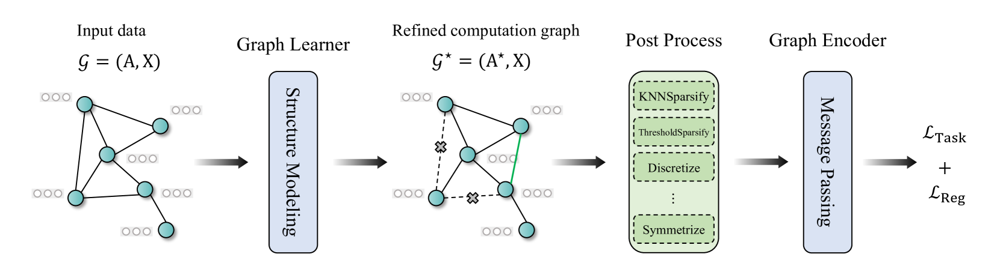

# GSLB: The Graph Structure Learning Benchmark

# GSLB: The Graph Structure Learning Benchmark

Zhixun Li1 Liang Wang2,3 Xin Sun4 Yifan Luo5 Yanqiao Zhu6 Dingshuo Chen2,3
  
Yingtao Luo7 Xiangxin Zhou2,3 Qiang Liu2,3 Shu Wu2,3 Liang Wang2,3,4 Jeffrey Xu Yu1
  
1 Department of Systems Engineering and Engineering Management
  
The Chinese University of Hong Kong
  
2Center for Research on Intelligent Perception and Computing
  
State Key Laboratory of Multimodal Artificial Intelligence Systems
  
Institute of Automation, Chinese Academy of Sciences
  
3 School of Artificial Intelligence, University of Chinese Academy of Sciences
  
4Department of Automation, University of Science and Technology of China
  
5School of Cyberspace Security, Beijing University of Posts and Telecommunications
  
6Department of Computer Science, University of California, Los Angeles
  
7Heinz College of Information Systems and Public Policy, Machine Learning Department
  
School of Computer Science, Carnegie Mellon University
  

\faEnvelope[regular] Primary contact: zxli@se.cuhk.edu.hk
  

###### Abstract

Graph Structure Learning (GSL) has recently garnered considerable attention due to its ability to optimize both the parameters of Graph Neural Networks (GNNs) and the computation graph structure simultaneously. Despite the proliferation of GSL methods developed in recent years, there is no standard experimental setting or fair comparison for performance evaluation, which creates a great obstacle to understanding the progress in this field. To fill this gap, we systematically analyze the performance of GSL in different scenarios and develop a comprehensive Graph Structure Learning Benchmark (GSLB) curated from 20 diverse graph datasets and 16 distinct GSL algorithms. Specifically, GSLB systematically investigates the characteristics of GSL in terms of three dimensions: effectiveness, robustness, and complexity. We comprehensively evaluate state-of-the-art GSL algorithms in node- and graph-level tasks, and analyze their performance in robust learning and model complexity. Further, to facilitate reproducible research, we have developed an easy-to-use library for training, evaluating, and visualizing different GSL methods. Empirical results of our extensive experiments demonstrate the ability of GSL and reveal its potential benefits on various downstream tasks, offering insights and opportunities for future research. The code of GSLB is available at: <https://github.com/GSL-Benchmark/GSLB>.

## 1 Introduction

Graphs, structures made of vertices and edges, are ubiquitous in real-world applications. A wide variety of applications spanning social network zhang2022robust; fan2019graph, molecular property prediction wieder2020compact; hao2020asgn, fake news detection xu2022evidence; bian2020rumor, and fraud detection li2022devil; liu2021pick have found graphs instrumental in modeling complex systems. In recent years, Graph Neural Networks (GNNs) have attracted increasing attention due to their powerful ability to learn node or graph representations. However, most of the GNNs heavily rely on the assumption that the initial structure of the graph is trustworthy enough to serve as ground-truth for training. Due to uncertainty and complexity in data collection, graph structures are inevitably redundant, biased, noisy, incomplete, or the original graph structures are even unavailable, which will bring great challenges for the deployment of GNNs in real-world applications.

To mitigate the aforementioned problems, Graph Structure Learning (GSL) chen2020iterative; zheng2020robust; luo2021learning; fatemi2021slaps; zhu2021survey; zhang2021mining has become an important theme in graph learning.
GSL aims to make the computation structure of GNNs more suitable for downstream tasks and improve the quality of the learned representations. While it is widespread in different communities and the research enthusiasm for GSL is increasing, there is no standardized benchmark that could offer a fair and consistent comparison of different GSL algorithms. Moreover, due to the complexity and diversity of graph datasets, the experimental setups in existing work are not consistent, such as varying ratios of the training set and different train/validation/test splits. This poses a great obstacle to a holistic understanding of the current research status. Therefore, the development of a standardized and comprehensive benchmark for GSL is an urgent need within the community.

Table 1: An overview of GSLB. Both algorithms and datasets are divided into three categories: homogeneous node-level, heterogeneous node-level, and graph-level. The evaluation is divided into three dimensions: effectiveness, robustness, and complexity.

*Algorithms*
Homogeneous GSL
LDS franceschi2019learning, GRCN yu2021graph, ProGNN jin2020graph, IDGL chen2020iterative, CoGSL liu2022compact, SUBLIME liu2022towards,
GEN wang2021graph, STABLE li2022reliable, NodeFormer wu2022nodeformer, SLAPS fatemi2021slaps,
GSR zhao2023self,
HES-GSL wu2023homophily

Heterogeneous GSL
GTN yun2019graph, HGSL zhao2021heterogeneous
Graph-level GSL
HGP-SL zhang2019hierarchical, VIB-GSL sun2022graph
*Datasets*
Homogeneous datasets
Cora yang2016revisiting, Citeseer yang2016revisiting, Pubmed yang2016revisiting, ogbn-arxiv hu2020open, Polblogs, Cornell pei2020geom,
Texas pei2020geom, Wisconsin pei2020geom, Actor tang2009social

Heterogeneous datasets
ACM yun2019graph, DBLP yun2019graph, Yelp lu2019relation
Graph-level datasets
IMDB-B cai2018simple, IMDB-M cai2018simple, COLLAB yanardag2015deep, REDDIT-B yanardag2015deep, MUTAG debnath1991structure,
PROTEINS borgwardt2005protein, Peptides-Func dwivedi2022long, Peptides-Struct dwivedi2022long

*Evaluations*
Effectiveness
Homogeneous node classification (Topology Refinement/Topology Inference),
Heterogeneous node classification, Graph-level tasks

Robustness
Supervision signal robustness, Structure robustness, Feature robustness
Complexity
Time complexity, Space complexity

In this work, we propose Graph Structure Learning Benchmark (GSLB), which serves as the first comprehensive benchmark for GSL. Our benchmark encompasses 16 state-of-the-art GSL algorithms and 20 diverse graph datasets covering homogeneous node-level, heterogeneous node-level, and graph-level tasks.
We systematically investigate the characteristics of GSL in terms of three dimensions: effectiveness, robustness, and complexity.
Based on these three dimensions, we conduct an extensive comparative study of existing GSL algorithms in different scenarios.
For effectiveness, GSLB provides a fair and comprehensive comparison of existing algorithms on homogeneous node-level, heterogeneous node-level, and graph-level tasks, where we consider both homophilic and heterophilic graph datasets for homogeneous node-level tasks, and cover both Topology Refinement (TR, i.e., refining graphs from data with the original topology) and Topology Inference (TI, i.e., inferring graphs from data without initial topology) settings.
For robustness, GSLB evaluates GSL models under three types of noise: supervision signal noise, structure noise, and feature noise. We also compare GSL algorithms with the models specifically designed to improve these types of robustness.
For complexity, GSLB conducts a detailed evaluation of representative GSL algorithms in terms of time complexity and space complexity.

Through extensive experiments, we observe that: (1) GSL generally brings performance improvement for node-level tasks, especially on heterophilic graphs; (2) on graph-level tasks, current GSL models bring limited improvement and their performance varies greatly across different datasets; (3) most GSL algorithms (especially unsupervised GSL algorithms) show impressive robustness; (4) GSL models require significant time and memory overhead, making them challenging to deploy on large-scale graphs.
In summary, we make the following three contributions:

- •
  
  We propose GSLB, the first comprehensive benchmark for graph structure learning. We integrate 16 state-of-the-art GSL algorithms and 20 diverse graph datasets covering homogeneous node-level, heterogeneous node-level, and graph-level tasks. An overview of our benchmark is shown in Table [1](#S1.T1 "Table 1 ‣ 1 Introduction ‣ GSLB: The Graph Structure Learning Benchmark").
- •
  
  To explore the ability and limitations of GSL, we systematically evaluate existing algorithms from three dimensions: effectiveness, robustness, and complexity. Based on the results, we reveal the potential benefits and drawbacks of GSL to assist future research efforts.
- •
  
  To facilitate future work and help researchers quickly use the latest models, we develop an easy-to-use open-source library. Besides, users can evaluate their own models or datasets with less effort. Our code is available at <https://github.com/GSL-Benchmark/GSLB>.

## 2 Problem Definition

In this section, we will briefly review the advances and basic concepts of GSL. Given an undirected graph 𝒢=(𝐀,𝐗)𝒢𝐀𝐗\mathcal{G}=(\mathbf{A},\mathbf{X})caligraphic\_G = ( bold\_A , bold\_X ), where 𝐀∈ℝN×N𝐀superscriptℝ𝑁𝑁\mathbf{A}\in\mathbb{R}^{N\times N}bold\_A ∈ blackboard\_R start\_POSTSUPERSCRIPT italic\_N × italic\_N end\_POSTSUPERSCRIPT is the adjacency matrix, au⁢v=1subscript𝑎𝑢𝑣1a\_{uv}=1italic\_a start\_POSTSUBSCRIPT italic\_u italic\_v end\_POSTSUBSCRIPT = 1 if edge (u,v)𝑢𝑣(u,v)( italic\_u , italic\_v ) exists and au⁢v=0subscript𝑎𝑢𝑣0a\_{uv}=0italic\_a start\_POSTSUBSCRIPT italic\_u italic\_v end\_POSTSUBSCRIPT = 0 otherwise, and 𝐗∈ℝN×F𝐗superscriptℝ𝑁𝐹\mathbf{X}\in\mathbb{R}^{N\times F}bold\_X ∈ blackboard\_R start\_POSTSUPERSCRIPT italic\_N × italic\_F end\_POSTSUPERSCRIPT is the node features matrix, N𝑁Nitalic\_N is the number of nodes, F𝐹Fitalic\_F is the dimension of node features. Given an optional graph 𝒢𝒢\mathcal{G}caligraphic\_G, the goal of GSL is to jointly optimize computation graph 𝒢⋆=(𝐀⋆,𝐗)superscript𝒢⋆superscript𝐀⋆𝐗\mathcal{G}^{\star}=(\mathbf{A}^{\star},\mathbf{X})caligraphic\_G start\_POSTSUPERSCRIPT ⋆ end\_POSTSUPERSCRIPT = ( bold\_A start\_POSTSUPERSCRIPT ⋆ end\_POSTSUPERSCRIPT , bold\_X ) and the parameters of graph encoder ΘfsubscriptΘ𝑓\Theta\_{f}roman\_Θ start\_POSTSUBSCRIPT italic\_f end\_POSTSUBSCRIPT to obtain high-quality node representations 𝐙⋆∈ℝN×F′superscript𝐙⋆superscriptℝ𝑁superscript𝐹′\mathbf{Z}^{\star}\in\mathbb{R}^{N\times F^{\prime}}bold\_Z start\_POSTSUPERSCRIPT ⋆ end\_POSTSUPERSCRIPT ∈ blackboard\_R start\_POSTSUPERSCRIPT italic\_N × italic\_F start\_POSTSUPERSCRIPT ′ end\_POSTSUPERSCRIPT end\_POSTSUPERSCRIPT for downstream tasks, where 𝐀⋆superscript𝐀⋆\mathbf{A}^{\star}bold\_A start\_POSTSUPERSCRIPT ⋆ end\_POSTSUPERSCRIPT is the refined graph by graph learner.

In general, the objective of GSL can be summarized as the following formula:

|  | ℒGSL=ℒTask⁢(𝐙⋆,𝐘)+λ⁢ℒReg⁢(𝐀⋆,𝐙⋆,𝒢)subscriptℒGSLsubscriptℒTasksuperscript𝐙⋆𝐘𝜆subscriptℒRegsuperscript𝐀⋆superscript𝐙⋆𝒢\mathcal{L}\_{\text{GSL}}=\mathcal{L}\_{\text{Task}}(\mathbf{Z}^{\star},\mathbf{% Y})+\lambda\mathcal{L}\_{\text{Reg}}(\mathbf{A}^{\star},\mathbf{Z}^{\star},% \mathcal{G})caligraphic\_L start\_POSTSUBSCRIPT GSL end\_POSTSUBSCRIPT = caligraphic\_L start\_POSTSUBSCRIPT Task end\_POSTSUBSCRIPT ( bold\_Z start\_POSTSUPERSCRIPT ⋆ end\_POSTSUPERSCRIPT , bold\_Y ) + italic\_λ caligraphic\_L start\_POSTSUBSCRIPT Reg end\_POSTSUBSCRIPT ( bold\_A start\_POSTSUPERSCRIPT ⋆ end\_POSTSUPERSCRIPT , bold\_Z start\_POSTSUPERSCRIPT ⋆ end\_POSTSUPERSCRIPT , caligraphic\_G ) |  | (1) |
| --- | --- | --- | --- |

where the first term ℒTasksubscriptℒTask\mathcal{L}\_{\text{Task}}caligraphic\_L start\_POSTSUBSCRIPT Task end\_POSTSUBSCRIPT refers to a task-specific objective with respect to the learned representation 𝐙⋆superscript𝐙⋆\mathbf{Z}^{\star}bold\_Z start\_POSTSUPERSCRIPT ⋆ end\_POSTSUPERSCRIPT and ground-truth 𝐘𝐘\mathbf{Y}bold\_Y, the second term ℒRegsubscriptℒReg\mathcal{L}\_{\text{Reg}}caligraphic\_L start\_POSTSUBSCRIPT Reg end\_POSTSUBSCRIPT imposes constraints on the learned graph structure and representations, and λ𝜆\lambdaitalic\_λ is a hyper-parameter that controls the trade-off between the two terms. The general framework of GSL is shown in Figure [1](#S2.F1 "Figure 1 ‣ 2 Problem Definition ‣ GSLB: The Graph Structure Learning Benchmark").

Figure 1: A general framework of Graph Structure Learning (GSL). GSL methods start with input features and an optional initial graph structure. Its corresponding computation graph is refined/inferred through a structure learning module. With the learned computation graph, Graph Neural Networks (GNNs) are used to generate graph representations.

## 3 GSLB: Graph Structure Learning Benchmark

In this section, we introduce the overview of Graph Structure Learning Benchmark, with considerations of algorithms (Section [3.1](#S3.SS1 "3.1 Benchmark Algorithms ‣ 3 GSLB: Graph Structure Learning Benchmark ‣ GSLB: The Graph Structure Learning Benchmark")), datasets (Section [3.2](#S3.SS2 "3.2 Benchmark Datasets ‣ 3 GSLB: Graph Structure Learning Benchmark ‣ GSLB: The Graph Structure Learning Benchmark")) and evaluations (Section [3.3](#S3.SS3 "3.3 Benchmark Evaluations ‣ 3 GSLB: Graph Structure Learning Benchmark ‣ GSLB: The Graph Structure Learning Benchmark")).

### 3.1 Benchmark Algorithms

Table [1](#S1.T1 "Table 1 ‣ 1 Introduction ‣ GSLB: The Graph Structure Learning Benchmark") shows the overall 16 algorithms integrated in GSLB. They are divided into three categories: homogeneous GSL, heterogeneous GSL, and graph-level GSL. We briefly introduce each category in the following, and more details are provided in Appendix LABEL:appen:alg.

Homogeneous GSL. Most of the existing GSL algorithms are designed for homogeneous graphs. They assume there is only one type of nodes and edges in the graph. We select 7 TR-oriented algorithms including GRCN yu2021graph, ProGNN jin2020graph, IDGL chen2020iterative, GEN wang2021graph, CoGSL liu2022compact, STABLE li2022reliable, and GSR zhao2023self. For TI-oriented algorithms, we select SUBLIME liu2022towards, NodeFormer wu2022nodeformer, SLAPS fatemi2021slaps, and HES-GSL wu2023homophily. It is worth noting that TR-oriented algorithms can only be applied if the original graph structure is available, but we can construct a preliminary graph based on node features (e.g., k𝑘kitalic\_kNN graphs or ϵitalic-ϵ\epsilonitalic\_ϵ-graphs).

Heterogeneous GSL. We integrate two representative heterogeneous GSL algorithms: Graph Transformer Networks (GTN) yun2019graph and Heterogeneous Graph Structure Learning (HGSL) zhao2021heterogeneous, which can handle the heterogeneity and capture complex interactions in heterogeneous graphs.

Graph-level GSL.
Graph-level GSL algorithms aim to refine each graph structure in datasets. We select two graph-level algorithms: Hierarchical Graph Pooling with Structure Learning (HGP-SL) zhang2019hierarchical and Variational Information Bottleneck guided Graph Structure Learning (VIB-GSL) sun2022graph.

### 3.2 Benchmark Datasets

To comprehensively and effectively evaluate the characteristics of GSL in the field of graph learning, we have integrated a large number of datasets from various domains for different types of tasks. For node-level tasks, to evaluate the most mainstream task of GSL, node classification, we use four citation networks (i.e., Cora, Citeseer, Pubmed yang2016revisiting), and ogbn-arxiv hu2020open, three website networks from WebKB (i.e., Cornell, Texas, and Wisconsin pei2020geom), and a cooccurrence network Actor with homophily ratio ranging from strong homophily to strong heterophily. Subsequently, to validate the effectiveness of GSL in heterogeneous node classification, we utilized three heterogeneous graph datasets (i.e., DBLP yun2019graph, ACM yun2019graph, and Yelp lu2019relation). To investigate the robustness of GSL, we further incorporate the Polblogs dataset for evaluation. For graph-level tasks, we select six public graph classification benchmark dataset from TUDataset morris2020tudataset for evaluation, including IMDB-B cai2018simple, IMDB-M cai2018simple, RDT-B yanardag2015deep, COLLAB yanardag2015deep, MUTAG debnath1991structure and PROTEINS borgwardt2005protein. Each dataset is a collection of graphs where each graph is associated with a level. Besides, exploring whether GSL can capture long-range information is an exciting topic. Therefore, we have utilized recently proposed long-range graph datasets: Peptides-func and Peptides-struct dwivedi2022long. See more details and statistics about datasets in Appendix LABEL:appen:dataset.

### 3.3 Benchmark Evaluations

To comprehensively investigate the pros and cons of GSL, our benchmark evaluations encompass three dimensions: effectiveness, robustness, and complexity. For effectiveness, GSLB provides a fair and comprehensive comparison of existing algorithms from three perspectives: homogeneous node classification, heterogeneous node classification, and graph-level tasks. In the case of homogeneous node classification, we evaluated them on both homophilic and heterophilic graph datasets, conducting experiments in both TR and TI scenarios. For graph-level, we evaluate graph-level GSL algorithms on TUDataset and long-range graph datasets for exploring the capabilities on graph-level tasks. For most datasets, we use accuracy as our evaluation metric. For robustness, GSLB evaluates three types of robustness: supervision signal robustness, structure robustness, and feature robustness. We control the count of labels to explore the supervision signal robustness of GSL and find that GSL exhibits excellent performance in the scenarios with few labels. We inject random structure noise and graph topology attacks to investigate the structure robustness. We also study the feature robustness by randomly masking a certain proportion of node features. For complexity, we conduct a detailed evaluation of representative GSL algorithms in terms of time complexity and space complexity. It will help to facilitate the deployment of GSL in real-world applications.

## 4 Experiments and Analysis

In this section, we systematically investigate the effectiveness, robustness, and complexity of GSL algorithms by answering the following specific questions:

- •
  
  For effectiveness, RQ1: How effective are the algorithms on node-level representation learning (Section [4.2](#S4.SS2 "4.2 Performance on node-level representation learning ‣ 4 Experiments and Analysis ‣ GSLB: The Graph Structure Learning Benchmark"))? RQ2: Can GSL mitigate homophily inductive bias of traditional message-passing based GNNs (Section [4.2](#S4.SS2 "4.2 Performance on node-level representation learning ‣ 4 Experiments and Analysis ‣ GSLB: The Graph Structure Learning Benchmark"))? RQ3: How does GSL perform on heterogeneous graph datasets (Section [4.3](#S4.SS3 "4.3 Performance on heterogeneous graph node-level representation learning ‣ 4 Experiments and Analysis ‣ GSLB: The Graph Structure Learning Benchmark"))? RQ4: How effective are the algorithms on graph-level representation learning (Section [4.4](#S4.SS4 "4.4 Performance of GSL algorithms on graph-level tasks ‣ 4 Experiments and Analysis ‣ GSLB: The Graph Structure Learning Benchmark"))? RQ5: Can GSL methods capture long-range information on the graph (Appendix LABEL:appen:exp)?
- •
  
  For robustness, RQ6: How robust are GSL algorithms when faced with a scarcity of labeled samples? RQ7: How robust are GSL algorithms in the face of structure attack or noise? RQ8: How is the feature robustness of GSL? (Section LABEL:sec:robust)
- •
  
  For complexity, RQ9: How efficient are these algorithms in terms of time and space (Section LABEL:sec:complexity)?
- •
  
  Otherwise, RQ10: What does the learned graph structure look like (Appendix LABEL:appen:visual)?

### 4.1 Experimental Settings

All algorithms in GSLB are implemented by PyTorch paszke2019pytorch, and unless specifically indicated, the encoders for all algorithms are Graph Convolutional Networks. All experiments are conducted on a Linux server with GPU (NVIDIA GeForce 3090 and NVIDIA A100) and CPU (AMD EPYC 7763), using PyTorch 1.13.0, DGL 1.1.0 wang2019deep and Python 3.9.16.

### 4.2 Performance on node-level representation learning

For node-level representation learning, we conduct experiments on homogeneous graph datasets under both TR and TI scenarios, and use classification accuracy as our evaluation metric. Table [2](#S4.T2 "Table 2 ‣ 4.2 Performance on node-level representation learning ‣ 4 Experiments and Analysis ‣ GSLB: The Graph Structure Learning Benchmark") shows the experimental results of various GSL algorithms under the standard setting of transductive node classification task in the TR scenario. We can observe that: 1) Most GSL algorithms generally show improvements in node classification task, particularly on datasets with high heterophily ratio. Due to the presence of heterophilic connections in heterophily graphs, where nodes are often connected to nodes with different labels, it violates the homophily assumption of message-passing neural networks. As a result, traditional GNNs like GCN and GAT exhibit poor performance. However, GSL can improve significantly on heterophily graph datasets by learning new graph structures based on downstream tasks and specific learning objectives, thus enhancing the homophily of the graph and promoting the performance on node-level representation learning. 2) SUBLIME achieves optimal or near-optimal results on most datasets. It learns graph structure through contrastive learning in an unsupervised manner. As mentioned in the recent literature fatemi2021slaps, optimizing graph structures solely based on label information is insufficient. Leveraging a large and abundant amount of unlabeled information can enhance the performance of GSL. 3) The scalability of GSL still needs improvement, as only a few models can be trained on large-scale datasets (e.g., ogbn-arxiv). We will discuss the scalability of GSL algorithms in detail in a subsequent section (Section LABEL:sec:complexity).

Table [3](#S4.T3 "Table 3 ‣ 4.2 Performance on node-level representation learning ‣ 4 Experiments and Analysis ‣ GSLB: The Graph Structure Learning Benchmark") shows the experimental results of the transductive node classification task in the TI scenario. Some GSL algorithms are designed for TR scenario (i.e., GRCN, IDGL, etc.), so we use kNN graphs as their original graph structure. As we can observe, on the homophily graph datasets, GSL outperforms baselines, such as MLP, GCNk⁢n⁢n𝑘𝑛𝑛{}\_{knn}start\_FLOATSUBSCRIPT italic\_k italic\_n italic\_n end\_FLOATSUBSCRIPT and GATk⁢n⁢n𝑘𝑛𝑛{}\_{knn}start\_FLOATSUBSCRIPT italic\_k italic\_n italic\_n end\_FLOATSUBSCRIPT. However, on the heterophily graph datasets, most GSL algorithms often have difficulty achieving better results than baseline models. As mentioned in earlier literature, a network with randomness tends to get better performance utilizing kNN for direct information propagation jin2021universal. Therefore, traditional message-passing neural networks with kNN graphs demonstrate powerful performance. In addition, as observed in the TR scenario, models that leverage self-supervision to extract abundant unlabeled information often achieve better performance.

Table 2: Accuracy ±plus-or-minus\pm± STD comparison (%) under the standard setting of transductive node classification task in the Topology Refinement (TR) scenario, which means the original graph structure is available for each method. Performance is averaged from 10 independent repetitions. The highest results are highlighted with bold, while the second highest results are marked with underline. "OOM" denotes out of memory.

Cora
Citeseer
Pubmed
ogbn-arxiv
Cornell
Texas
Wisconsin
Actor
Edge Hom.
0.81
0.74
0.80
0.65
0.12
0.06
0.18
0.22
GCN
81.46±plus-or-minus\pm±0.58
71.36±plus-or-minus\pm±0.31
79.18±plus-or-minus\pm±0.29
70.77±plus-or-minus\pm±0.19
47.84±plus-or-minus\pm±5.55
57.83±plus-or-minus\pm±2.76
57.45±plus-or-minus\pm±4.30
30.01±plus-or-minus\pm±0.77
GAT
81.41±plus-or-minus\pm±0.77
70.69±plus-or-minus\pm±0.58
77.85±plus-or-minus\pm±0.42
69.90±plus-or-minus\pm±0.25
46.22±plus-or-minus\pm±6.33
54.05±plus-or-minus\pm±7.35
57.65±plus-or-minus\pm±7.75
28.91±plus-or-minus\pm±0.83
GPRGNN
83.66±plus-or-minus\pm±0.77
71.64±plus-or-minus\pm±0.49
75.99±plus-or-minus\pm±1.63
50.80±plus-or-minus\pm±0.29
76.76±plus-or-minus\pm±5.30
85.14±plus-or-minus\pm±3.68
83.33±plus-or-minus\pm±3.42
34.09±plus-or-minus\pm±1.09
LDS
83.01±plus-or-minus\pm±0.41
73.55±plus-or-minus\pm±0.54
OOM
OOM
47.87±plus-or-minus\pm±7.14
58.92±plus-or-minus\pm±4.32
61.70±plus-or-minus\pm±3.58
31.05±plus-or-minus\pm±1.31
GRCN
83.87±plus-or-minus\pm±0.49
72.43±plus-or-minus\pm±0.61
78.92±plus-or-minus\pm±0.39
OOM
54.32±plus-or-minus\pm±8.24
62.16±plus-or-minus\pm±7.05
56.08±plus-or-minus\pm±7.19
29.97±plus-or-minus\pm±0.71
ProGNN
80.30±plus-or-minus\pm±0.57
68.51±plus-or-minus\pm±0.52
OOM
OOM
54.05±plus-or-minus\pm±6.16
48.37±plus-or-minus\pm±12.17
62.54±plus-or-minus\pm±7.56
22.35±plus-or-minus\pm±0.88
IDGL
83.88±plus-or-minus\pm±0.42
72.20±plus-or-minus\pm±1.18
80.00±plus-or-minus\pm±0.38
OOM
50.00±plus-or-minus\pm±8.98
62.43±plus-or-minus\pm±6.09
59.41±plus-or-minus\pm±4.11
28.16±plus-or-minus\pm±1.41
GEN
80.21±plus-or-minus\pm±1.72
71.15±plus-or-minus\pm±1.81
78.91±plus-or-minus\pm±0.69
OOM
57.02±plus-or-minus\pm±7.19
65.94±plus-or-minus\pm±1.38
66.07±plus-or-minus\pm±3.72
27.21±plus-or-minus\pm±2.05
CoGSL
81.76±plus-or-minus\pm±0.24
73.09±plus-or-minus\pm±0.42
OOM
OOM
52.16±plus-or-minus\pm±3.21
59.46±plus-or-minus\pm±4.36
58.82±plus-or-minus\pm±1.52
32.95±plus-or-minus\pm±1.20
SUBLIME
83.40±plus-or-minus\pm±0.42
72.30±plus-or-minus\pm±1.09
80.90±plus-or-minus\pm±0.94
71.75±plus-or-minus\pm±0.36
70.54±plus-or-minus\pm±5.98
77.03±plus-or-minus\pm±4.23
78.82±plus-or-minus\pm±6.55
33.57±plus-or-minus\pm±0.68
STABLE
80.20±plus-or-minus\pm±0.68
68.91±plus-or-minus\pm±1.01
OOM
OOM
44.03±plus-or-minus\pm±4.05
55.24±plus-or-minus\pm±6.04
53.00±plus-or-minus\pm±5.27
30.18±plus-or-minus\pm±1.00
NodeFormer
80.28±plus-or-minus\pm±0.82
71.31±plus-or-minus\pm±0.98
78.21±plus-or-minus\pm±1.43
55.40±plus-or-minus\pm±0.23
42.70±plus-or-minus\pm±5.51
58.92±plus-or-minus\pm±4.32
48.43±plus-or-minus\pm±7.02
25.51±plus-or-minus\pm±1.77
GSR
82.48±plus-or-minus\pm±0.43
71.10±plus-or-minus\pm±0.25
78.09±plus-or-minus\pm±0.53
OOM
44.32±plus-or-minus\pm±2.16
60.81±plus-or-minus\pm±4.87
56.86±plus-or-minus\pm±1.24
30.23±plus-or-minus\pm±0.38

Table 3: Accuracy ±plus-or-minus\pm± STD comparison (%) under the standard setting of transductive node classification task in the Topology Inference (TI) scenario, which means the original graph structure is not available for each method.

Cora
Citeseer
Pubmed
ogbn-arxiv
Cornell
Texas
Wisconsin
Actor
Edge Hom.
0.81
0.74
0.80
0.65
0.12
0.06
0.18
0.22
MLP
58.55±plus-or-minus\pm±0.80
59.52±plus-or-minus\pm±0.64
73.00±plus-or-minus\pm±0.30
55.21±plus-or-minus\pm±0.11
71.35±plus-or-minus\pm±6.19
80.27±plus-or-minus\pm±5.93
84.71±plus-or-minus\pm±3.14
35.49±plus-or-minus\pm±1.04
GCNk⁢n⁢n𝑘𝑛𝑛{}\_{knn}start\_FLOATSUBSCRIPT italic\_k italic\_n italic\_n end\_FLOATSUBSCRIPT
66.10±plus-or-minus\pm±0.44
68.33±plus-or-minus\pm±0.89
69.23±plus-or-minus\pm±0.49
55.21±plus-or-minus\pm±0.22
75.14±plus-or-minus\pm±2.65
75.95±plus-or-minus\pm±4.43
84.12±plus-or-minus\pm±3.97
32.98±plus-or-minus\pm±0.49
GATk⁢n⁢n𝑘𝑛𝑛{}\_{knn}start\_FLOATSUBSCRIPT italic\_k italic\_n italic\_n end\_FLOATSUBSCRIPT
64.62±plus-or-minus\pm±1.04
68.05±plus-or-minus\pm±1.12
68.76±plus-or-minus\pm±0.80
55.92±plus-or-minus\pm±0.30
74.05±plus-or-minus\pm±5.16
76.49±plus-or-minus\pm±4.99
82.16±plus-or-minus\pm±4.06
31.67±plus-or-minus\pm±1.19
GPRGNNk⁢n⁢n𝑘𝑛𝑛{}\_{knn}start\_FLOATSUBSCRIPT italic\_k italic\_n italic\_n end\_FLOATSUBSCRIPT
69.27±plus-or-minus\pm±0.62
70.29±plus-or-minus\pm±0.54
68.19±plus-or-minus\pm±1.19
51.39±plus-or-minus\pm±0.13
75.68±plus-or-minus\pm±2.70
81.08±plus-or-minus\pm±4.18
84.12±plus-or-minus\pm±3.22
34.71±plus-or-minus\pm±1.51
LDS
69.87±plus-or-minus\pm±0.41
72.43±plus-or-minus\pm±0.61
OOM
OOM
72.65±plus-or-minus\pm±3.86
70.20±plus-or-minus\pm±5.07
78.14±plus-or-minus\pm±4.50
32.39±plus-or-minus\pm±0.79
GRCNk⁢n⁢n𝑘𝑛𝑛{}\_{knn}start\_FLOATSUBSCRIPT italic\_k italic\_n italic\_n end\_FLOATSUBSCRIPT
69.48±plus-or-minus\pm±0.66
68.41±plus-or-minus\pm±0.50
68.96±plus-or-minus\pm±0.85
OOM
71.08±plus-or-minus\pm±6.84
74.32±plus-or-minus\pm±5.02
78.63±plus-or-minus\pm±4.92
30.83±plus-or-minus\pm±0.76
ProGNNk⁢n⁢n𝑘𝑛𝑛{}\_{knn}start\_FLOATSUBSCRIPT italic\_k italic\_n italic\_n end\_FLOATSUBSCRIPT
67.11±plus-or-minus\pm±0.56
64.55±plus-or-minus\pm±0.95
OOM
OOM
71.35±plus-or-minus\pm±4.04
71.89±plus-or-minus\pm±5.69
72.94±plus-or-minus\pm±7.93
31.56±plus-or-minus\pm±1.14
IDGLk⁢n⁢n𝑘𝑛𝑛{}\_{knn}start\_FLOATSUBSCRIPT italic\_k italic\_n italic\_n end\_FLOATSUBSCRIPT
69.74±plus-or-minus\pm±0.57
66.33±plus-or-minus\pm±0.84
74.01±plus-or-minus\pm±0.64
OOM
72.70±plus-or-minus\pm±4.75
75.40±plus-or-minus\pm±4.75
79.21±plus-or-minus\pm±3.94
33.07±plus-or-minus\pm±1.37
GENk⁢n⁢n𝑘𝑛𝑛{}\_{knn}start\_FLOATSUBSCRIPT italic\_k italic\_n italic\_n end\_FLOATSUBSCRIPT
66.95±plus-or-minus\pm±1.40
67.29±plus-or-minus\pm±1.17
69.76±plus-or-minus\pm±1.53
OOM
71.08±plus-or-minus\pm±5.54
74.59±plus-or-minus\pm±3.46
81.76±plus-or-minus\pm±2.91
31.28±plus-or-minus\pm±1.06
CoGSLk⁢n⁢n𝑘𝑛𝑛{}\_{knn}start\_FLOATSUBSCRIPT italic\_k italic\_n italic\_n end\_FLOATSUBSCRIPT
66.65±plus-or-minus\pm±0.37
68.72±plus-or-minus\pm±0.84
OOM
OOM
70.27±plus-or-minus\pm±3.42
72.70±plus-or-minus\pm±4.26
76.96±plus-or-minus\pm±5.25
34.52±plus-or-minus\pm±1.56
GSRk⁢n⁢n𝑘𝑛𝑛{}\_{knn}start\_FLOATSUBSCRIPT italic\_k italic\_n italic\_n end\_FLOATSUBSCRIPT
66.28±plus-or-minus\pm±0.59
66.77±plus-or-minus\pm±0.62
68.49±plus-or-minus\pm±1.49
OOM
70.27±plus-or-minus\pm±3.62
74.86±plus-or-minus\pm±3.63
78.62±plus-or-minus\pm±5.91
33.73±plus-or-minus\pm±1.12
SLAPS
72.28±plus-or-minus\pm±0.97
70.71±plus-or-minus\pm±1.13
74.50±plus-or-minus\pm±1.47
55.19±plus-or-minus\pm±0.21
74.59±plus-or-minus\pm±3.67
79.19±plus-or-minus\pm±4.99
81.96±plus-or-minus\pm±3.26
37.16±plus-or-minus\pm±0.91
SUBLIME
72.74±plus-or-minus\pm±1.91
72.63±plus-or-minus\pm±0.60
75.08±plus-or-minus\pm±0.55
55.57±plus-or-minus\pm±0.18
72.35±plus-or-minus\pm±3.57
75.51±plus-or-minus\pm±5.08
82.14±plus-or-minus\pm±2.62
32.20±plus-or-minus\pm±1.02
NodeFormer
54.35±plus-or-minus\pm±5.33
45.90±plus-or-minus\pm±5.42
59.83±plus-or-minus\pm±6.50
55.37±plus-or-minus\pm±0.23
42.70±plus-or-minus\pm±5.51
58.92±plus-or-minus\pm±4.32
48.24±plus-or-minus\pm±6.63
29.24±plus-or-minus\pm±1.68
HES-GSL
73.68±plus-or-minus\pm±1.04
70.12±plus-or-minus\pm±1.11
77.08±plus-or-minus\pm±0.78
56.46±plus-or-minus\pm±0.27
66.22±plus-or-minus\pm±6.19
74.05±plus-or-minus\pm±6.42
79.61±plus-or-minus\pm±5.28
36.73±plus-or-minus\pm±0.76

### 4.3 Performance on heterogeneous graph node-level representation learning

In this section, we evaluate the performance of GSL algorithms on heterogeneous node classification task and use Macro-F1 and Micro-F1 as our evaluation metrics. Table [4](#S4.T4 "Table 4 ‣ 4.3 Performance on heterogeneous graph node-level representation learning ‣ 4 Experiments and Analysis ‣ GSLB: The Graph Structure Learning Benchmark") shows the experimental results on heterogeneous graph datasets. By observing the results, we can find that: 1) Because GTN and HGSL consider both heterogeneity and structure learning, they generally outperform other models on heterogeneous graph datasets. 2) GSL algorithms generally outperform the vanilla GNN models (e.g. GCN and GAT) since they have learned better structures to facilitate message passing. 3) Due to the majority of GSL algorithms not explicitly accounting for heterogeneity, they may exhibit poorer performance on heterogeneous graph datasets. 4) Some datasets (e.g. Yelp) exhibit stronger heterogeneity, and on such datasets, models that consider heterogeneity (e.g. HAN, GTN, and HGSL) perform significantly better.

Table 4: Macro-F1 and Micro-F1 ±plus-or-minus\pm± STD comparison (%) under the standard setting of heterogeneous node classification task.

  

Method
ACM
DBLP
Yelp
Macro-F1
Micro-F1
Macro-F1
Micro-F1
Macro-F1
Micro-F1
GCN
90.27±plus-or-minus\pm±0.59
90.18±plus-or-minus\pm±0.61
90.01±plus-or-minus\pm±0.32
90.99±plus-or-minus\pm±0.28
78.01±plus-or-minus\pm±1.89
81.03±plus-or-minus\pm±1.81
GAT
91.52±plus-or-minus\pm±0.62
91.46±plus-or-minus\pm±0.62
90.22±plus-or-minus\pm±0.37
91.13±plus-or-minus\pm±0.40
82.12±plus-or-minus\pm±1.47
84.43±plus-or-minus\pm±1.56
HAN
91.67±plus-or-minus\pm±0.39
91.47±plus-or-minus\pm±0.22
90.53±plus-or-minus\pm±0.24
91.47±plus-or-minus\pm±0.22
88.49±plus-or-minus\pm±1.73
88.78±plus-or-minus\pm±1.40
LDS
92.35±plus-or-minus\pm±0.43
92.05±plus-or-minus\pm±0.26
88.11±plus-or-minus\pm±0.86
88.74±plus-or-minus\pm±0.85
75.98±plus-or-minus\pm±2.35
78.14±plus-or-minus\pm±1.98
GRCN
93.04±plus-or-minus\pm±0.17
92.94±plus-or-minus\pm±0.18
88.33±plus-or-minus\pm±0.47
89.43±plus-or-minus\pm±0.44
76.05±plus-or-minus\pm±1.05
80.68±plus-or-minus\pm±0.96
IDGL
91.69±plus-or-minus\pm±1.24
91.63±plus-or-minus\pm±1.24
89.65±plus-or-minus\pm±0.60
90.61±plus-or-minus\pm±0.56
76.98±plus-or-minus\pm±5.78
79.15±plus-or-minus\pm±5.06
ProGNN
90.57±plus-or-minus\pm±1.03
90.50±plus-or-minus\pm±1.29
83.13±plus-or-minus\pm±1.56
84.83±plus-or-minus\pm±1.36
51.76±plus-or-minus\pm±1.46
58.39±plus-or-minus\pm±1.25
GEN
87.91±plus-or-minus\pm±2.78
87.88±plus-or-minus\pm±2.61
89.74±plus-or-minus\pm±0.69
90.65±plus-or-minus\pm±0.71
80.43±plus-or-minus\pm±3.78
82.68±plus-or-minus\pm±2.84
STABLE
83.54±plus-or-minus\pm±4.20
83.38±plus-or-minus\pm±4.51
75.18±plus-or-minus\pm±1.95
76.42±plus-or-minus\pm±1.95
71.48±plus-or-minus\pm±4.71
76.62±plus-or-minus\pm±2.75
GEN
87.91±plus-or-minus\pm±2.78
87.88±plus-or-minus\pm±2.61
89.74±plus-or-minus\pm±0.69
90.65±plus-or-minus\pm±0.71
80.43±plus-or-minus\pm±3.78
82.68±plus-or-minus\pm±2.84
SUBLIME
92.42±plus-or-minus\pm±0.16
92.13±plus-or-minus\pm±0.37
90.98±plus-or-minus\pm±0.37
91.82±plus-or-minus\pm±0.27
79.68±plus-or-minus\pm±0.79
82.99±plus-or-minus\pm±0.82
NodeFormer
91.33±plus-or-minus\pm±0.77
90.60±plus-or-minus\pm±0.95
79.54±plus-or-minus\pm±0.78
80.56±plus-or-minus\pm±0.62
91.69±plus-or-minus\pm±0.65
90.59±plus-or-minus\pm±1.21
GSR
92.14±plus-or-minus\pm±1.08
92.11±plus-or-minus\pm±0.99
76.59±plus-or-minus\pm±0.45
77.69±plus-or-minus\pm±0.42
83.85±plus-or-minus\pm±0.76
85.73±plus-or-minus\pm±0.54
GTN
92.04±plus-or-minus\pm±0.38
91.94±plus-or-minus\pm±0.39
90.52±plus-or-minus\pm±0.45
91.48±plus-or-minus\pm±0.39
92.98±plus-or-minus\pm±0.52
92.44±plus-or-minus\pm±0.46
HGSL
93.23±plus-or-minus\pm±0.50
93.13±plus-or-minus\pm±0.51
91.58±plus-or-minus\pm±0.40
92.49±plus-or-minus\pm±0.35
92.79±plus-or-minus\pm±0.44
92.24±plus-or-minus\pm±0.48

### 4.4 Performance of GSL algorithms on graph-level tasks

In this section, we conduct graph classification experiments on four social datasets (i.e., IMDB-B, RDT-B, COLLAB, and IMDB-M) and two biological datasets (i.e., MUTAG and PROTEINS). Table [4.4](#S4.SS4 "4.4 Performance of GSL algorithms on graph-level tasks ‣ 4 Experiments and Analysis ‣ GSLB: The Graph Structure Learning Benchmark") shows the experimental results of average accuracy and the standard deviation of 10-fold cross-validation. We can observe that HGP-SL (with GCN as the encoder) consistently outperforms GCN on all datasets. However, we find that VIB-GSL exhibits strong instability across different random seeds. And due to the absence of training scripts in the official code111<https://github.com/RingBDStack/VIB-GSL>, we performed hyperparameter tuning based on the parameter search space (β∈{10−1,10−2,10−3,10−4,10−5,10−6}𝛽superscript101superscript102superscript103superscript104superscript105superscript106\beta\in\{10^{-1},10^{-2},10^{-3},10^{-4},10^{-5},10^{-6}\}italic\_β ∈ { 10 start\_POSTSUPERSCRIPT - 1 end\_POSTSUPERSCRIPT , 10 start\_POSTSUPERSCRIPT - 2 end\_POSTSUPERSCRIPT , 10 start\_POSTSUPERSCRIPT - 3 end\_POSTSUPERSCRIPT , 10 start\_POSTSUPERSCRIPT - 4 end\_POSTSUPERSCRIPT , 10 start\_POSTSUPERSCRIPT - 5 end\_POSTSUPERSCRIPT , 10 start\_POSTSUPERSCRIPT - 6 end\_POSTSUPERSCRIPT }) provided in the paper, but we are unable to surpass the performance of the baseline models consistently. Lastly, we conducted an analysis of graph-level GSL algorithms on long-range graph dataset dwivedi2022long. For detailed information, please refer to Appendix LABEL:appen:exp.

Table 5: Accuracy ±plus-or-minus\pm± STD comparison (%) under the setting of graph-level classification task.

